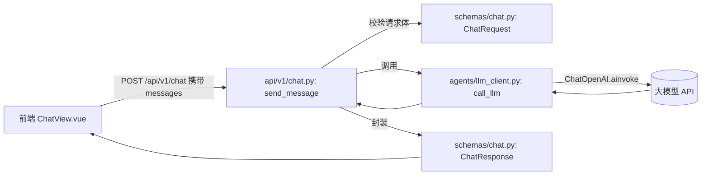
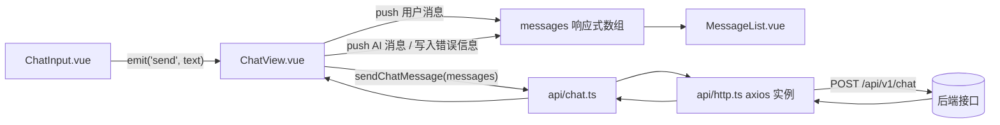

## Day 2：先做一个能聊天的页面

昨天把前后端的项目骨架搭起来了，`backend/` 和 `frontend/` 两个目录都能跑，但页面是空的，接口也没有真正的业务逻辑。今天要做的是让"能对话"这件事从架构图变成用户能亲手体验的功能，验证前后端联调这条链路是不是真的通。今天不涉及结构化输出、工具调用这些后面几天才会加的能力，范围刻意收得很窄，后端就是一个接收消息、转发给大模型、把回复原样返回的接口，前端就是一个经典的三段式聊天页面，把这条最短路径先跑通，比一上来就堆功能更重要。

### 一、后端：跑通 `POST /api/v1/chat`

后端这一块要做的事情不多，但涉及三个文件，分别负责请求响应的数据结构、调用大模型的逻辑、以及把两者串起来的路由。先把这三者的关系理清楚，再动手写代码。

#### 1.1 设计阶段

请求进来之后，`api/v1/chat.py` 里的路由函数负责接手，它先用 `schemas/chat.py` 里定义的 `ChatRequest` 校验请求体是否合法，请求体里带的是完整的消息历史而不是单条消息，这么设计是因为今天还不打算在后端维护会话状态，最简单的办法是让前端每次都把到目前为止的对话历史整体发过来，后端只管无状态地转发给模型，多轮对话的"记忆"暂时靠前端维护的这份历史来实现。校验通过之后，路由函数把消息列表交给 `agents/llm_client.py` 里的 `call_llm` 函数，这个函数基于 LangChain 的 `ChatOpenAI` 封装了调用大模型的细节，包括把普通字典消息转成 LangChain 的消息对象、从环境变量里读取密钥和模型名。之所以从第一天调用模型开始就用 LangChain 而不是直接用厂商 SDK，是因为往后几周要接入的检索增强、工具调用、多轮 Agent 逻辑都会构建在 LangChain 的消息体系和可运行对象之上，越早统一到这一套抽象，后面加能力时改动越小。拿到模型的回复后，路由函数用 `ChatResponse` 把结果包好返回给前端。整条链路里唯一有状态的地方在数据库和向量库都还没接入之前是不存在的，今天的后端是彻底无状态的一次转发。



#### 1.2 实现阶段

先落地 `ChatRequest` 和 `ChatResponse` 这两个数据结构，它们决定了前后端之间的契约，写在 `backend/app/schemas/chat.py` 里。

```python
# backend/app/schemas/chat.py
from typing import Literal

from pydantic import BaseModel, Field


class ChatMessage(BaseModel):
    """单条对话消息，role 只区分用户和 AI 两种角色，系统提示词由后端在调用模型时自行拼装。"""

    role: Literal["user", "assistant"]
    content: str


class ChatRequest(BaseModel):
    """
    聊天请求消息，包含全部的消息
    """
    # 这里传的是完整历史而不是单条消息，因为今天的后端不维护会话状态，
    # 多轮上下文靠前端把之前的消息一并带上来实现。
    messages: list[ChatMessage] = Field(min_length=1)


class ChatResponse(BaseModel):
    reply: str
```

`ChatMessage` 里的 `role` 用 `Literal["user", "assistant"]` 而不是普通字符串，是为了让 FastAPI 在请求体里塞进其他值时直接返回 422，不用在业务代码里手写校验分支。`ChatRequest.messages` 加了 `Field(min_length=1)`，防止前端出现空数组的异常请求打到模型接口上白白消耗一次调用额度。

接下来是调用大模型的部分，写在 `backend/app/agents/llm_client.py` 里。

```python
# backend/app/agents/llm_client.py
import os

from langchain_core.messages import AIMessage, BaseMessage, HumanMessage
from langchain_openai import ChatOpenAI

_MODEL_NAME = os.getenv("CHAT_MODEL_NAME", "deepseek-ai/DeepSeek-V4-Pro")

# ChatOpenAI 在模块加载时实例化一次并全局复用，FastAPI 的路由函数是 async def，
# ChatOpenAI 的 ainvoke 走的是异步调用，不会阻塞事件循环。
_llm = ChatOpenAI(
    model=_MODEL_NAME,
    api_key=os.getenv("OPENAI_API_KEY"),
    # 如果公司内部走的是私有部署或者国内厂商提供的兼容接口，改这里的 base_url 即可，
    # 不用改调用逻辑，这也是选择 OpenAI 协议兼容接口的原因，LangChain 的 ChatOpenAI
    # 本身就是按这个协议对接的，换厂商基本不用碰代码。
    base_url=os.getenv("OPENAI_BASE_URL") or None,
)

_ROLE_TO_MESSAGE = {
    "user": HumanMessage,
    "assistant": AIMessage,
}


def _to_langchain_messages(messages: list[dict[str, str]]) -> list[BaseMessage]:
    """把前端传来的 role/content 字典转换成 LangChain 的消息对象列表。"""
    return [_ROLE_TO_MESSAGE[message["role"]](content=message["content"]) for message in messages]


async def call_llm(messages: list[dict[str, str]]) -> str:
    """把消息历史转发给大模型，返回纯文本回复。"""
    response = await _llm.ainvoke(_to_langchain_messages(messages))
    return response.content
```

`base_url` 特意读的是环境变量而不是写死 OpenAI 官方地址，公司内部大概率会用私有化部署的模型服务或者国内厂商提供的兼容接口，只要对方兼容 OpenAI 的协议格式，这里就不用改一行调用代码，只需要换环境变量，这里用 `or None` 是因为环境变量没配置时读到的是空字符串，直接传给 `ChatOpenAI` 会被当成一个非法地址，传 `None` 才会让它退回默认的官方地址。`_to_langchain_messages` 里没有处理 `system` 角色，是因为今天的请求体里还不需要系统提示词，等后面要给 Agent 加固定的角色设定和行为约束时再补上这个分支。`call_llm` 目前没有做重试和超时控制，这是有意留到后面处理的，今天的目标是先把链路跑通，过早引入重试逻辑反而会让第一版代码难以验证问题出在哪一层。

最后是把两者串起来的路由，写在 `backend/app/api/v1/chat.py` 里。

```python
# backend/app/api/v1/chat.py
from fastapi import APIRouter, HTTPException

from app.agents.llm_client import call_llm
from app.schemas.chat import ChatRequest, ChatResponse

router = APIRouter()


@router.post("/chat", response_model=ChatResponse)
async def send_message(request: ChatRequest) -> ChatResponse:
    try:
        reply = await call_llm([message.model_dump() for message in request.messages])
    except Exception as exc:
        # 模型调用失败的原因可能是网络问题、密钥失效或者对方服务限流，
        # 这里统一转成 502 而不是让异常直接冒泡成 500，方便前端区分"我们的接口挂了"
        # 和"上游模型服务不可用"这两种不同的错误场景。
        raise HTTPException(status_code=502, detail="调用大模型服务失败") from exc

    return ChatResponse(reply=reply)
```

`request.messages` 里的每一项都是 `ChatMessage` 实例，调用 `call_llm` 之前用 `model_dump()` 转成普通字典列表，是因为 OpenAI 客户端要的是 `{"role": ..., "content": ...}` 这种原生字典，直接传 Pydantic 模型实例会报类型错误。捕获异常时特意只在这一层做，而不是让 `call_llm` 内部吞掉异常，是为了让路由层统一决定该返回什么状态码，`call_llm` 保持纯粹，将来别的地方要复用它调用模型的能力时不用担心里面藏着和 HTTP 相关的逻辑。

路由写好之后要注册到应用里，同时补上跨域配置，因为前端本地开发跑在 Vite 默认的 5173 端口，和后端的 8080 端口不同源，浏览器会拦截跨域请求。

```python
# backend/app/main.py
from dotenv import load_dotenv
# load_dotenv 必须在任何导入自己模块（如 llm_client）之前运行，
# 因为 llm_client 在模块加载时就会读取环境变量来初始化 ChatOpenAI。
load_dotenv()
from fastapi import FastAPI
from fastapi.middleware.cors import CORSMiddleware

from app.api.v1.chat import router as chat_router


app = FastAPI(title="AI 知识工单助手")

app.add_middleware(
    CORSMiddleware,
    allow_origins=["http://localhost:5173"],
    allow_methods=["*"],
    allow_headers=["*"],
)

app.include_router(chat_router, prefix="/api/v1")

if __name__ == "__main__":
    uvicorn.run(app, host="0.0.0.0", port=8080)
```

`load_dotenv()` 放在导入导入自己模块之前执行，是因为 `llm_client.py` 里的 `ChatOpenAI` 是模块加载时就实例化的，如果环境变量还没加载进去，读到的密钥会是空值。`allow_origins` 目前只写死了本地开发地址，等实际部署时要换成正式的前端域名，这里不建议图省事写成 `["*"]`，一旦接口需要带认证信息，浏览器和 FastAPI 都不允许 `allow_origins` 是通配符的同时又允许携带凭证。

今天新增的依赖是 `langchain-openai` 和它依赖的 `langchain-core`，加进 `backend/requirements.txt`，后面几周要用到的 `langchain` 主包、检索和 Agent 相关的包会在真正用到时再补充，今天先只装聊天链路必需的这两个。

```text
langchain-core==1.4.8
langchain-openai==1.3.3
```

再在 `backend/.env` 里补上今天用到的几个环境变量，这个文件不提交到仓库，只在本地和部署环境里各自维护一份。

```text
OPENAI_API_KEY=your_api_key_here
OPENAI_BASE_URL=https://api.siliconflow.cn/v1
CHAT_MODEL_NAME=deepseek-ai/DeepSeek-V4-Pro
```

### 二、前端：搭建三段式聊天页面

后端接口跑通之后，前端要做的是把"输入问题、展示回复"这件事做成一个完整可用的页面，包括发送时的 loading 状态和请求失败时的错误提示，这两点在演示阶段最容易被忽略，但恰恰是判断一个页面是不是真的能用的关键细节。

#### 2.1 设计阶段

页面拆成三层，最外层是 `ChatView.vue`，负责维护整个对话的消息数组、发送状态和错误信息，这些是页面级别的状态，不适合下放到子组件里各自维护。往下是两个纯展示和纯交互的子组件，`MessageList.vue` 只负责把消息数组渲染成气泡列表并在新消息出现时自动滚到底部，`ChatInput.vue` 只负责输入框和发送按钮的交互，用户按下发送或者敲回车时，通过 `emit` 把输入内容交还给父组件，自己不关心这条消息发出去之后发生了什么。和后端通信的逻辑不直接写在组件里，而是拆成两层，`api/http.ts` 封装一个统一的 axios 实例和错误处理，`api/chat.ts` 在这个实例基础上暴露一个 `sendChatMessage` 函数，这样组件里只需要调用一个语义清晰的函数，不用关心请求路径、超时时间这些细节。



#### 2.2 实现阶段

先搭一个统一的 axios 实例，写在 `frontend/src/api/http.ts` 里，后面所有接口调用都会基于它，不用每个文件各自配置一遍。

```typescript
// frontend/src/api/http.ts
import axios from 'axios'

const http = axios.create({
  baseURL: import.meta.env.VITE_API_BASE_URL ?? '/api/v1',
  timeout: 30_000, // 大模型响应偶尔会慢，超时时间给宽松一点，避免正常请求被误判成失败
})

http.interceptors.response.use(
  (response) => response,
  (error) => {
    // 统一在这里把 axios 的错误对象转成组件更容易处理的纯文本信息，
    // 组件不需要知道错误到底是网络问题还是后端返回的业务错误。
    const message = error.response?.data?.detail ?? '网络异常，请稍后重试'
    return Promise.reject(new Error(message))
  },
)

export default http
```

`baseURL` 读的是 `VITE_API_BASE_URL` 这个环境变量，本地开发时留空会走 Vite 的开发服务器代理转发到后端，部署到正式环境时通过环境变量指到真实的后端地址，页面代码本身不用改。响应拦截器里统一把错误转成 `Error` 对象并附上后端返回的 `detail` 字段，对应的正是后端 `HTTPException(detail=...)` 里写的那句提示，前端组件拿到的错误信息和用户在页面上看到的提示是一致的。

在这个实例基础上封装聊天接口，写在 `frontend/src/api/chat.ts` 里。

```typescript
// frontend/src/api/chat.ts
import http from './http'

export interface ChatMessage {
  role: 'user' | 'assistant'
  content: string
}

export interface ChatResponse {
  reply: string
}

export async function sendChatMessage(messages: ChatMessage[]): Promise<string> {
  const { data } = await http.post<ChatResponse>('/chat', { messages })
  return data.reply
}
```

`ChatMessage` 这个类型和后端 `schemas/chat.py` 里的 `ChatMessage` 字段是对齐的，`role` 同样限定成 `'user' | 'assistant'` 两个字面量，如果前端不小心传了别的值，TypeScript 编译期就会报错，不用等到请求发出去被后端的 422 拒绝才发现问题。

再写负责展示消息列表的 `MessageList.vue`。

```html
<!-- frontend/src/components/chat/MessageList.vue -->
<script setup lang="ts">
import { nextTick, ref, watch } from 'vue'
import type { ChatMessage } from '../../api/chat'

const props = defineProps<{
  messages: ChatMessage[]
}>()

const listRef = ref<HTMLDivElement | null>(null)

// 消息数组变化后要等 DOM 更新完再滚动，直接在这里滚会滚到旧的高度上
watch(
  () => props.messages.length,
  async () => {
    await nextTick()
    if (listRef.value) {
      listRef.value.scrollTop = listRef.value.scrollHeight
    }
  },
)
</script>

<template>
  <div ref="listRef" class="message-list">
    <div
      v-for="(message, index) in props.messages"
      :key="index"
      class="message-item"
      :class="message.role"
    >
      <div class="message-bubble">{{ message.content }}</div>
    </div>
  </div>
</template>

<style scoped>
.message-list {
  flex: 1;
  overflow-y: auto;
  padding: 16px;
}

.message-item {
  display: flex;
  margin-bottom: 12px;
}

.message-item.user {
  justify-content: flex-end;
}

.message-item.assistant {
  justify-content: flex-start;
}

.message-bubble {
  max-width: 70%;
  padding: 10px 14px;
  border-radius: 8px;
  white-space: pre-wrap;
  word-break: break-word;
}

.message-item.user .message-bubble {
  background-color: #2563eb;
  color: #fff;
}

.message-item.assistant .message-bubble {
  background-color: #f1f5f9;
  color: #1f2937;
}
</style>
```

这里用 `:key="index"` 而不是消息自带的唯一 id，是因为今天的消息对象里确实没有 id 字段，数组只增不减也不重排，用下标做 key 不会引发渲染错乱，等后面消息支持编辑或者删除时再补上真正的 id。滚动到底部的逻辑放在 `watch` 里监听 `messages.length` 而不是整个数组，是因为深度监听整个消息数组在消息内容较长时会有不必要的性能开销，只关心数量变化就足够触发滚动了。

然后是负责输入交互的 `ChatInput.vue`。

```vue
<!-- frontend/src/components/chat/ChatInput.vue -->
<script setup lang="ts">
import { ref } from 'vue'

defineProps<{
  loading: boolean
}>()

const emit = defineEmits<{
  send: [text: string]
}>()

const draft = ref('')

function handleSend() {
  const text = draft.value.trim()
  if (!text) return
  emit('send', text)
  draft.value = ''
}

function handleKeydown(event: KeyboardEvent) {
  // 回车发送，Shift+回车换行，是聊天类输入框的通用交互习惯
  if (event.key === 'Enter' && !event.shiftKey) {
    event.preventDefault()
    handleSend()
  }
}
</script>

<template>
  <div class="chat-input">
    <textarea
      v-model="draft"
      class="chat-textarea"
      placeholder="输入你的问题，按 Enter 发送，Shift+Enter 换行"
      rows="2"
      @keydown="handleKeydown"
    />
    <button class="send-button" :disabled="loading || !draft.trim()" @click="handleSend">
      {{ loading ? '发送中…' : '发送' }}
    </button>
  </div>
</template>

<style scoped>
.chat-input {
  display: flex;
  gap: 8px;
  padding: 12px 16px;
  border-top: 1px solid #e5e7eb;
}

.chat-textarea {
  flex: 1;
  resize: none;
  padding: 8px 12px;
  border: 1px solid #d1d5db;
  border-radius: 6px;
  font-size: 14px;
}

.send-button {
  padding: 0 20px;
  border: none;
  border-radius: 6px;
  background-color: #2563eb;
  color: #fff;
  cursor: pointer;
}

.send-button:disabled {
  background-color: #93c5fd;
  cursor: not-allowed;
}
</style>
```

`loading` 这个 prop 由父组件传入，`ChatInput` 自己不知道请求进行到哪一步，只知道拿到这个布尔值之后要不要禁用发送按钮，这样组件的职责边界很清楚，请求状态只在 `ChatView` 里维护一份，不会出现父子组件各自持有一份状态导致不同步的问题。发送成功后清空 `draft` 放在 `handleSend` 里而不是等父组件处理完再回过头清空，是因为清空输入框和消息有没有发送成功是两件事，用户按下发送的瞬间就应该看到输入框变空，不用等网络请求返回。

最后是把三者组装起来的 `ChatView.vue`。

```vue
<!-- frontend/src/views/ChatView.vue -->
<script setup lang="ts">
import { ref } from 'vue'
import { sendChatMessage, type ChatMessage } from '../api/chat'
import MessageList from '../components/chat/MessageList.vue'
import ChatInput from '../components/chat/ChatInput.vue'

const messages = ref<ChatMessage[]>([])
const loading = ref(false)
const errorMessage = ref('')

async function handleSend(text: string) {
  errorMessage.value = ''
  messages.value.push({ role: 'user', content: text })
  loading.value = true

  try {
    // 把目前为止的完整对话历史发给后端，多轮上下文靠这份历史撑起来，
    // 后端今天不维护任何会话状态
    const reply = await sendChatMessage(messages.value)
    messages.value.push({ role: 'assistant', content: reply })
  } catch (error) {
    errorMessage.value = error instanceof Error ? error.message : '发送失败，请稍后重试'
  } finally {
    loading.value = false
  }
}
</script>

<template>
  <div class="chat-view">
    <aside class="session-sidebar">
      <div class="session-item active">默认会话</div>
    </aside>
    <section class="chat-main">
      <MessageList :messages="messages" />
      <p v-if="errorMessage" class="error-tip">{{ errorMessage }}</p>
      <ChatInput :loading="loading" @send="handleSend" />
    </section>
  </div>
</template>

<style scoped>
.chat-view {
  display: flex;
  height: 100vh;
}

.session-sidebar {
  width: 220px;
  border-right: 1px solid #e5e7eb;
  padding: 16px;
}

.session-item {
  padding: 8px 12px;
  border-radius: 6px;
}

.session-item.active {
  background-color: #eff6ff;
  color: #2563eb;
}

.chat-main {
  flex: 1;
  display: flex;
  flex-direction: column;
}

.error-tip {
  margin: 0 16px 8px;
  color: #dc2626;
  font-size: 13px;
}
</style>
```

左侧的会话列表今天只写死了一个"默认会话"，多会话的创建、切换、持久化是后面才会补的能力，今天先占好这块布局位置。`handleSend` 里先把用户消息 `push` 进 `messages`，再发请求，这样用户输入后能立刻在界面上看到自己发的内容，不用等接口返回才出现，请求失败时也不会把已经发出去的这条用户消息撤回，而是在下方用 `errorMessage` 提示失败原因，让用户清楚知道是回复没拿到而不是消息没发出去。`finally` 里统一把 `loading` 置回 `false`，不管请求成功还是失败都会执行，避免出现请求失败之后发送按钮一直卡在禁用状态的问题。

页面写好之后要接进路由，`frontend/src/router/index.ts` 补上 `/chat` 这一条。

```typescript
// frontend/src/router/index.ts
import { createRouter, createWebHistory } from 'vue-router'

const router = createRouter({
  history: createWebHistory(),
  routes: [
    { path: '/', redirect: '/chat' },
    { path: '/chat', component: () => import('../views/ChatView.vue') },
  ],
})

export default router
```

再确认 `frontend/src/main.ts` 里挂载了这个路由，昨天已经装好 `vue-router` 依赖，今天是第一次真正用上它。

```typescript
// frontend/src/main.ts
import { createApp } from 'vue'
import { createPinia } from 'pinia'
import router from './router'
import App from './App.vue'

const app = createApp(App)
app.use(createPinia())
app.use(router)
app.mount('#app')
```

### 三、本篇产出清单

| 文件 | 主要内容 | 实现的功能 |
| --- | --- | --- |
| `backend/app/schemas/chat.py` | 新增 `ChatMessage`、`ChatRequest`、`ChatResponse` | 定义聊天接口的请求响应结构 |
| `backend/app/agents/llm_client.py` | 新增 `call_llm` | 封装对大模型 Chat Completions 接口的异步调用 |
| `backend/app/api/chat.py` | 新增 `send_message` 路由 | 提供 `POST /chat` 接口，校验请求并转发给模型 |
| `backend/app/main.py` | 修改，挂载 CORS 中间件与 `chat_router` | 注册聊天接口，放通前端本地开发的跨域请求 |
| `backend/requirements.txt` | 修改，新增 `openai` | 补上调用大模型所需的依赖 |
| `frontend/src/api/http.ts` | 新增统一 axios 实例 | 统一配置请求基础地址、超时时间和错误转换 |
| `frontend/src/api/chat.ts` | 新增 `sendChatMessage`、`ChatMessage` 类型 | 封装聊天接口调用，和后端数据结构对齐 |
| `frontend/src/components/chat/MessageList.vue` | 新增 | 渲染消息气泡列表，新消息到达时自动滚动到底部 |
| `frontend/src/components/chat/ChatInput.vue` | 新增 | 输入框与发送按钮，支持 Enter 发送、Shift+Enter 换行 |
| `frontend/src/views/ChatView.vue` | 新增 | 组装三段式聊天页面，维护消息、loading、错误状态 |
| `frontend/src/router/index.ts` | 修改，新增 `/chat` 路由 | 让 `/chat` 页面可以通过路由访问 |
| `frontend/src/main.ts` | 修改，挂载 `router` | 让路由在应用里真正生效 |

跟着写完这些文件之后，本地启动前后端两个服务，打开浏览器访问 `/chat`，应该已经能输入问题并看到 AI 的真实回复，网络异常时页面下方也会出现对应的错误提示。这份产出会是明天结构化改造的直接基础，`ChatResponse` 的字段今天只有一个 `reply`，明天会在这个文件里继续加字段。

### 四、总结

今天把"能对话"这件事从架构图变成了用户能亲手体验的功能。后端提供了一个无状态的 `POST /api/v1/chat` 接口，靠前端每次带上完整的消息历史来实现多轮对话的上下文，这是今天刻意选择的最简单方案,后面消息量变大之后大概率要换成服务端维护会话、只截取最近若干轮上下文发给模型这类更节省成本的做法,但作为第一版把链路跑通,今天这种做法足够。前端把聊天页面拆成了 `ChatView`、`MessageList`、`ChatInput` 三层，请求状态和错误信息统一收在 `ChatView` 里，两个子组件保持纯粹，只负责各自的展示和交互，这个划分方式会在后面几天持续复用,新加的结构化卡片、工具调用过程展示都会是在这个骨架上叠加新组件,而不是推倒重来。

今天遗留的问题也很明确，全量重发消息历史的方案在对话轮次变多之后会让请求体越来越大、调用成本越来越高，多会话的创建和切换还只是界面上的一个占位，这些都不是今天要解决的范围。明天要做的是让接口的返回值从一段纯文本升级成带意图分类、置信度、建议操作的结构化 JSON，前端也要跟着新增能把这些字段渲染成卡片和进度条的组件，让 AI 的回复第一次具备辅助业务决策的能力。