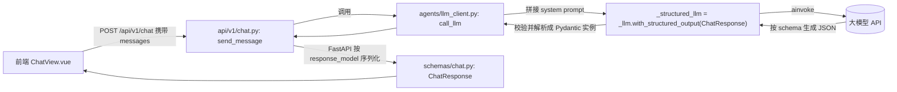
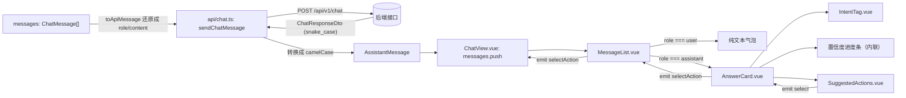

## Day 3：业务方要求 AI 按固定格式返回，前端要能展示卡片

昨天把聊天主链路跑通之后，客服团队试用了一下，很快提了一个很实际的问题，AI 回复的一段自由文本，客服看完还是得自己判断这到底是订单问题还是账号问题，这次回答靠不靠谱，要不要转给人工处理。业务方的诉求很明确，AI 的输出不能只是聊天记录里的一段话，而要能直接支撑客服的决策，所以今天要做的是把接口的返回值从纯文本升级成结构化数据，字段包括问题类型、回答内容、置信度、是否需要人工介入和建议操作，前端也要跟着新增组件，把这些字段渲染成一张信息完整的回答卡片。

### 一、后端：让 `POST /api/v1/chat` 返回结构化 JSON

后端这一块的核心变化是让模型的输出从一段文本变成一个符合固定 schema 的对象，这就要用到 LangChain 提供的结构化输出能力。按 [LangChain 官方文档](https://docs.langchain.com/oss/python/langchain/models#structured-output)的说明，`with_structured_output` 接受一个 Pydantic 模型作为 schema，默认情况下（不设置 `include_raw`）直接返回校验通过的 Pydantic 实例，不需要自己再解析一遍模型返回的原始文本，这正好省掉昨天版本里"模型返回什么就原样透传什么"的粗糙做法。

#### 1.1 设计阶段

结构化输出的核心是先把 schema 定下来，这个 schema 会在三个地方复用，作为 FastAPI 的 `response_model`、作为 `with_structured_output` 的目标类型、也作为前端约定的数据契约，所以把它放在 `schemas/chat.py` 里最合适，改名成 `ChatResponse` 之后不再是昨天那个只有一个 `reply` 字段的模型，而是包含 `intent`、`answer`、`confidence`、`need_human`、`suggested_actions` 五个字段。`agents/llm_client.py` 里的 `call_llm` 不再返回 `str`，而是返回一个 `ChatResponse` 实例，内部把原来纯聊天用的 `_llm` 包一层 `with_structured_output(ChatResponse)` 得到 `_structured_llm`，调用前额外拼一条系统提示词，告诉模型 `intent` 只能从几个固定枚举值里选、置信度该怎么打分、什么情况下应该建议转人工，这条提示词和 schema 本身的字段描述共同决定了模型输出的质量，缺一个效果都会打折扣。`api/v1/chat.py` 里的路由函数基本不用改结构，只是 `response_model` 从 `ChatResponse`（旧版）自然过渡到新版 `ChatResponse`，调用 `call_llm` 拿到的对象可以直接返回给 FastAPI 做序列化。



#### 1.2 实现阶段

先改 `backend/app/schemas/chat.py`，把 `ChatResponse` 从昨天的单字段模型换成今天需要的结构化模型。

```python
# backend/app/schemas/chat.py
from typing import Literal

from pydantic import BaseModel, Field


class ChatMessage(BaseModel):
    """单条对话消息，role 只区分用户和 AI 两种角色，系统提示词由后端在调用模型时自行拼装。"""

    role: Literal["user", "assistant"]
    content: str


class ChatRequest(BaseModel):
    """
    聊天请求消息，包含全部的消息
    """
    # 这里传的是完整历史而不是单条消息，因为后端不维护会话状态，
    # 多轮上下文靠前端把之前的消息一并带上来实现。
    messages: list[ChatMessage] = Field(min_length=1)


class ChatResponse(BaseModel):
    """
    结构化的 AI 回复。intent 决定这条回复归到哪一类问题，answer 是真正要展示给
    终端用户的文本，confidence 和 need_human 共同决定客服要不要介入，
    suggested_actions 只给客服看，不会出现在用户可见的界面上。
    """

    intent: Literal[
        "order_issue", "account_issue", "refund_request", "general_inquiry", "other"
    ] = Field(description="用户问题所属的业务类型")
    answer: str = Field(description="面向用户展示的回答内容")
    confidence: float = Field(ge=0, le=1, description="AI 对本次判断的置信度，取值范围 0 到 1")
    need_human: bool = Field(description="是否建议转人工处理")
    suggested_actions: list[str] = Field(
        default_factory=list, description="给客服的后续操作建议，不展示给终端用户"
    )
```

`intent` 用 `Literal` 罗列出全部合法取值而不是普通 `str`，这样即便模型偶尔跑偏输出了枚举之外的值，Pydantic 校验也会直接报错，能在 `call_llm` 这一层就暴露问题，而不是把脏数据一路带到前端。`suggested_actions` 用 `Field(default_factory=list)` 而不是 `= []`，因为可变对象不能直接作为字段默认值，这是 Pydantic 和 dataclass 的通用写法，避免多个实例共享同一个默认列表。

接下来是 `backend/app/agents/llm_client.py`，把昨天纯转发文本的 `call_llm` 换成基于结构化输出的版本。

```python
# backend/app/agents/llm_client.py
import os

from langchain_core.messages import AIMessage, BaseMessage, HumanMessage, SystemMessage
from langchain_openai import ChatOpenAI

from app.schemas.chat import ChatResponse

_MODEL_NAME = os.getenv("CHAT_MODEL_NAME", "deepseek-ai/DeepSeek-V4-Pro")

_llm = ChatOpenAI(
    model=_MODEL_NAME,
    api_key=os.getenv("OPENAI_API_KEY"),
    base_url=os.getenv("OPENAI_BASE_URL") or None,
)

# with_structured_output 默认（不传 include_raw）会直接返回校验通过的 ChatResponse 实例，
# 不需要自己再解析模型输出的原始文本，也不需要处理 include_raw=True 时才会出现的 {"raw", "parsed", "parsing_error"} 这种字典结构。
_structured_llm = _llm.with_structured_output(ChatResponse)

_SYSTEM_PROMPT = (
    "你是一个电商平台的智能客服助手，需要基于用户的问题给出结构化判断。"
    "intent 只能从 order_issue、account_issue、refund_request、general_inquiry、other 中选择一个，"
    "分别对应订单问题、账号问题、退款请求、一般咨询和其他情况。"
    "confidence 反映你对这次判断和回答的把握程度，如果问题描述模糊或者超出你的知识范围，应该给出较低的置信度并将 need_human 设为 true，提醒客服人员介入。"
    "suggested_actions 给出客服人员可以立刻执行的具体动作，不要给空泛的建议。"
)

_ROLE_TO_MESSAGE = {
    "user": HumanMessage,
    "assistant": AIMessage,
}


def _to_langchain_messages(messages: list[dict[str, str]]) -> list[BaseMessage]:
    """把前端传来的 role/content 字典转换成 LangChain 的消息对象列表。"""
    return [_ROLE_TO_MESSAGE[message["role"]](content=message["content"]) for message in messages]


async def call_llm(messages: list[dict[str, str]]) -> ChatResponse:
    """把消息历史转发给大模型，返回符合 ChatResponse schema 的结构化判断结果。"""
    langchain_messages = [SystemMessage(content=_SYSTEM_PROMPT), *_to_langchain_messages(messages)]
    return await _structured_llm.ainvoke(langchain_messages)
```

`_structured_llm` 在模块加载时就基于 `_llm` 包一层，不用每次调用 `call_llm` 都重新构造，这一点和昨天 `_llm` 全局复用一次的思路是一致的。系统提示词和 `ChatResponse` 里每个字段的 `description` 其实是在做同一件事，只是作用的层次不同，`description` 是给底层结构化输出机制用来生成对应 JSON Schema 的，系统提示词则是给模型的业务背景和打分标准，两者都写清楚，模型输出的稳定性会明显好于只依赖其中一种。`_to_langchain_messages` 里目前只处理 `user` 和 `assistant` 两种角色，`system` 消息是在 `call_llm` 里单独拼接的，没有让它进到这个转换函数里，是因为系统提示词是后端固定拼装的，不属于前端传上来的历史消息。

最后是路由部分，`backend/app/api/v1/chat.py` 的改动很小，因为它本来就只是把 `call_llm` 的返回值包一层返回，现在返回值本身已经是结构化对象了。

```python
# backend/app/api/v1/chat.py
from fastapi import APIRouter, HTTPException

from app.agents.llm_client import call_llm
from app.schemas.chat import ChatRequest, ChatResponse

router = APIRouter()


@router.post("/chat", response_model=ChatResponse)
async def send_message(request: ChatRequest) -> ChatResponse:
    try:
        return await call_llm([message.model_dump() for message in request.messages])
    except Exception as exc:
        # 除了昨天已有的网络、密钥、限流这些原因，结构化输出还可能因为模型没有按 schema 生成合法 JSON 而抛出校验错误，这里统一按 502 处理，后续如果要单独区分"解析失败"和"上游服务不可用"，可以在这里拆分异常类型。
        raise HTTPException(status_code=502, detail="调用大模型服务失败") from exc
```

`return await call_llm(...)` 直接返回而不再像昨天那样先接一个变量再包一层 `ChatResponse(reply=reply)`，是因为 `call_llm` 现在返回的本身就是完整的 `ChatResponse` 实例，FastAPI 会按 `response_model` 对它做序列化，中间不需要额外转换。异常分支里的注释特意提到了结构化输出可能出现的解析失败，这是今天新增的一类风险，之前纯文本转发不存在"模型输出不合法"这种问题，但结构化输出要求模型精确匹配 schema，遇到复杂或者模糊的问题时确实可能触发校验错误，目前的处理方式是先统一兜底成 502，等后面观察到真实的失败率再决定要不要针对这类错误单独重试。

### 二、前端：把结构化字段渲染成回答卡片

后端接口升级之后，前端要做的是新增几个组件，把 `intent`、`confidence`、`need_human`、`suggested_actions` 这些字段可视化出来，同时要调整消息列表的渲染逻辑，AI 的回复不再是一个纯文本气泡，而是一张信息完整的卡片。

#### 2.1 设计阶段

新增三个组件，`AnswerCard.vue` 是承载单条 AI 回复的容器，接收一个 `AssistantMessage` 对象作为 prop，内部组合 `IntentTag.vue` 展示问题类型标签、一段置信度进度条、`SuggestedActions.vue` 展示建议操作按钮，`need_human` 为 `true` 时在卡片顶部显示一条醒目提醒。`IntentTag.vue` 只负责把 `intent` 的枚举值映射成中文标签和对应的颜色，映射关系写死在组件内部，好处是以后业务方新增意图类型时只需要改这一份映射表。`SuggestedActions.vue` 接收建议操作的字符串数组，渲染成一排按钮，点击时通过 `emit` 把具体的操作文本交还给上层，它自己不关心点击之后应该发生什么，这一点和昨天 `ChatInput.vue` 只管交互不管业务的思路是一致的，真正的工具调用能力要到第 4 天才会接入，今天先把交互路径搭好。渲染消息列表的 `MessageList.vue` 需要跟着调整，用户消息还是渲染成纯文本气泡，AI 消息则换成 `AnswerCard`，为此前端的 `ChatMessage` 类型也要从"用户和 AI 共用一套 role/content 字段"，拆成 `UserMessage` 和 `AssistantMessage` 两种形状的联合类型，`api/chat.ts` 里的 `sendChatMessage` 负责把后端返回的 snake_case 字段转换成前端惯用的 camelCase，并在发请求前把历史消息里的 `AssistantMessage` 还原成一段纯文本，因为后端目前只关心对话历史里说过什么，不关心当时判断出的意图和置信度。



#### 2.2 实现阶段

先改 `frontend/src/api/chat.ts`，把消息类型拆成用户和 AI 两种形状，并调整 `sendChatMessage` 的输入输出。

```typescript
// frontend/src/api/chat.ts
import http from './http'

export type Intent = 'order_issue' | 'account_issue' | 'refund_request' | 'general_inquiry' | 'other'

export interface UserMessage {
  role: 'user'
  content: string
}

export interface AssistantMessage {
  role: 'assistant'
  intent: Intent
  answer: string
  confidence: number
  needHuman: boolean
  suggestedActions: string[]
}

export type ChatMessage = UserMessage | AssistantMessage

interface ChatResponseDto {
  intent: Intent
  answer: string
  confidence: number
  need_human: boolean
  suggested_actions: string[]
}

// 发给后端的历史消息里，AI 消息只需要还原成一段文本，后端目前只有 content 字段拼接对话上下文。不关心当时判断出的 intent 和置信度这些衍生字段
function toApiMessage(message: ChatMessage): { role: 'user' | 'assistant'; content: string } {
  if (message.role === 'user') {
    return { role: 'user', content: message.content }
  }
  return { role: 'assistant', content: message.answer }
}

export async function sendChatMessage(history: ChatMessage[]): Promise<AssistantMessage> {
  const payload = { messages: history.map(toApiMessage) }
  const { data } = await http.post<ChatResponseDto>('/chat', payload)
  return {
    role: 'assistant',
    intent: data.intent,
    answer: data.answer,
    confidence: data.confidence,
    needHuman: data.need_human,
    suggestedActions: data.suggested_actions,
  }
}
```

`ChatMessage` 从昨天单一形状的接口变成 `UserMessage | AssistantMessage` 的联合类型，是因为两种消息现在携带的字段完全不同，用一个可选字段堆出来的形状会让组件里到处出现 `message.intent ?? ''` 这类防御性代码，拆成联合类型之后配合 `message.role === 'user'` 的判断，TypeScript 能在对应分支里精确收窄类型，`message.answer`、`message.confidence` 这些字段不用担心是 `undefined`。`ChatResponseDto` 单独定义是因为它对应的是后端原始返回的 JSON 结构，字段名是 snake_case，`sendChatMessage` 里做的转换把这层命名差异挡在这个文件内部，组件代码只需要面对 camelCase 的 `AssistantMessage`。

然后是 `IntentTag.vue`，负责把意图枚举值渲染成带颜色的标签。

```vue
<!-- frontend/src/components/chat/IntentTag.vue -->
<script setup lang="ts">
import { computed } from 'vue'
import type { Intent } from '../../api/chat'

const props = defineProps<{
  intent: Intent
}>()

// 意图到展示文案、颜色的映射谢斯在组件里，后面业务放扩充意图类型时只需要再这一份映射里加一条，不用改调用方的代码
const INTENT_META: Record<Intent, { label: string; color: string }> = {
  order_issue: { label: '订单问题', color: '#2563eb' },
  account_issue: { label: '账号问题', color: '#9333ea' },
  refund_request: { label: '退款请求', color: '#dc2626' },
  general_inquiry: { label: '一般咨询', color: '#059669' },
  other: { label: '其他', color: '#6b7280' },
}

const meta = computed(() => INTENT_META[props.intent])
</script>

<template>
  <span class="intent-tag" :style="{ backgroundColor: meta.color }">{{ meta.label }}</span>
</template>

<style scoped>
.intent-tag {
  display: inline-block;
  padding: 2px 10px;
  border-radius: 999px;
  font-size: 12px;
  color: #fff;
}
</style>
```

`INTENT_META` 用 `Record<Intent, ...>` 而不是普通对象类型，好处是如果后端 schema 新增了一个意图值而这里忘了补映射，TypeScript 编译期就会报缺少属性的错误，不会等到运行时才发现某个意图渲染不出标签。

接着是 `SuggestedActions.vue`，把建议操作渲染成按钮组。

```vue
<!-- frontend/src/components/chat/SuggestedActions.vue -->
<script setup lang="ts">
defineProps<{
  actions: string[]
}>()

const emit = defineEmits<{
  select: [action: string]
}>()
</script>

<template>
  <div v-if="actions.length" class="suggested-actions">
    <span class="label">建议操作</span>
    <button
      v-for="action in actions"
      :key="action"
      class="action-button"
      @click="emit('select', action)"
    >
      {{ action }}
    </button>
  </div>
</template>

<style scoped>
.suggested-actions {
  margin-top: 8px;
  display: flex;
  flex-wrap: wrap;
  align-items: center;
  gap: 8px;
}

.label {
  font-size: 12px;
  color: #6b7280;
}

.action-button {
  padding: 4px 10px;
  border: 1px solid #d1d5db;
  border-radius: 6px;
  background-color: #fff;
  font-size: 12px;
  cursor: pointer;
}

.action-button:hover {
  border-color: #2563eb;
  color: #2563eb;
}
</style>
```

`v-if="actions.length"` 挡住了空数组的情况，避免出现一个只有"建议操作"四个字、下面没有任何按钮的空壳。按钮的 `key` 用 `action` 字符串本身而不是下标，因为建议操作数组不涉及后续的增删排序，用内容本身做 key 更直接。

再写 `AnswerCard.vue`，把前面两个组件和置信度进度条组合起来。

```vue
<!-- frontend/src/components/chat/AnswerCard.vue -->
<script setup lang="ts">
import type { AssistantMessage } from '../../api/chat'
import IntentTag from './IntentTag.vue'
import SuggestedActions from './SuggestedActions.vue'

defineProps<{
  message: AssistantMessage
}>()

const emit = defineEmits<{
  selectAction: [action: string]
}>()
</script>

<template>
  <div class="answer-card">
    <div class="answer-header">
      <IntentTag :intent="message.intent" />
      <span v-if="message.needHuman" class="human-alert">建议转人工</span>
    </div>
    <p class="answer-text">{{ message.answer }}</p>
    <div class="confidence-row">
      <span class="confidence-label">置信度 {{ Math.round(message.confidence * 100) }}%</span>
      <div class="confidence-bar">
          <div
              class="confidence-fill"
              :class="{ low: message.confidence < 0.6 }"
              :style="{ width: `${message.confidence * 100}%` }"
          />
      </div>
    </div>
    <SuggestedActions :actions="message.suggestedActions" @select="emit('selectAction', $event)" />
  </div>
</template>

<style scoped>
.answer-card {
  max-width: 70%;
  padding: 12px 14px;
  border-radius: 8px;
  background-color: #f1f5f9;
}

.answer-header {
  display: flex;
  align-items: center;
  gap: 8px;
  margin-bottom: 6px;
}

.human-alert {
  font-size: 12px;
  color: #dc2626;
  font-weight: 600;
}

.answer-text {
  margin: 0 0 8px;
  white-space: pre-wrap;
  word-break: break-word;
  color: #1f2937;
}

.confidence-row {
  display: flex;
  align-items: center;
  gap: 8px;
}

.confidence-label {
  font-size: 12px;
  color: #6b7280;
  white-space: nowrap;
}

.confidence-bar {
  flex: 1;
  height: 6px;
  border-radius: 999px;
  background-color: #e5e7eb;
  overflow: hidden;
}

.confidence-fill {
  height: 100%;
  background-color: #2563eb;
  transition: width 0.2s ease;
}

.confidence-fill.low {
  background-color: #f59e0b;
}
</style>
```

置信度进度条没有拆成独立组件，因为它只是几行样式加一个宽度绑定，拆出去反而会让 `AnswerCard` 需要多传几个 prop，不如直接内联。`confidence-fill.low` 这个类名在置信度低于 0.6 时把进度条颜色从蓝色换成橙色，这个阈值和 `need_human` 是两回事，`need_human` 是模型自己判断要不要转人工，进度条变色只是给客服一个视觉上的提醒，即便模型没有勾选转人工，客服看到橙色也会多留意一下这条回复。`AnswerCard` 自己不处理建议操作被点击之后的业务逻辑，只是把 `SuggestedActions` 抛出来的事件继续往上 `emit`，这个转发链条会一直传到 `ChatView.vue`。

接下来改 `MessageList.vue`，让 AI 消息改用 `AnswerCard` 渲染。

```vue
<!-- frontend/src/components/chat/MessageList.vue -->
<script setup lang="ts">
import { nextTick, ref, watch } from 'vue'
import type { ChatMessage } from '../../api/chat'
import AnswerCard from './AnswerCard.vue'

const props = defineProps<{
  messages: ChatMessage[]
}>()

const emit = defineEmits<{
  selectAction: [action: string]
}>()

const listRef = ref<HTMLDivElement | null>(null)

watch(
  () => props.messages.length,
  async () => {
    await nextTick()
    if (listRef.value) {
      listRef.value.scrollTop = listRef.value.scrollHeight
    }
  },
)
</script>

<template>
  <div ref="listRef" class="message-list">
    <div
      v-for="(message, index) in props.messages"
      :key="index"
      class="message-item"
      :class="message.role"
    >
      <div v-if="message.role === 'user'" class="message-bubble">{{ message.content }}</div>
      <AnswerCard v-else :message="message" @select-action="emit('selectAction', $event)" />
    </div>
  </div>
</template>

<style scoped>
.message-list {
  flex: 1;
  overflow-y: auto;
  padding: 16px;
}

.message-item {
  display: flex;
  margin-bottom: 12px;
}

.message-item.user {
  justify-content: flex-end;
}

.message-item.assistant {
  justify-content: flex-start;
}

.message-bubble {
  max-width: 70%;
  padding: 10px 14px;
  border-radius: 8px;
  white-space: pre-wrap;
  word-break: break-word;
  background-color: #2563eb;
  color: #fff;
}
</style>
```

`v-if="message.role === 'user'"` 这个判断除了控制渲染分支，也让 Vue 的模板类型推导知道进入 `AnswerCard` 分支时 `message` 已经收窄成 `AssistantMessage`，`:message="message"` 才能通过类型检查。AI 消息不再需要 `.message-bubble` 的背景色样式，这部分视觉呈现已经交给 `AnswerCard` 自己的 `.answer-card` 类处理，昨天写在这里的蓝色气泡样式现在只用于用户消息。

最后调整 `ChatView.vue`，接住 `AssistantMessage` 并处理建议操作的点击事件。

```vue
<!-- frontend/src/views/ChatView.vue -->
<script setup lang="ts">
import { ref } from 'vue'
import { sendChatMessage, type ChatMessage } from '../api/chat'
import MessageList from '../components/chat/MessageList.vue'
import ChatInput from '../components/chat/ChatInput.vue'

const messages = ref<ChatMessage[]>([])
const loading = ref(false)
const errorMessage = ref('')

async function handleSend(text: string) {
  errorMessage.value = ''
  messages.value.push({ role: 'user', content: text })
  loading.value = true

  try {
    const assistantMessage = await sendChatMessage(messages.value)
    messages.value.push(assistantMessage)
  } catch (error) {
    errorMessage.value = error instanceof Error ? error.message : '发送失败，请稍后重试'
  } finally {
    loading.value = false
  }
}

function handleSelectAction(action: string) {
  // 真正触发工具调用是第 4 天要接入的能力，今天先用弹窗占位，
  // 把交互路径提前搭好，后面只需要替换这个函数的实现。
  window.alert(`已记录建议操作：${action}，工具调用能力将在后续接入`)
}
</script>

<template>
  <div class="chat-view">
    <aside class="session-sidebar">
      <div class="session-item active">默认会话</div>
    </aside>
    <section class="chat-main">
      <MessageList :messages="messages" @select-action="handleSelectAction" />
      <p v-if="errorMessage" class="error-tip">{{ errorMessage }}</p>
      <ChatInput :loading="loading" @send="handleSend" />
    </section>
  </div>
</template>

<style scoped>
.chat-view{
    display: flex;
    height: 100vh;
}
.session-sidebar{
    width: 220px;
    border-right: 1px solid #e5e7eb;
    padding: 16px;
}
.session-item{
    padding: 8px 12px;
    border-radius: 6px;
}
.session-item.active{
    background-color: #eff6ff;
    color: #2563eb;
}
.chat-main{
    display: flex;
    flex-direction: column;
    flex: 1;
}
.error-tip{
    margin: 0 16px 8px;
    color: #dc2626;
    font-size: 13px;
}
</style>
```

`handleSend` 里 `sendChatMessage` 的返回值现在直接就是 `AssistantMessage`，`push` 进 `messages` 之后 `MessageList` 会自动识别出 `role === 'assistant'` 并交给 `AnswerCard` 渲染，`ChatView` 不需要关心内部字段是怎么展示的。`handleSelectAction` 目前只是弹一个提示框，这是有意留的占位实现，第 4 天接入工具调用之后，这个函数会换成真正发起查询请求的逻辑，今天先确保从按钮点击到 `ChatView` 收到事件这条链路是通的。

### 三、本篇产出清单

| 文件 | 主要内容 | 实现的功能 |
| --- | --- | --- |
| `backend/app/schemas/chat.py` | 修改，`ChatResponse` 换成含 `intent`、`answer`、`confidence`、`need_human`、`suggested_actions` 的结构化模型 | 定义结构化回复的数据契约 |
| `backend/app/agents/llm_client.py` | 修改，`call_llm` 改为基于 `with_structured_output(ChatResponse)` 返回结构化对象 | 让模型输出稳定符合业务约定的 JSON 结构 |
| `backend/app/api/v1/chat.py` | 修改，路由直接返回 `call_llm` 得到的 `ChatResponse` | 让接口按新的 `response_model` 序列化结构化回复 |
| `frontend/src/api/chat.ts` | 修改，新增 `Intent`、`UserMessage`、`AssistantMessage` 类型和 `toApiMessage` 转换逻辑 | 对齐后端结构化字段，处理 snake_case 到 camelCase 的转换 |
| `frontend/src/components/chat/IntentTag.vue` | 新增 | 把意图枚举值渲染成带颜色的标签 |
| `frontend/src/components/chat/SuggestedActions.vue` | 新增 | 把建议操作渲染成按钮组，点击后向上抛出事件 |
| `frontend/src/components/chat/AnswerCard.vue` | 新增 | 组合意图标签、回答文本、置信度进度条、建议操作和人工介入提醒 |
| `frontend/src/components/chat/MessageList.vue` | 修改，AI 消息改用 `AnswerCard` 渲染 | 区分用户纯文本气泡和 AI 结构化卡片两种展示方式 |
| `frontend/src/views/ChatView.vue` | 修改，新增 `handleSelectAction` | 承接 `AssistantMessage` 并处理建议操作按钮的点击事件 |

跟着写完这些改动后，本地重启前后端服务，在聊天页面提问一个订单相关的问题，应该能看到 AI 的回复变成了一张带意图标签、置信度进度条和建议操作按钮的卡片，如果模型判断需要转人工，卡片顶部还会出现醒目提示。

### 四、总结

今天把 AI 的输出从一段自由文本升级成了业务方真正需要的结构化数据，后端的关键改动是用 LangChain 的 `with_structured_output` 把 `ChatOpenAI` 包了一层，配合 Pydantic 的 `ChatResponse` schema 和一条说明打分标准的系统提示词，让模型稳定输出符合约定的意图分类、置信度和建议操作，而不是靠后端自己写正则去解析模型可能随意组织的文本。前端把 AI 消息的展示方式从纯文本气泡换成了 `AnswerCard`，`IntentTag` 和 `SuggestedActions` 保持了昨天定下的组件职责划分习惯，只管展示和交互，不掺杂业务逻辑，这让今天新增的三个组件可以直接复用到后面几天的功能里，不需要推倒重来。

今天遗留的问题同样清楚，`suggested_actions` 目前只是文本建议，点击按钮后除了弹一个提示框什么都不会发生，AI 也还不具备真正查询业务系统的能力，置信度和是否转人工完全依赖模型自己的判断，还没有引入任何可验证的业务规则做交叉校验。明天要做的是让 AI 从"只会说"进化到"能动手"，接入订单查询这类外部工具，当用户问题涉及具体订单时，AI 能主动调用工具拿到真实数据，而不是仅凭语言模型的知识给出一个可能不准确的回答。