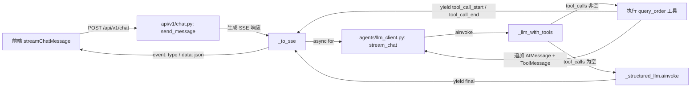
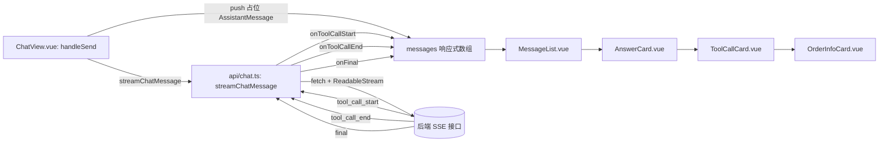

## Day 4：AI 不能只聊天，还要能查订单

昨天把回答变成结构化卡片之后，客服团队的反馈很快又更进了一步，用户问“帮我查一下订单 202606050001 为什么还没发货”，AI 只能凭对话历史里的只言片语猜一个答案，猜不对客服还得自己去后台查一遍订单系统，这就完全没有省下人力。业务方要的不是一个更好看的猜测，而是 AI 真的去查一下订单系统再回答，所以今天要做的是给 Agent 接入第一个工具，让它在判断出用户在问订单状态时自动调用查询接口拿到真实数据，再基于这份数据组织回答。这一步还牵出一个绕不开的问题，工具调用往往要经过好几轮模型推理才能收敛，如果像前几天一样等模型把话全说完再一次性返回，用户中间会盯着一个空白的对话框等上好几秒，所以今天顺带把接口从一次性响应换成流式接口，让“正在调用工具”“工具已返回”“最终结论”这几个阶段实时推送到前端，用户能看着 AI 一步步把事情做完，而不是干等一个结果。

### 一、后端：让 Agent 具备工具调用能力，并以流式接口返回执行过程

后端今天要解决两件相互关联的事情，一是让模型能够识别出“这是一个订单问题”并调用查询工具拿到真实数据，二是把这个可能要来回好几轮的过程用流式接口实时推送出去，而不是攒到最后一起返回。这两件事拆开看分别不难，但组合在一起时有一个容易踩的坑，LangChain 的结构化输出和工具绑定不能作用在同一个模型实例上，这一点在设计阶段就要想清楚，不然实现到一半会发现两种能力互相打架。

#### 1.1 设计阶段

先看数据结构，订单查询要返回什么字段属于业务约定，所以单独放进 `schemas/order.py`，定义一个 `OrderInfo`，包含订单号、订单状态、支付状态、物流状态四个字段，状态字段都用 `Literal` 限定取值范围，理由和 Day 3 里 `intent` 用 `Literal` 一样，把非法值挡在校验层而不是让脏数据流到前端。真正执行查询的逻辑放进新增的 `tools/order_tool.py`，用 LangChain 的 `@tool` 装饰器把一个普通函数 `query_order` 包装成模型可以识别和调用的工具，装饰器会读取函数的类型注解和 docstring， 自动生成工具的 JSON Schema。所以 docstring 里必须把“订单号是什么格式”写清楚，模型就是根据这段说明来判断什么时候该调用这个工具、调用时该传什么参数。

工具准备好之后是今天最关键的设计决定，`agents/llm_client.py` 里要同时具备“判断要不要调用工具”和“把最终答案整理成固定 schema”这两种能力，但 LangChain 官方文档在结构化输出一节明确提示过，一个已经调用过 `bind_tools` 的模型实例不再支持叠加 `with_structured_output`，所以这里不能像 Day 3 那样只维护一个 `_structured_llm`，而是要分别准备 `_llm_with_tools`（绑定了 `query_order` 的模型，负责判断和发起工具调用）和 `_structured_llm`（不绑定任何工具，只在拿到足够信息后把自然语言整理成 `ChatResponse`）。原来的 `call_llm` 也要跟着换个写法，改成一个异步生成器 `stream_chat`，内部用一个 `while` 循环反复调用 `_llm_with_tools`，只要模型返回的 `tool_calls` 不为空就执行对应工具、把结果重新喂回对话历史，直到模型不再要求调用工具或者达到最大轮数上限，跳出循环后再用 `_structured_llm` 生成最终回答。循环过程中每执行完一次工具调用，就把这次调用的名称、参数、结果作为一个事件 `yield` 出去，路由层再把这些事件逐个包装成 SSE 格式推送给前端，值得说明的是最终返回给前端的 `tool_calls` 列表是由这段循环代码在执行完工具后自己拼出来的，不依赖模型在最后一句话里复述“我刚才查了订单 xxx”，这样即使模型的表达不稳定，工具调用记录本身也是准确的。



#### 1.2 实现阶段

先落地订单数据结构，写在新增的 `backend/app/schemas/order.py` 里。

```python
# backend/app/schemas/order.py
from typing import Literal

from pydantic import BaseModel, Field


class OrderInfo(BaseModel):
    """订单查询结果，字段覆盖发货、支付、物流三个客服最关心的维度。"""

    order_no: str = Field(description="订单号")
    status: Literal["待发货", "已发货", "已完成", "已取消"] = Field(description="订单当前状态")
    pay_status: Literal["已支付", "未支付"] = Field(description="支付状态")
    logistics_status: Literal["未出库", "已出库", "已签收"] = Field(description="物流状态")
```

接着是订单查询工具本身，写在新增的 `backend/app/tools/order_tool.py` 里。

```python
# backend/app/tools/order_tool.py
from langchain_core.tools import tool

from app.schemas.order import OrderInfo

# 模拟订单数据源，真实项目里这里会换成调用订单系统的 RPC 或者查数据库，
# 今天先用一份内存字典把工具调用的链路跑通。
_MOCK_ORDERS: dict[str, OrderInfo] = {
    "202606050001": OrderInfo(
        order_no="202606050001",
        status="待发货",
        pay_status="已支付",
        logistics_status="未出库",
    ),
    "202606050002": OrderInfo(
        order_no="202606050002",
        status="已发货",
        pay_status="已支付",
        logistics_status="已出库",
    ),
}


@tool
def query_order(order_no: str) -> dict:
    """根据订单号查询订单的发货状态、支付状态和物流状态，订单号是形如 202606050001 的字符串。"""
    order = _MOCK_ORDERS.get(order_no)
    if order is None:
        # 订单不存在时不抛出异常，而是返回一个带 error 字段的普通 dict，让模型能在最终回答里直接告诉用户没查到这个订单。
        # 如果这里抛异常，反而需要在 stream_chat 里额外区分这类业务性的“查无结果” 和真正的网络、序列化异常，没有必要让两种情况混在一起。
        return {"error": f"未找到订单 {order_no}，请确认订单号是否正确。"}
    return order.model_dump()
```

`query_order` 的 docstring 不是写给人看的注释，而是模型判断该不该调用这个工具、以及该怎么组织回答的重要依据，装饰器 `@tool` 会把函数签名和 docstring 一起转换成工具的 JSON Schema 发给模型，描述里特意写明订单号的格式样例，是因为模型有时会把用户话里的其他数字误当成订单号传进来，一段具体的格式说明能明显降低这种误判概率。

然后是 `backend/app/schemas/chat.py`，在 Day 3 的结构化模型基础上新增工具调用记录的字段。

```python
# backend/app/schemas/chat.py
from typing import Literal

from pydantic import BaseModel, Field


class ChatMessage(BaseModel):
    """单条对话消息，role 只区分用户和 AI 两种角色，系统提示词由后端在调用模型时自行拼装。"""

    role: Literal["user", "assistant"]
    content: str


class ChatRequest(BaseModel):
    """
    聊天请求消息，包含全部的消息
    """
    # 这里传的是完整历史而不是单条消息，因为后端不维护会话状态，
    # 多轮上下文靠前端把之前的消息一并带上来实现。
    messages: list[ChatMessage] = Field(min_length=1)


class ToolCallResult(BaseModel):
    """一次工具调用的完整记录，args 和 result 都是原始 dict，方便前端直接渲染成卡片。"""

    name: str = Field(description="被调用的工具名")
    args: dict = Field(description="调用工具时传入的参数")
    result: dict = Field(description="工具返回的结果")


class ChatResponse(BaseModel):
    """
    结构化的 AI 回复。intent 决定这条回复归到哪一类问题，answer 是真正要展示给
    终端用户的文本，confidence 和 need_human 共同决定客服要不要介入，
    suggested_actions 只给客服看，不会出现在用户可见的界面上，
    tool_calls 记录这轮对话里实际发生过的工具调用，由后端在执行完工具后拼装，
    不依赖模型在最终回答里复述调用细节。
    """

    intent: Literal[
        "order_issue", "account_issue", "refund_request", "general_inquiry", "other"
    ] = Field(description="用户问题所属的业务类型")
    answer: str = Field(description="面向用户展示的回答内容")
    confidence: float = Field(ge=0, le=1, description="AI 对本次判断的置信度，取值范围 0 到 1")
    need_human: bool = Field(description="是否建议转人工处理")
    suggested_actions: list[str] = Field(
        default_factory=list, description="给客服的后续操作建议，不展示给终端用户"
    )
    tool_calls: list[ToolCallResult] = Field(
        default_factory=list, description="本轮对话实际发生的工具调用记录"
    )
```

`ToolCallResult` 里的 `args` 和 `result` 都用了普通的 `dict` 而不是针对每个工具单独定义一套嵌套模型，这是有意简化的地方，今天只有一个 `query_order` 工具，等第 5 天接入更多工具之后，如果每种工具的参数和结果都要单独校验，再考虑按工具名建立一套联合类型也不迟，现在过早地为多态工具设计通用 schema 反而会增加不必要的复杂度。

核心改动在 `backend/app/agents/llm_client.py`，把昨天单次调用的 `call_llm` 换成支持多轮工具调用的流式版本。

```python
# backend/app/agents/llm_client.py
import json
import os
from typing import AsyncGenerator

from langchain_core.messages import AIMessage, BaseMessage, HumanMessage, SystemMessage, ToolMessage
from langchain_openai import ChatOpenAI

from app.schemas.chat import ChatResponse, ToolCallResult
from app.tools.order_tool import query_order

_MODEL_NAME = os.getenv("CHAT_MODEL_NAME", "deepseek-ai/DeepSeek-V4-Pro")

# ChatOpenAI 在模块加载时实例化一次并全局复用，FastAPI 的路由函数是 async def，
# ChatOpenAI 的 ainvoke 走的是异步调用，不会阻塞事件循环。
_llm = ChatOpenAI(
    model=_MODEL_NAME,
    api_key=os.getenv("OPENAI_API_KEY"),
    # 如果公司内部走的是私有部署或者国内厂商提供的兼容接口，改这里的 base_url 即可，
    # 不用改调用逻辑，这也是选择 OpenAI 协议兼容接口的原因，LangChain 的 ChatOpenAI 本身就是按这个给协议对接的，换厂商基本上不用碰代码
    base_url=os.getenv("OPENAI_BASE_URL") or None
)

# 结构化输出和工具调用不能共用同一个绑定后的模型实例，LangChain 官方文档在结构化输出一节特别提示过，预先 bind_tools 之后的模型不再支持叠加 with_structured_output，所以这里准备两个各司其职的模型实例，_llm_with_tools 只负责判断要不要调用工具、调用哪个工具，_structured_llm 只在拿到足够信息之后把自然语言整理成规定的 schema。
_TOOLS = [query_order]
_llm_with_tools = _llm.bind_tools(_TOOLS)
# with_structured_output 默认（不传 include_raw）会直接返回校验通过的 ChatResponse 实例不需要自己再解析模型输出的原始文本，也不需要处理 include_raw=True 时才会出现的 {"raw","parsed","parsing_error"} 这种字典结构
_structured_llm = _llm.with_structured_output(ChatResponse)
_TOOLS_BY_NAME = {t.name: t for t in _TOOLS}

# 防止模型陷入反复调用工具却始终不给出最终答案的死循环，三轮对绝大多数客服场景足够，真的触发上限说明模型没有在合理的步数内收敛，这时候直接跳出循环走最终结构化回答，比无限等待要安全的多
_MAX_TOOL_ITERATIONS = 3

_SYSTEM_PROMPT = (
    "你是一个电商平台的智能客服助手，需要基于用户的问题给出结构化判断。"
    "intent 只能从 order_issue、account_issue、refund_request、general_inquiry、other 中选择一个，"
    "分别对应订单问题、账号问题、退款请求、一般咨询和其他情况。"
    "如果用户的问题涉及具体订单号的发货、支付或物流状态，你可以调用 query_order 工具查询真实数据，"
    "再基于查询结果组织回答，不要凭空编造订单状态。"
    "confidence 反映你对这次判断和回答的把握程度，如果问题描述模糊或者超出你的知识范围，应该给出较低的置信度并将 need_human 设为 true，提醒客服人员介入。"
    "suggested_actions 给出客服人员可以立刻执行的具体动作，不要给空泛的建议。"
)

_ROLE_TO_MESSAGE = {
    "user": HumanMessage,
    "assistant": AIMessage,
}


def _to_langchain_messages(messages: list[dict[str, str]]) -> list[BaseMessage]:
    """把前端传来的 role/content 字典转换成 LangChain 的消息对象列表。"""
    return [_ROLE_TO_MESSAGE[message["role"]](content=message["content"]) for message in messages]


async def stream_chat(messages: list[dict[str, str]]) -> AsyncGenerator[dict, None]:
    """
    驱动一次可能包含多轮工具调用的对话，以事件流的形式产出中间过程和最终结果。
    产出的事件有三类：
        - tool_call_start：表示即将执行某个工具调用
        - tool_call_end：表示这次调用已经拿到结果
        - final：表示整轮对话结束后的结构化回答，调用方案事件类型转发即可，不需要关心中间循环了几轮
    """
    history: list[BaseMessage] = [SystemMessage(content=_SYSTEM_PROMPT), *_to_langchain_messages(messages)]
    collected_tool_calls: list[ToolCallResult] = []

    try:
        for _ in range(_MAX_TOOL_ITERATIONS):
            ai_message = await _llm_with_tools.ainvoke(history)

            if not ai_message.tool_calls:
                # 模型这一轮没有请求任何工具，说明它认为已经掌握了足够信息，
                # 直接跳出循环进入最终的结构化输出。
                break

            history.append(ai_message)

            for tool_call in ai_message.tool_calls:
                tool_name = tool_call["name"]
                tool_args = tool_call["args"]
                yield {"type": "tool_call_start", "name": tool_name, "args": tool_args}

                tool = _TOOLS_BY_NAME.get(tool_name)
                tool_result = await tool.ainvoke(tool_args)

                yield {"type": "tool_call_end", "name": tool_name, "result": tool_result}
                collected_tool_calls.append(
                    ToolCallResult(name=tool_name, args=tool_args, result=tool_result)
                )
                # ToolMessage 必须带上对应的 tool_call_id，模型才能把这条结果和他发起的那次调用对上号，尤其在一轮里并行调用多个工具时这一点不能省。
                history.append(
                    ToolMessage(content=json.dumps(tool_result, ensure_ascii=False), tool_call_id=tool_call["id"])
                )
        else:
            # for...else 在循环耗尽 _MAX_TOOL_ITERATIONS 次数、始终没有触发 break 时执行，
            # 说明模型一直在反复调用工具没有收敛，这里追加一条系统提示，
            # 逼着接下来的结构化输出必须直接给出结论。
            history.append(SystemMessage(content="已达到最大工具调用次数，请基于目前已有的信息直接给出结论。"))

        final_response: ChatResponse = await _structured_llm.ainvoke(history)
        final_response.tool_calls = collected_tool_calls
        yield {"type": "final", "data": final_response.model_dump()}
    except Exception as exc:
        # 流已经开始推送之后不能再抛出 HTTPException 让FastAPI 转换成标准错误响应，响应头和部分事件很可能已经发给前端了，只能通过一个 error 事件通知调用方，由前端决定怎么在界面上呈现这次失败。
        yield {"type": "error", "message": str(exc)}
```

这段代码里最容易被忽略的细节是 `history.append(ai_message)` 必须发生在处理它携带的 `tool_calls` 之前，因为紧接着要追加的每一条 `ToolMessage` 都要通过 `tool_call_id` 和这条 `ai_message` 里的某个 `tool_call` 对应起来，顺序反了模型会因为在历史里找不到对应的调用记录而报错。`final_response.tool_calls = collected_tool_calls` 这一行是今天设计上的核心取舍，`_structured_llm.ainvoke` 生成的 `ChatResponse` 本身不会填 `tool_calls` 这个字段，因为提示词里根本没要求模型复述工具调用细节，这些记录完全由前面的循环代码在执行工具时同步收集，最后直接赋值覆盖，这样即使模型的 `answer` 字段里对工具调用只字未提，卡片上的工具调用记录依然是准确完整的。

最后是路由部分，`backend/app/api/v1/chat.py` 要从返回一次性 JSON 换成返回 SSE 流。

```python
# backend/app/api/v1/chat.py
import json

from fastapi import APIRouter
from fastapi.responses import StreamingResponse

from app.agents.llm_client import stream_chat
from app.schemas.chat import ChatRequest

router = APIRouter()


async def _to_sse(messages: list[dict[str, str]]):
    """把 stream_chat 产出的事件字典逐个格式化成 SSE 要求的 event/data 文本块。"""
    async for event in stream_chat(messages):
        event_type = event["type"]
        yield f"event: {event_type}\ndata: {json.dumps(event, ensure_ascii=False)}\n\n"


@router.post("/chat")
async def send_message(request: ChatRequest) -> StreamingResponse:
    payload = [message.model_dump() for message in request.messages]
    return StreamingResponse(_to_sse(payload), media_type="text/event-stream")
```

请求体的校验完全没有变化，`ChatRequest` 依然会在进入这个函数之前由 FastAPI 完成，参数不合法时照样返回 422，变化只发生在响应这一侧，`response_model` 和昨天那种直接返回 `ChatResponse` 实例的写法在这里不再适用，因为响应体不再是一次性的 JSON，而是一段持续输出的事件流，`media_type="text/event-stream"` 是 SSE 协议要求的标准 MIME 类型，浏览器和大部分 HTTP 客户端看到这个类型才会按事件流的方式处理响应而不是等待整个 body 读完。

### 二、前端：用 SSE 展示工具调用过程和订单卡片

后端接口变成流式之后，前端要跟着解决两个问题，一是怎么把这段 SSE 响应解析出来，二是解析出来的事件怎么实时反映到界面上，尤其是工具调用过程要有专门的卡片展示，而不是和最终回答混在一起。

#### 2.1 设计阶段

原生的 `EventSource` 是浏览器提供的解析 SSE 的标准方式，但它只支持发起 GET 请求，没有办法在建立连接时带上完整的对话历史作为请求体，今天的接口偏偏需要 POST 一段 JSON，所以只能退而求其次，用 `fetch` 拿到响应的 `ReadableStream`，自己按 SSE 的格式解析出一个个事件，这部分逻辑放进 `api/chat.ts` 新增的 `streamChatMessage` 函数里，对外暴露的形式是传入历史消息和一组回调函数，内部处理完解析细节之后分别触发 `onToolCallStart`、`onToolCallEnd`、`onFinal`、`onError` 四个回调，调用方不需要关心 SSE 的文本格式长什么样。为了让消息类型能装下工具调用过程中的中间状态，`AssistantMessage` 要新增 `toolCalls` 和 `pending` 两个字段，`pending` 为真时代表这条消息还在流式生成过程中，界面要展示占位提示而不是空白的意图标签和置信度。

组件层面新增两个，`ToolCallCard.vue` 负责展示单次工具调用的状态，调用中和调用完成是两种不同的展示内容，调用完成且工具名是 `query_order` 时内嵌 `OrderInfoCard.vue` 展示订单详情，`OrderInfoCard.vue` 只负责把订单字段渲染成一张信息卡片，不关心这份数据是怎么来的。`AnswerCard.vue` 要在原有的意图标签和回答文本之间插入工具调用记录的展示区，`ChatView.vue` 里的 `handleSend` 需要改造成先往消息列表里推入一条 `pending` 状态的占位消息，再调用 `streamChatMessage`，通过回调把工具调用的开始、结束和最终结果依次应用到这条占位消息上，整个过程消息列表里的这一条记录始终是同一个对象引用，界面看到的效果是它从“AI 正在思考”逐渐补全出工具调用卡片、意图标签、回答内容和置信度进度条。



#### 2.2 实现阶段

先改 `frontend/src/api/chat.ts`，加上工具调用相关的类型和解析 SSE 的 `streamChatMessage`。

```typescript
// frontend/src/api/chat.ts
export type Intent = 'order_issue' | 'account_issue' | 'refund_request' | 'general_inquiry' | 'other'

export interface UserMessage {
  role: 'user'
  content: string
}

export interface ToolCall {
  name: string
  args: Record<string, unknown>
  result?: Record<string, unknown>
  status: 'calling' | 'done'
}

export interface AssistantMessage {
  role: 'assistant'
  intent: Intent
  answer: string
  confidence: number
  needHuman: boolean
  suggestedActions: string[]
  toolCalls: ToolCall[]
  pending?: boolean
}

export type ChatMessage = UserMessage | AssistantMessage

interface ChatResponseDto {
  intent: Intent
  answer: string
  confidence: number
  need_human: boolean
  suggested_actions: string[]
  tool_calls: { name: string; args: Record<string, unknown>; result: Record<string, unknown> }[]
}

// 发给后端的历史消息里，AI 消息只需要还原成一段文本，后端目前只有 content 字段拼接对话上下文。不关心当时判断出的 intent 和置信度这些衍生字段
function toApiMessage(message: ChatMessage): { role: 'user' | 'assistant'; content: string } {
  if (message.role === 'user') {
    return { role: 'user', content: message.content }
  }
  return { role: 'assistant', content: message.answer }
}

interface StreamHandlers {
  onToolCallStart: (name: string, args: Record<string, unknown>) => void
  onToolCallEnd: (name: string, args: Record<string, unknown>, result: Record<string, unknown>) => void
  onFinal: (message: AssistantMessage) => void
  onError: (message: string) => void
}

// 原生 EventSource 只能发 GET 请求，没法带上完整的对话历史作为请求体，
// 这里改用 fetch 拿到 ReadableStream 自己解析 SSE 格式，本质上和 EventSource
// 做的事情一样，只是把发起请求和解析事件流这两件事都自己接管。
export async function streamChatMessage(history: ChatMessage[], handlers: StreamHandlers): Promise<void> {
  const payload = { messages: history.map(toApiMessage) }
  const response = await fetch('/api/v1/chat', {
    method: 'POST',
    headers: { 'Content-Type': 'application/json' },
    body: JSON.stringify(payload),
  })

  if (!response.ok || !response.body) {
    handlers.onError('请求发送失败，请稍后重试')
    return
  }

  const reader = response.body.getReader()
  const decoder = new TextDecoder()
  // SSE 事件块之间用连续两个换行符分割，但网络分片不保证一个 chunk 刚好落在事件边界上，所以要维护一个缓冲区，每次追加新内容后按分割符分割，切不完整的尾巴留到下一次 chunk 再拼。
  let buffer = ''

  function processBuffer(fullBuffer: string): string {
    const events = fullBuffer.split('\n\n')
    const remainder = events.pop() ?? ''

    for (const rawEvent of events) {
      const dataLine = rawEvent.split('\n').find((line) => line.startsWith('data: '))
      if (!dataLine) continue

      const event = JSON.parse(dataLine.slice('data: '.length))
      switch (event.type) {
        case 'tool_call_start':
          handlers.onToolCallStart(event.name, event.args)
          break
        case 'tool_call_end':
          handlers.onToolCallEnd(event.name, event.args, event.result)
          break
        case 'final': {
          const data = event.data as ChatResponseDto
          handlers.onFinal({
            role: 'assistant',
            intent: data.intent,
            answer: data.answer,
            confidence: data.confidence,
            needHuman: data.need_human,
            suggestedActions: data.suggested_actions,
            toolCalls: data.tool_calls.map((call) => ({ ...call, status: 'done' as const })),
          })
          break
        }
        case 'error':
          handlers.onError(event.message)
          break
      }
    }

    return remainder
  }

  while (true) {
    const { done, value } = await reader.read()
    if (done) {
      // 流结束时处理缓冲区中可能残留的最后一个事件
      processBuffer(buffer)
      break
    }

    buffer += decoder.decode(value, { stream: true })
    buffer = processBuffer(buffer)
  }
}
```

`processBuffer` 函数把事件解析逻辑从主循环中提取出来，同时解决了两个问题。一是 `buffer.split('\n\n')` 之后立刻 `pop()` 出最后一段作为 remainder 返回，如果本次读到的 chunk 恰好在一个事件写到一半的地方结束，直接按分隔符切出来的最后一段就是不完整的，必须留到和下一次 chunk 拼接之后再解析，不然会出现 `JSON.parse` 解析半截 JSON 报错的问题。二是在 `done: true` 时也要调用一次 `processBuffer(buffer)` 处理缓冲区中可能残留的最后一个事件，防止因为流末尾的 chunk 刚好以 `\n\n` 结尾、split 后最后一段为空字符串但 buffer 里还有未处理数据的情况。`final` 事件里把 `tool_calls` 数组统一标成 `status: 'done'`，是因为流式过程中前端自己已经维护过一份带 `calling` 状态的工具调用列表，`final` 事件到达时这些调用理应都已经结束，用后端返回的这份权威记录覆盖前端中途维护的状态，可以避免因为漏处理某个 `tool_call_end` 事件导致卡片一直卡在“调用中”。

接着新增 `frontend/src/components/tools/ToolCallCard.vue`，展示单次工具调用的状态。

```vue
<!-- frontend/src/components/tools/ToolCallCard.vue -->
<script setup lang="ts">
import type { ToolCall } from '../../api/chat'
import OrderInfoCard from '../business/OrderInfoCard.vue'

defineProps<{
  toolCall: ToolCall
}>()

// 目前只有订单查询这一个工具，这里按工具名做一次映射，后面接入工单、用户、知识库等更多工具之后，这回映射会扩成一张“工具->参数展示文案”的表
const ARG_LABEL: Record<string, string> = {
  query_order: '订单号',
}
</script>

<template>
  <div class="tool-call-card">
    <div class="tool-call-header">
      <span class="tool-call-icon">🔧</span>
      <span v-if="toolCall.status === 'calling'">AI 正在调用工具：{{ toolCall.name }}</span>
      <span v-else>工具调用完成：{{ toolCall.name }}</span>
    </div>
    <div v-if="toolCall.status === 'calling'" class="tool-call-args">
      {{ ARG_LABEL[toolCall.name] ?? '参数' }}：{{ Object.values(toolCall.args)[0] }}
    </div>
    <OrderInfoCard
      v-else-if="toolCall.name === 'query_order' && toolCall.result"
      :order="toolCall.result"
    />
  </div>
</template>

<style scoped>
.tool-call-card {
  margin-bottom: 8px;
  padding: 8px 12px;
  border-radius: 6px;
  background-color: #f8fafc;
  border: 1px solid #e2e8f0;
  font-size: 13px;
}

.tool-call-icon {
  font-size: 14px;
}

.tool-call-header {
  display: flex;
  align-items: center;
  gap: 6px;
  color: #475569;
}

.tool-call-args {
  margin-top: 4px;
  color: #64748b;
}
</style>
```

再新增 `frontend/src/components/business/OrderInfoCard.vue`，把订单字段渲染成详情卡片。

```vue
<!-- frontend/src/components/business/OrderInfoCard.vue -->
<script setup lang="ts">
import { computed } from 'vue'

const props = defineProps<{
  order: Record<string, unknown>
}>()

const STATUS_COLOR: Record<string, string> = {
  待发货: '#f59e0b',
  已发货: '#2563eb',
  已完成: '#059669',
  已取消: '#6b7280',
}

// order 来自工具返回的原始 JSON，类型是 Record<string, unknown>，后端已经用 OrderInfo 这个 Pydantic 模型校验过字段是否合法，前端这里只需要按约定的 key 读取并转成字符串展示，不需要再重复做一遍业务校验。
const orderNo = computed(() => String(props.order.order_no ?? ''))
const status = computed(() => String(props.order.status ?? ''))
const payStatus = computed(() => String(props.order.pay_status ?? ''))
const logisticsStatus = computed(() => String(props.order.logistics_status ?? ''))
const hasError = computed(() => typeof props.order.error === 'string')
</script>

<template>
  <div v-if="hasError" class="order-card order-card-error">{{ order.error }}</div>
  <div v-else class="order-card">
    <div class="order-row">
      <span class="order-label">订单号</span>
      <span>{{ orderNo }}</span>
    </div>
    <div class="order-row">
      <span class="order-label">订单状态</span>
      <span class="order-status" :style="{ color: STATUS_COLOR[status] ?? '#374151' }">{{ status }}</span>
    </div>
    <div class="order-row">
      <span class="order-label">支付状态</span>
      <span>{{ payStatus }}</span>
    </div>
    <div class="order-row">
      <span class="order-label">物流状态</span>
      <span>{{ logisticsStatus }}</span>
    </div>
  </div>
</template>

<style scoped>
.order-card {
  margin-top: 4px;
  padding: 8px 10px;
  border-radius: 6px;
  background-color: #fff;
  border: 1px solid #e5e7eb;
}

.order-card-error {
  color: #dc2626;
}

.order-row {
  display: flex;
  justify-content: space-between;
  padding: 2px 0;
  font-size: 13px;
}

.order-label {
  color: #6b7280;
}

.order-status {
  font-weight: 600;
}
</style>
```

`hasError` 单独判断 `order.error` 是不是字符串，对应的正是后端 `query_order` 在订单不存在时返回的那种带 `error` 字段的 dict，这里没有走异常处理，而是把它当成一种正常的展示分支，因为订单查不到本来就是客服场景里常见的情况，不需要用错误提示的样式吓到用户，用一句平静的文字说明情况就够了。

接下来修改 `frontend/src/components/chat/AnswerCard.vue`，加入工具调用记录的展示区和占位状态。

```vue
<!-- frontend/src/components/chat/AnswerCard.vue -->
<script setup lang="ts">
import type { AssistantMessage } from '../../api/chat'
import IntentTag from './IntentTag.vue'
import SuggestedActions from './SuggestedActions.vue'
import ToolCallCard from '../tools/ToolCallCard.vue'

defineProps<{
  message: AssistantMessage
}>()

const emit = defineEmits<{
  selectAction: [action: string]
}>()
</script>

<template>
  <div class="answer-card">
    <div v-if="!message.pending" class="answer-header">
      <IntentTag :intent="message.intent" />
      <span v-if="message.needHuman" class="human-alert">建议转人工</span>
    </div>
    <div v-for="(toolCall, index) in message.toolCalls" :key="index">
      <ToolCallCard :tool-call="toolCall" />
    </div>
    <p v-if="message.pending && !message.answer" class="answer-pending">AI 正在思考…</p>
    <p v-else class="answer-text">{{ message.answer }}</p>
    <div v-if="!message.pending" class="confidence-row">
      <span class="confidence-label">置信度 {{ Math.round(message.confidence * 100) }}%</span>
      <div class="confidence-bar">
          <div
              class="confidence-fill"
              :class="{ low: message.confidence < 0.6 }"
              :style="{ width: `${message.confidence * 100}%` }"
          />
      </div>
    </div>
    <SuggestedActions v-if="!message.pending" :actions="message.suggestedActions" @select="emit('selectAction', $event)" />
  </div>
</template>

<style scoped>
.answer-card {
  max-width: 70%;
  padding: 12px 14px;
  border-radius: 8px;
  background-color: #f1f5f9;
}

.answer-header {
  display: flex;
  align-items: center;
  gap: 8px;
  margin-bottom: 6px;
}

.human-alert {
  font-size: 12px;
  color: #dc2626;
  font-weight: 600;
}

.answer-pending {
  margin: 0;
  color: #94a3b8;
  font-size: 13px;
}

.answer-text {
  margin: 0 0 8px;
  white-space: pre-wrap;
  word-break: break-word;
  color: #1f2937;
}

.confidence-row {
  display: flex;
  align-items: center;
  gap: 8px;
}

.confidence-label {
  font-size: 12px;
  color: #6b7280;
  white-space: nowrap;
}

.confidence-bar {
  flex: 1;
  height: 6px;
  border-radius: 999px;
  background-color: #e5e7eb;
  overflow: hidden;
}

.confidence-fill {
  height: 100%;
  background-color: #2563eb;
  transition: width 0.2s ease;
}

.confidence-fill.low {
  background-color: #f59e0b;
}
</style>
```

工具调用记录区特意放在意图标签下方、回答文本上方，是为了让阅读顺序贴合真实发生的时间线，用户看到的是先有工具调用过程，再有基于这份数据得出的最终回答。`message.pending && !message.answer` 这个判断条件里额外加了 `!message.answer`，是因为工具调用可能已经执行完但最终的结构化回答还没到达，这时候工具调用卡片应该已经能看到，只是回答文本部分还在等待，用"AI 正在思考"占位比让这段区域整体空白要更合理。

最后调整 `frontend/src/views/ChatView.vue`，用占位消息加流式回调驱动界面更新。

```vue
<!-- frontend/src/views/ChatView.vue -->
<script setup lang="ts">
import { ref } from 'vue'
import { streamChatMessage, type AssistantMessage, type ChatMessage } from '../api/chat'
import MessageList from '../components/chat/MessageList.vue'
import ChatInput from '../components/chat/ChatInput.vue'

const messages = ref<ChatMessage[]>([])
const loading = ref(false)
const errorMessage = ref('')

function createPendingMessage(): AssistantMessage {
  return {
    role: 'assistant',
    intent: 'other',
    answer: '',
    confidence: 0,
    needHuman: false,
    suggestedActions: [],
    toolCalls: [],
    pending: true,
  }
}

async function handleSend(text: string) {
  errorMessage.value = ''
  messages.value.push({ role: 'user', content: text })

  const pendingMessage = createPendingMessage()
  messages.value.push(pendingMessage)
  loading.value = true

  try {
    // 发给后端的历史消息要去掉刚推入的占位消息本身，它的 answer 还是空字符串，带上去只会在对话历史里插入一条没有意义的空白 AI 回复。
    await streamChatMessage(messages.value.slice(0, -1), {
      onToolCallStart(name, args) {
        pendingMessage.toolCalls.push({ name, args, status: 'calling' })
      },
      onToolCallEnd(name, args, result) {
        // 按工具名加状态反查刚才 push 进去的那条记录并原地更新，而不是重新 push 一条，避免同一次调用在卡片上重复出现两行。
        const target = pendingMessage.toolCalls.find(
          (call) => call.name === name && call.status === 'calling',
        )
        if (target) {
          target.status = 'done'
          target.result = result
        }
      },
      onFinal(finalMessage) {
        // 找到占位消息在数组中的索引，用新消息替换它以触发 Vue 响应式更新
        const index = messages.value.indexOf(pendingMessage)
        if (index !== -1) {
          messages.value[index] = { ...finalMessage, pending: false }
        }
      },
      onError(message) {
        errorMessage.value = message
      },
    })
  } catch (error) {
    errorMessage.value = error instanceof Error ? error.message : '发送失败，请稍后重试'
  } finally {
    loading.value = false
  }
}

function handleSelectAction(action: string) {
  // 真正触发工具调用是第 5 天要接入的能力，今天先用弹窗占位，把交互路径提前搭好，后面只需要替换这个函数的实现。
  window.alert(`已记录建议操作：${action}，工具调用能力将在后续接入`)
}
</script>

<template>
  <div class="chat-view">
    <aside class="session-sidebar">
      <div class="session-item active">默认会话</div>
    </aside>
    <section class="chat-main">
      <MessageList :messages="messages" @select-action="handleSelectAction" />
      <p v-if="errorMessage" class="error-tip">{{ errorMessage }}</p>
      <ChatInput :loading="loading" @send="handleSend" />
    </section>
  </div>
</template>

<style scoped>
.chat-view{
    display: flex;
    height: 100vh;
}
.session-sidebar{
    width: 220px;
    border-right: 1px solid #e5e7eb;
    padding: 16px;
}
.session-item{
    padding: 8px 12px;
    border-radius: 6px;
}
.session-item.active{
    background-color: #eff6ff;
    color: #2563eb;
}
.chat-main{
    display: flex;
    flex-direction: column;
    flex: 1;
}
.error-tip{
    margin: 0 16px 8px;
    color: #dc2626;
    font-size: 13px;
}
</style>
```

`pendingMessage` 从推入 `messages` 数组到流式过程结束，始终是同一个对象引用，`onToolCallStart` 和 `onToolCallEnd` 里对它做的都是原地修改，`onToolCallEnd` 里用 `name` 加 `status === 'calling'` 一起查找目标记录，而不是只用 `name`，是为了应对同一个工具在一轮对话里被调用多次的情况，只按名字找永远只会命中第一条。`onFinal` 回调里没有用 `Object.assign` 做原地修改，而是通过 `messages.value.indexOf(pendingMessage)` 找到占位消息在数组中的索引，然后用 `messages.value[index] = { ...finalMessage, pending: false }` 替换整个数组元素，这是因为 Vue 3 的响应式系统在某些情况下无法追踪 `Object.assign` 对代理对象属性的修改，替换整个数组元素是更可靠的触发视图更新的方式。

### 三、本篇产出清单

| 文件 | 主要内容 | 实现的功能 |
| --- | --- | --- |
| `backend/app/schemas/order.py` | 新增，定义 `OrderInfo` 模型 | 约束订单查询结果的字段和取值范围 |
| `backend/app/tools/order_tool.py` | 新增，封装 `query_order` 工具函数 | 提供可供 Agent 识别和调用的订单查询能力 |
| `backend/app/schemas/chat.py` | 修改，新增 `ToolCallResult` 模型，`ChatResponse` 新增 `tool_calls` 字段 | 让结构化回复能携带完整的工具调用记录 |
| `backend/app/agents/llm_client.py` | 修改，`call_llm` 重写为支持多轮工具调用的流式生成器 `stream_chat` | 驱动模型判断、调用工具、收敛出最终结构化回答，并实时产出中间事件 |
| `backend/app/api/v1/chat.py` | 修改，路由改为返回 `StreamingResponse` | 把 `stream_chat` 产出的事件按 SSE 协议推送给前端 |
| `frontend/src/api/chat.ts` | 修改，新增 `ToolCall` 类型和 `streamChatMessage` 函数 | 用 fetch 手动解析 SSE 响应，按事件类型分发回调 |
| `frontend/src/components/tools/ToolCallCard.vue` | 新增 | 展示单次工具调用的进行中和已完成两种状态 |
| `frontend/src/components/business/OrderInfoCard.vue` | 新增 | 把订单查询结果渲染成详情卡片 |
| `frontend/src/components/chat/AnswerCard.vue` | 修改，新增工具调用记录展示区和 pending 占位状态 | 让回答卡片能呈现从思考中到工具调用再到最终结论的完整过程 |
| `frontend/src/views/ChatView.vue` | 修改，`handleSend` 改为基于占位消息和流式回调更新界面 | 驱动整条流式交互链路，实时更新工具调用和最终回答 |

### 四、总结

今天做成了两件事。一是让 AI 从"只会说"进化到"能动手"，面对订单查询这类真实业务诉求时不再凭对话历史猜答案，而是主动调用订单查询工具拿到真实数据再组织回答。二是把接口从一次性 JSON 响应改造成了 SSE 流式接口，用户在前端能实时看到 AI 正在调用哪个工具、参数是什么、返回了什么结果，而不是对着一个空白对话框干等。这两件事都围绕同一个目标，让 AI 助手的回答有据可查、执行过程有迹可循。今天引入的流式事件模型和多轮工具调用循环，会在第 5 天接入工单、用户、知识库等更多工具时被直接复用，届时 Agent 要在一轮对话里协同调用好几个不同的工具，今天打好的这套"判断、执行、推送、收敛"的循环骨架就是那一步的基础。