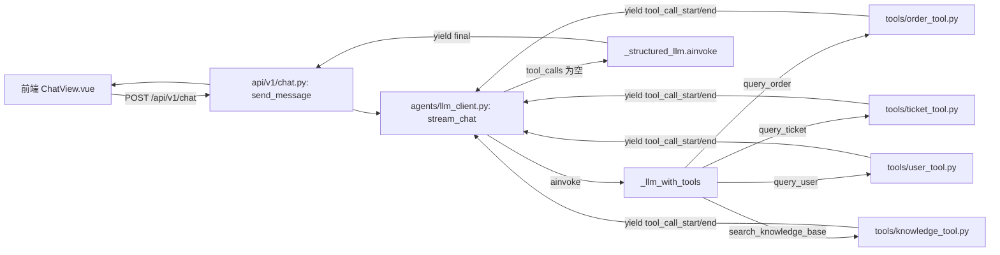
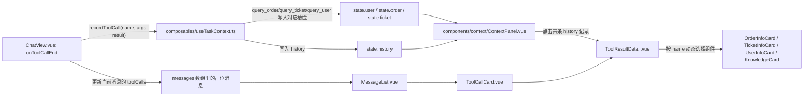

## Day 5：把聊天页面升级成业务 Agent 工作台

昨天把订单查询工具接上之后，客服团队试用了几天又提了新的诉求，用户找客服很少只问一件事，经常是先问订单发货状态，接着问自己是不是 VIP 能不能加急，最后又扯到之前提交的一个工单还没处理，这几件事分别对应订单、用户、工单三套后台系统，客服自己处理时也是来回切几个系统页面反复核对。业务方希望 AI 能把这几件事一次性串起来处理，而不是只会查订单这一件事，所以今天要给 Agent 再接入工单、用户、知识库三个工具，让它具备协同调用多个工具、综合多个来源信息给出结论的能力。工具一多，另一个问题也随之而来，客服光看聊天记录里散落的几张工具调用卡片，很难一眼看清这轮对话里到底有没有确认过用户是谁、订单是什么状态、有没有关联的工单，所以前端也要跟着做一次工作台化的改造，在聊天区域右侧加一个任务上下文面板，把当前用户、当前订单、当前工单这几个业务实体的最新状态固定展示出来，并保留一份完整的工具调用记录供客服随时点开核对细节。

### 一、后端：接入工单、用户、知识库三个工具

昨天已经把“判断要不要调用工具、执行工具、把结果喂回历史、循环收敛”这套骨架搭好了，`stream_chat` 里的 `while` 循环本身不需要因为工具数量增加而改动，今天要做的事情主要是照着 `order_tool.py` 的样子再写三个工具，把它们注册进 `_TOOLS` 列表，再补一段系统提示词告诉模型什么时候该用哪个工具。真正需要仔细考虑的地方是新增的这几个工具在参数上很容易互相混淆，订单号、工单号、用户 ID 都是形如 `T20260701001` 这样的字符串，如果 docstring 写得含糊，模型很可能把用户随口提到的一个编号传给错误的工具，所以每个工具的 docstring 都要把参数的具体格式和典型来源写清楚，这一点在设计阶段就要定下来。

#### 1.1 设计阶段

三个新工具分别对应三套业务数据，工单查询工具 `query_ticket` 放进新增的 `tools/ticket_tool.py`，依赖新增的 `schemas/ticket.py` 里的 `TicketInfo`，字段包括工单号、标题、状态、优先级和负责人，状态和优先级同样用 `Literal` 限定取值，和 Day 4 里 `OrderInfo` 的设计思路一致。用户查询工具 `query_user` 放进新增的 `tools/user_tool.py`，依赖新增的 `schemas/user.py` 里的 `UserInfo`，字段包括用户 ID、姓名、等级和手机号，手机号在 mock 数据里就以脱敏格式存储，避免真实项目里因为示例代码习惯而在别处也明文存手机号。知识库检索工具 `search_knowledge_base` 放进新增的 `tools/knowledge_tool.py`，依赖新增的 `schemas/knowledge.py` 里的 `KnowledgeSnippet`，今天的实现只是一个在几条 mock 文档里做关键词包含匹配的简化版本，用来先把“Agent 判断需要查知识库、调用工具、拿到片段、组织回答”这条链路跑通，真正的向量检索要等第 2 周专门讲检索增强时再替换掉这里的实现，两者对外的函数签名不会变，届时只需要替换 `search_knowledge_base` 内部的实现。

四个工具的返回值都统一成 `dict`，包括知识库工具返回的 `{"snippets": [...]}`，这是刻意维持和 Day 4 一致的约定，`ToolCallResult.result` 字段类型不用因为新增工具而跟着变复杂。`agents/llm_client.py` 里改动的地方集中在三处，`_TOOLS` 列表要把新增的三个工具加进去，系统提示词要补上每个工具各自适用的场景描述，另外 `_MAX_TOOL_ITERATIONS` 从 3 调到 4，因为今天的场景里一次对话可能要先确认用户身份、再查订单、再查关联工单，三轮工具调用已经把余量用得比较紧，调到 4 留出一点安全边际，避免正常的多工具协同场景也被强行截断。



#### 1.2 实现阶段

先写工单相关的数据结构，新增 `backend/app/schemas/ticket.py`。

```python
# backend/app/schemas/ticket.py
from typing import Literal

from pydantic import BaseModel, Field


class TicketInfo(BaseModel):
    """工单信息，字段覆盖客服判断处理进度和优先级最常用到的几项。"""

    ticket_no: str = Field(description="工单号")
    title: str = Field(description="工单标题，概括用户诉求")
    status: Literal["待处理", "处理中", "已解决", "已关闭"] = Field(description="工单当前处理状态")
    priority: Literal["低", "中", "高", "紧急"] = Field(description="工单优先级")
    assignee: str = Field(description="当前负责处理的客服姓名，未分配时为“未分配”")
```

对应的工单查询工具，新增 `backend/app/tools/ticket_tool.py`。

```python
# backend/app/tools/ticket_tool.py
from langchain_core.tools import tool

from app.schemas.ticket import TicketInfo

# 和 order_tool.py 一样先用内存字典模拟工单系统，真实项目里这里会换成调用工单中台的接口。
_MOCK_TICKETS: dict[str, TicketInfo] = {
    "T20260701001": TicketInfo(
        ticket_no="T20260701001",
        title="订单发货延迟投诉",
        status="处理中",
        priority="高",
        assignee="王芳",
    ),
    "T20260702002": TicketInfo(
        ticket_no="T20260702002",
        title="账号无法登录",
        status="待处理",
        priority="紧急",
        assignee="未分配",
    ),
}


@tool
def query_ticket(ticket_no: str) -> dict:
    """根据工单号查询工单的标题、处理状态、优先级和负责人，工单号是形如 T20260701001 的字符串，
    通常出现在用户之前提交工单时收到的回执里，不要和订单号或者用户 ID 混淆。"""
    ticket = _MOCK_TICKETS.get(ticket_no)
    if ticket is None:
        return {"error": f"未找到工单 {ticket_no}，请确认工单号是否正确。"}
    return ticket.model_dump()
```

接着是用户相关的数据结构和工具，新增 `backend/app/schemas/user.py` 和 `backend/app/tools/user_tool.py`。

```python
# backend/app/schemas/user.py
from typing import Literal

from pydantic import BaseModel, Field


class UserInfo(BaseModel):
    """用户基本信息，等级字段直接决定客服能给到的加急、退款等权限范围。"""

    user_id: str = Field(description="用户唯一标识")
    name: str = Field(description="用户姓名")
    level: Literal["普通", "VIP", "SVIP"] = Field(description="用户等级")
    phone: str = Field(description="手机号，中间四位已脱敏，格式如 138****5566")
```

`UserInfo` 里的 `level` 字段之所以要用 `Literal` 限死取值，是因为客服在判断能不能给用户加急、退款时，实际依据的就是这个等级，如果把它写成普通的 `str`，后面很容易因为一个拼写错误的等级值而让权限判断静静地异常。有了这个数据结构，接下来写对应的查询工具。

```python
# backend/app/tools/user_tool.py
from langchain_core.tools import tool

from app.schemas.user import UserInfo

_MOCK_USERS: dict[str, UserInfo] = {
    "U10001": UserInfo(user_id="U10001", name="张伟", level="VIP", phone="138****5566"),
    "U10002": UserInfo(user_id="U10002", name="李娜", level="普通", phone="139****2233"),
}


@tool
def query_user(user_id: str) -> dict:
    """根据用户 ID 查询用户的姓名、等级和手机号，用户 ID 是形如 U10001 的字符串，
    通常需要先从用户自述或者已经查到的订单、工单信息里获得，不要直接把订单号或者工单号当成用户 ID 传入。"""
    user = _MOCK_USERS.get(user_id)
    if user is None:
        return {"error": f"未找到用户 {user_id}，请确认用户 ID 是否正确。"}
    return user.model_dump()
```

最后是知识库检索工具，新增 `backend/app/schemas/knowledge.py` 和 `backend/app/tools/knowledge_tool.py`。

```python
# backend/app/schemas/knowledge.py
from pydantic import BaseModel, Field


class KnowledgeSnippet(BaseModel):
    """知识库命中的一条片段，今天用关键词匹配模拟，第 2 周会换成向量检索。"""

    title: str = Field(description="文档标题")
    content: str = Field(description="命中的片段内容")
    source: str = Field(description="文档来源路径，方便客服核对原文")
```

`KnowledgeSnippet` 多了 `source` 这个字段，是因为知识库检索和订单、工单、用户这三类查询不一样，后三者查到的是具体业务数据，客服直接采信就行，但知识库命中的只是一段文本片段，客服往往需要回到原文确认上下文才能放心回复用户，所以把来源路径也存下来。数据结构定下来之后，接着实现检索工具本身。

```python
# backend/app/tools/knowledge_tool.py
from langchain_core.tools import tool

from app.schemas.knowledge import KnowledgeSnippet

# 今天先用几条写死的文档模拟知识库，验证“判断需要查资料、调用检索、组织回答”这条链路，第 2 周接入向量库之后，只需要替换这个列表和下面的匹配逻辑，search_knowledge_base 对外的签名不变。
_MOCK_DOCS: list[KnowledgeSnippet] = [
    KnowledgeSnippet(
        title="退款政策说明",
        content="订单支付成功后 7 天内且尚未发货的，可以申请无理由退款，退款会在 3 个工作日内原路退回。",
        source="knowledge_base/refund_policy.md",
    ),
    KnowledgeSnippet(
        title="发货时效说明",
        content="普通商品在支付成功后 48 小时内安排发货，偏远地区可能延长至 72 小时。",
        source="knowledge_base/shipping_sla.md",
    ),
    KnowledgeSnippet(
        title="账号安全说明",
        content="连续输错密码 5 次会临时锁定账号 30 分钟，可以通过绑定手机号验证码解锁。",
        source="knowledge_base/account_security.md",
    ),
]


@tool
def search_knowledge_base(query: str) -> dict:
    """按关键词在知识库里检索相关说明，query 是从用户问题里提炼出的关键词，
    比如退款、发货时效、账号锁定，今天的实现只是简单的关键词包含匹配，不支持语义相似的问法。"""
    hits = [doc for doc in _MOCK_DOCS if query in doc.title or query in doc.content]
    return {"snippets": [hit.model_dump() for hit in hits]}
```

`search_knowledge_base` 返回的是 `{"snippets": [...]}` 而不是直接返回一个列表，是为了让四个工具的返回值都保持 `dict` 这一种形状，`ToolCallResult.result` 字段的类型不用因为多了一个返回列表的工具而改成联合类型，路由层和前端解析事件时也不用为这一个工具单独判断返回值是不是数组。

改完这三组工具，`backend/app/agents/llm_client.py` 要跟着把它们注册进去，同时补齐系统提示词。

```python
# backend/app/agents/llm_client.py
import json
import os
from typing import AsyncGenerator

from langchain_core.messages import AIMessage, BaseMessage, HumanMessage, SystemMessage, ToolMessage
from langchain_openai import ChatOpenAI

from app.schemas.chat import ChatResponse, ToolCallResult
from app.tools.knowledge_tool import search_knowledge_base
from app.tools.order_tool import query_order
from app.tools.ticket_tool import query_ticket
from app.tools.user_tool import query_user

_MODEL_NAME = os.getenv("CHAT_MODEL_NAME", "deepseek-ai/DeepSeek-V4-Pro")

_llm = ChatOpenAI(
    model=_MODEL_NAME,
    api_key=os.getenv("OPENAI_API_KEY"),
    base_url=os.getenv("OPENAI_BASE_URL") or None,
)

_TOOLS = [query_order, query_ticket, query_user, search_knowledge_base]
_llm_with_tools = _llm.bind_tools(_TOOLS)
_structured_llm = _llm.with_structured_output(ChatResponse)
_TOOLS_BY_NAME = {t.name: t for t in _TOOLS}

# 今天的场景可能需要先查用户、再查订单、再查关联工单，三轮工具调用已经把余量用得比较紧，
# 调到 4 给正常的多工具协同流程留一点安全边际，真触发上限说明模型没有在合理步数内收敛。
_MAX_TOOL_ITERATIONS = 4

_SYSTEM_PROMPT = (
    "你是一个电商平台的智能客服助手，需要基于用户的问题给出结构化判断。"
    "intent 只能从 order_issue、account_issue、refund_request、general_inquiry、other 中选择一个，"
    "分别对应订单问题、账号问题、退款请求、一般咨询和其他情况。"
    "如果用户的问题涉及具体订单号的发货、支付或物流状态，调用 query_order 查询真实数据。"
    "如果用户提到了工单号或者想知道之前提交的工单处理进度，调用 query_ticket 查询。"
    "如果需要确认用户的身份、等级或者联系方式，调用 query_user 查询，用户 ID 通常需要先从对话里确认，不要凭空编造。"
    "如果用户的问题属于退款政策、发货时效、账号安全这类通用规则性问题，调用 search_knowledge_base 检索相关说明，"
    "不要凭记忆直接回答政策类问题。"
    "以上工具可以在同一轮对话里按需要多次调用，不要凭空编造任何工具没有返回过的数据。"
    "confidence 反映你对这次判断和回答的把握程度，如果问题描述模糊或者超出你的知识范围，"
    "应该给出较低的置信度并将 need_human 设为 true，提醒客服人员介入。"
    "suggested_actions 给出客服人员可以立刻执行的具体动作，不要给空泛的建议。"
)

_ROLE_TO_MESSAGE = {
    "user": HumanMessage,
    "assistant": AIMessage,
}


def _to_langchain_messages(messages: list[dict[str, str]]) -> list[BaseMessage]:
    """把前端传来的 role/content 字典转换成 LangChain 的消息对象列表。"""
    return [_ROLE_TO_MESSAGE[message["role"]](content=message["content"]) for message in messages]


async def stream_chat(messages: list[dict[str, str]]) -> AsyncGenerator[dict, None]:
    """驱动一次可能包含多轮、多种工具调用的对话，以事件流的形式产出中间过程和最终结果。"""
    history: list[BaseMessage] = [SystemMessage(content=_SYSTEM_PROMPT), *_to_langchain_messages(messages)]
    collected_tool_calls: list[ToolCallResult] = []

    try:
        for _ in range(_MAX_TOOL_ITERATIONS):
            ai_message = await _llm_with_tools.ainvoke(history)

            if not ai_message.tool_calls:
                break

            history.append(ai_message)

            for tool_call in ai_message.tool_calls:
                tool_name = tool_call["name"]
                tool_args = tool_call["args"]
                yield {"type": "tool_call_start", "name": tool_name, "args": tool_args}

                tool = _TOOLS_BY_NAME.get(tool_name)
                tool_result = await tool.ainvoke(tool_args)

                yield {"type": "tool_call_end", "name": tool_name, "result": tool_result}
                collected_tool_calls.append(
                    ToolCallResult(name=tool_name, args=tool_args, result=tool_result)
                )
                history.append(
                    ToolMessage(content=json.dumps(tool_result, ensure_ascii=False), tool_call_id=tool_call["id"])
                )
        else:
            history.append(SystemMessage(content="已达到最大工具调用次数，请基于目前已有的信息直接给出结论。"))

        final_response: ChatResponse = await _structured_llm.ainvoke(history)
        final_response.tool_calls = collected_tool_calls
        yield {"type": "final", "data": final_response.model_dump()}
    except Exception as exc:
        yield {"type": "error", "message": str(exc)}
```

这次改动里唯一需要留意的坑不在循环本身，而在四个工具的 docstring 之间要互相划清边界，`query_ticket` 的说明里特意加了一句“不要和订单号或者用户 ID 混淆”，`query_user` 的说明里也提醒“不要直接把订单号或者工单号当成用户 ID 传入”，这是因为三种编号在字符串形态上确实很接近，都是字母加十几位数字，如果只描述“查用户”“查工单”而不强调参数的边界，模型偶尔会把用户提到的订单号错误地传给 `query_user`，实测下来把这种边界提醒直接写进 docstring 比只在系统提示词里笼统说明更有效，因为 docstring 是模型在决定调用哪个工具、传什么参数时优先参考的结构化描述。`_TOOLS_BY_NAME` 这一行代码完全没有改动，因为它是基于 `_TOOLS` 列表动态生成的，新增工具时只需要把函数塞进 `_TOOLS` 列表，不用在别的地方跟着改注册逻辑，这也是 Day 4 把这段逻辑设计成列表驱动而不是手写 `if/elif` 分支的好处，今天多接入三个工具几乎不需要碰这部分代码。

### 二、前端：搭建任务上下文面板

工具变多之后，聊天记录里散落的工具调用卡片能反映“发生了什么”，但客服想快速确认“现在手上这个用户是谁、订单什么状态、有没有关联工单”时，还是得从头翻聊天记录去找，所以今天要在聊天区域右侧加一块常驻的任务上下文面板，把用户、订单、工单这三类会持续存在的业务实体固定展示出来，并保留一份可以点开查看详情的调用记录列表。这一块的改动比后端复杂一些，因为要把 Day 4 里为订单单独写的详情卡片，重构成能通用支撑四种工具的展示体系。

#### 2.1 设计阶段

先看数据怎么流动。工具调用结束的事件 `onToolCallEnd` 目前只用来更新当前这条 AI 消息自己的 `toolCalls` 数组，这份数据是挂在单条消息上的，天然会随着聊天记录往上滚动而不容易被看到，今天新增一个模块级别的组合式函数 `composables/useTaskContext.ts`，内部用 `reactive` 维护一个跨越整个会话的状态对象，包含 `user`、`order`、`ticket` 三个槽位和一份 `history` 调用记录数组，对外只暴露一个 `recordToolCall` 方法，`ChatView.vue` 在 `onToolCallEnd` 里除了原来更新消息自身的逻辑，还要多调用一次这个方法。之所以只给 `user`、`order`、`ticket` 三种工具设置固定槽位，是因为这三者对应的是“一段时间内持续有效的业务实体”，客服确认过一次之后这份信息在后续对话里通常还有效，知识库检索命中的片段则不然，每次检索都是针对当次问题的即时结果，不适合固定占用一个展示位置，所以只出现在调用记录列表里，不进入这三个固定槽位。

详情卡片这一层要做一次统一，Day 4 的 `OrderInfoCard.vue` 接收的 prop 叫 `order`，为了让详情卡片能被“按工具名动态选择组件”这种写法复用，今天把它的 prop 统一改名成 `data`，再照着同样的结构补两张卡片，`TicketInfoCard.vue` 和 `UserInfoCard.vue`，另外新增一张 `KnowledgeCard.vue` 展示知识库命中的片段列表。四张卡片背后用一个新增的 `ToolResultDetail.vue` 统一调度，内部维护一张“工具名到卡片组件”的映射表，用 Vue 的动态组件 `<component :is="...">` 按传入的工具名渲染对应的卡片，这个组件在两个地方复用，一是 Day 4 的 `ToolCallCard.vue` 里原来写死判断 `query_order` 的地方直接换成它，二是新增的 `ContextPanel.vue` 里，客服点开某条调用记录时用它渲染详情。`ContextPanel.vue` 本身分四块，前三块分别从 `useTaskContext` 的 `user`、`order`、`ticket` 槽位读数据渲染成对应卡片，槽位为空时展示一行提示文字，第四块是调用记录列表，每一项显示工具名，点击后把这条记录的 `id` 记到本地的 `selectedId`，展开 `ToolResultDetail` 展示这次调用的完整结果，再点一次同一项则收起详情。



#### 2.2 实现阶段

先把 Day 4 的 `OrderInfoCard.vue` 中的 prop 从 `order` 换成 `data`，其余结构不变。

```vue
<!-- frontend/src/components/business/OrderInfoCard.vue -->
<script setup lang="ts">
import { computed } from 'vue'

const props = defineProps<{
  data: Record<string, unknown>
}>()

const STATUS_COLOR: Record<string, string> = {
  待发货: '#f59e0b',
  已发货: '#2563eb',
  已完成: '#059669',
  已取消: '#6b7280',
}

const orderNo = computed(() => String(props.data.order_no ?? ''))
const status = computed(() => String(props.data.status ?? ''))
const payStatus = computed(() => String(props.data.pay_status ?? ''))
const logisticsStatus = computed(() => String(props.data.logistics_status ?? ''))
const hasError = computed(() => typeof props.data.error === 'string')
</script>

<template>
  <div v-if="hasError" class="order-card order-card-error">{{ data.error }}</div>
  <div v-else class="order-card">
    <div class="order-row">
      <span class="order-label">订单号</span>
      <span>{{ orderNo }}</span>
    </div>
    <div class="order-row">
      <span class="order-label">订单状态</span>
      <span class="order-status" :style="{ color: STATUS_COLOR[status] ?? '#374151' }">{{ status }}</span>
    </div>
    <div class="order-row">
      <span class="order-label">支付状态</span>
      <span>{{ payStatus }}</span>
    </div>
    <div class="order-row">
      <span class="order-label">物流状态</span>
      <span>{{ logisticsStatus }}</span>
    </div>
  </div>
</template>

<style scoped>
.order-card {
  margin-top: 4px;
  padding: 8px 10px;
  border-radius: 6px;
  background-color: #fff;
  border: 1px solid #e5e7eb;
}

.order-card-error {
  color: #dc2626;
}

.order-row {
  display: flex;
  justify-content: space-between;
  padding: 2px 0;
  font-size: 13px;
}

.order-label {
  color: #6b7280;
}

.order-status {
  font-weight: 600;
}
</style>
```

照着同样的结构新增 `TicketInfoCard.vue`。

```vue
<!-- frontend/src/components/business/TicketInfoCard.vue -->
<script setup lang="ts">
import { computed } from 'vue'

const props = defineProps<{
  data: Record<string, unknown>
}>()

const STATUS_COLOR: Record<string, string> = {
  待处理: '#f59e0b',
  处理中: '#2563eb',
  已解决: '#059669',
  已关闭: '#6b7280',
}

const PRIORITY_COLOR: Record<string, string> = {
  低: '#6b7280',
  中: '#2563eb',
  高: '#f59e0b',
  紧急: '#dc2626',
}

const ticketNo = computed(() => String(props.data.ticket_no ?? ''))
const title = computed(() => String(props.data.title ?? ''))
const status = computed(() => String(props.data.status ?? ''))
const priority = computed(() => String(props.data.priority ?? ''))
const assignee = computed(() => String(props.data.assignee ?? ''))
const hasError = computed(() => typeof props.data.error === 'string')
</script>

<template>
  <div v-if="hasError" class="ticket-card ticket-card-error">{{ data.error }}</div>
  <div v-else class="ticket-card">
    <div class="ticket-row">
      <span class="ticket-label">工单号</span>
      <span>{{ ticketNo }}</span>
    </div>
    <div class="ticket-row">
      <span class="ticket-label">标题</span>
      <span>{{ title }}</span>
    </div>
    <div class="ticket-row">
      <span class="ticket-label">状态</span>
      <span :style="{ color: STATUS_COLOR[status] ?? '#374151' }">{{ status }}</span>
    </div>
    <div class="ticket-row">
      <span class="ticket-label">优先级</span>
      <span :style="{ color: PRIORITY_COLOR[priority] ?? '#374151' }">{{ priority }}</span>
    </div>
    <div class="ticket-row">
      <span class="ticket-label">负责人</span>
      <span>{{ assignee }}</span>
    </div>
  </div>
</template>

<style scoped>
.ticket-card {
  margin-top: 4px;
  padding: 8px 10px;
  border-radius: 6px;
  background-color: #fff;
  border: 1px solid #e5e7eb;
}

.ticket-card-error {
  color: #dc2626;
}

.ticket-row {
  display: flex;
  justify-content: space-between;
  padding: 2px 0;
  font-size: 13px;
}

.ticket-label {
  color: #6b7280;
}
</style>
```

再新增 `UserInfoCard.vue`。

```vue
<!-- frontend/src/components/business/UserInfoCard.vue -->
<script setup lang="ts">
import { computed } from 'vue'

const props = defineProps<{
  data: Record<string, unknown>
}>()

const LEVEL_COLOR: Record<string, string> = {
  普通: '#6b7280',
  VIP: '#2563eb',
  SVIP: '#b45309',
}

const userId = computed(() => String(props.data.user_id ?? ''))
const name = computed(() => String(props.data.name ?? ''))
const level = computed(() => String(props.data.level ?? ''))
const phone = computed(() => String(props.data.phone ?? ''))
const hasError = computed(() => typeof props.data.error === 'string')
</script>

<template>
  <div v-if="hasError" class="user-card user-card-error">{{ data.error }}</div>
  <div v-else class="user-card">
    <div class="user-row">
      <span class="user-label">用户 ID</span>
      <span>{{ userId }}</span>
    </div>
    <div class="user-row">
      <span class="user-label">姓名</span>
      <span>{{ name }}</span>
    </div>
    <div class="user-row">
      <span class="user-label">等级</span>
      <span :style="{ color: LEVEL_COLOR[level] ?? '#374151' }">{{ level }}</span>
    </div>
    <div class="user-row">
      <span class="user-label">手机号</span>
      <span>{{ phone }}</span>
    </div>
  </div>
</template>

<style scoped>
.user-card {
  margin-top: 4px;
  padding: 8px 10px;
  border-radius: 6px;
  background-color: #fff;
  border: 1px solid #e5e7eb;
}

.user-card-error {
  color: #dc2626;
}

.user-row {
  display: flex;
  justify-content: space-between;
  padding: 2px 0;
  font-size: 13px;
}

.user-label {
  color: #6b7280;
}
</style>
```

知识库检索结果的形状和前面三张卡片不一样，`data.snippets` 是一个列表，所以 `KnowledgeCard.vue` 不走“单条记录铺成几行”这种样式，而是把命中的片段依次列出来。

```vue
<!-- frontend/src/components/business/KnowledgeCard.vue -->
<script setup lang="ts">
import { computed } from 'vue'

interface Snippet {
  title: string
  content: string
  source: string
}

const props = defineProps<{
  data: Record<string, unknown>
}>()

// 后端保证 snippets 字段一定存在，这里用空数组兜底只是防御性写法，避免个别异常场景下字段缺失导致模板报错
const snippets = computed(() => (props.data.snippets as Snippet[] | undefined) ?? [])
</script>

<template>
  <div class="knowledge-card">
    <p v-if="!snippets.length" class="knowledge-empty">知识库里没有找到相关说明</p>
    <div v-for="(snippet, index) in snippets" :key="index" class="knowledge-item">
      <div class="knowledge-title">{{ snippet.title }}</div>
      <p class="knowledge-content">{{ snippet.content }}</p>
      <div class="knowledge-source">来源：{{ snippet.source }}</div>
    </div>
  </div>
</template>

<style scoped>
.knowledge-card {
  margin-top: 4px;
}

.knowledge-item {
  padding: 8px 10px;
  border-radius: 6px;
  background-color: #fff;
  border: 1px solid #e5e7eb;
  margin-bottom: 6px;
}

.knowledge-title {
  font-size: 13px;
  font-weight: 600;
  color: #1f2937;
}

.knowledge-content {
  margin: 4px 0;
  font-size: 13px;
  color: #374151;
}

.knowledge-source {
  font-size: 12px;
  color: #9ca3af;
}

.knowledge-empty {
  font-size: 13px;
  color: #6b7280;
}
</style>
```

四张卡片都统一用 `data` 这个 prop 名之后，就可以写 `ToolResultDetail.vue` 做统一调度。

```vue
<!-- frontend/src/components/tools/ToolResultDetail.vue -->
<script setup lang="ts">
import type { Component } from 'vue'
import OrderInfoCard from '../business/OrderInfoCard.vue'
import TicketInfoCard from '../business/TicketInfoCard.vue'
import UserInfoCard from '../business/UserInfoCard.vue'
import KnowledgeCard from '../business/KnowledgeCard.vue'

defineProps<{
  name: string
  result: Record<string, unknown>
}>()

// 工具名到详情卡片组的映射表，新增工具时只需要在这里补一行，ToolCallCard.vue 和 ContextPanel.vue 两处调用都不用跟着改判断逻辑。
const DETAIL_COMPONENTS: Record<string, Component> = {
  query_order: OrderInfoCard,
  query_ticket: TicketInfoCard,
  query_user: UserInfoCard,
  search_knowledge_base: KnowledgeCard,
}
</script>

<template>
  <component :is="DETAIL_COMPONENTS[name]" v-if="DETAIL_COMPONENTS[name]" :data="result" />
</template>
```

`ToolCallCard.vue` 原来写死判断 `query_order` 的那一段换成调用 `ToolResultDetail`，同时把参数提示的映射表补齐。

```vue
<!-- frontend/src/components/tools/ToolCallCard.vue -->
<script setup lang="ts">
import type { ToolCall } from '../../api/chat'
import ToolResultDetail from './ToolResultDetail.vue'

defineProps<{
  toolCall: ToolCall
}>()

const ARG_LABEL: Record<string, string> = {
  query_order: '订单号',
  query_ticket: '工单号',
  query_user: '用户 ID',
  search_knowledge_base: '检索关键词',
}
</script>

<template>
  <div class="tool-call-card">
    <div class="tool-call-header">
      <span class="tool-call-icon">🔧</span>
      <span v-if="toolCall.status === 'calling'">AI 正在调用工具：{{ toolCall.name }}</span>
      <span v-else>工具调用完成：{{ toolCall.name }}</span>
    </div>
    <div v-if="toolCall.status === 'calling'" class="tool-call-args">
      {{ ARG_LABEL[toolCall.name] ?? '参数' }}：{{ Object.values(toolCall.args)[0] }}
    </div>
    <ToolResultDetail v-else-if="toolCall.result" :name="toolCall.name" :result="toolCall.result" />
  </div>
</template>

<style scoped>
.tool-call-card {
  margin-bottom: 8px;
  padding: 8px 12px;
  border-radius: 6px;
  background-color: #f8fafc;
  border: 1px solid #e2e8f0;
  font-size: 13px;
}

.tool-call-icon {
  font-size: 14px;
}

.tool-call-header {
  display: flex;
  align-items: center;
  gap: 6px;
  color: #475569;
}

.tool-call-args {
  margin-top: 4px;
  color: #64748b;
}
</style>
```

接下来是今天新增的核心状态管理，`composables/useTaskContext.ts`。

```typescript
// frontend/src/composables/useTaskContext.ts
import { reactive } from 'vue'

export interface ToolCallRecord {
  id: number
  name: string
  args: Record<string, unknown>
  result: Record<string, unknown>
  timestamp: number
}

interface TaskContextState {
  user: Record<string, unknown> | null
  order: Record<string, unknown> | null
  ticket: Record<string, unknown> | null
  history: ToolCallRecord[]
}

// 用一个模块级别的 reactive 对象充当轻量状态管理，聊天页面和右侧的上下文面板各自从这里读写，仅仅为了这一点跨组件共享的状态引入 Pinia 没有必要。
const state = reactive<TaskContextState>({
  user: null,
  order: null,
  ticket: null,
  history: [],
})

// 只有代表一段时间内持续有效的业务实体的工具才占用固定槽位，知识库检索是针对当次问题的即时结果，不适合固定展示，所以不出现在这张表里。
const CONTEXT_SLOT: Partial<Record<string, 'user' | 'order' | 'ticket'>> = {
  query_user: 'user',
  query_order: 'order',
  query_ticket: 'ticket',
}

let nextId = 0

export function useTaskContext() {
  function recordToolCall(name: string, args: Record<string, unknown>, result: Record<string, unknown>) {
    state.history.push({ id: nextId++, name, args, result, timestamp: Date.now() })

    const slot = CONTEXT_SLOT[name]
    // 结果里带 error 字段说明这次查询没查到东西，不能用一个空结果把之前已经展示的有效上下文覆盖掉。
    if (slot && !result.error) {
      state[slot] = result
    }
  }

  return { state, recordToolCall }
}
```

`useTaskContext` 没有做成 Vuex 或者 Pinia 那种带命名空间、支持多实例的正式状态管理，而是简单地在模块作用域里放一个 `reactive` 对象，每次调用 `useTaskContext()` 拿到的都是同一份引用，这在只有一个聊天页面、状态生命周期和整个应用一致的场景下是够用的，等后面页面复杂到需要多个独立会话各自维护一份上下文时，再考虑升级成真正的状态管理方案也不迟。

有了状态管理，`ContextPanel.vue` 负责把这份状态渲染出来。

```vue
<!-- frontend/src/components/context/ContextPanel.vue -->
<script setup lang="ts">
import { computed, ref } from 'vue'
import { useTaskContext } from '../../composables/useTaskContext'
import OrderInfoCard from '../business/OrderInfoCard.vue'
import TicketInfoCard from '../business/TicketInfoCard.vue'
import UserInfoCard from '../business/UserInfoCard.vue'
import ToolResultDetail from '../tools/ToolResultDetail.vue'

const { state } = useTaskContext()
const selectedId = ref<number | null>(null)

const selectedRecord = computed(() => state.history.find((record) => record.id === selectedId.value) ?? null)

function selectRecord(id: number) {
  // 再点一次同一条记录时收起详情，避免用户想关掉详情时无从下手
  selectedId.value = selectedId.value === id ? null : id
}
</script>

<template>
  <aside class="context-panel">
    <section class="context-section">
      <h3>当前用户</h3>
      <UserInfoCard v-if="state.user" :data="state.user" />
      <p v-else class="context-empty">暂无用户信息</p>
    </section>
    <section class="context-section">
      <h3>当前订单</h3>
      <OrderInfoCard v-if="state.order" :data="state.order" />
      <p v-else class="context-empty">暂无订单信息</p>
    </section>
    <section class="context-section">
      <h3>当前工单</h3>
      <TicketInfoCard v-if="state.ticket" :data="state.ticket" />
      <p v-else class="context-empty">暂无工单信息</p>
    </section>
    <section class="context-section">
      <h3>工具调用记录</h3>
      <p v-if="!state.history.length" class="context-empty">本轮对话还没有调用过工具</p>
      <ul class="history-list">
        <li
          v-for="record in state.history"
          :key="record.id"
          class="history-item"
          :class="{ active: record.id === selectedId }"
          @click="selectRecord(record.id)"
        >
          {{ record.name }}
        </li>
      </ul>
      <ToolResultDetail
        v-if="selectedRecord"
        class="history-detail"
        :name="selectedRecord.name"
        :result="selectedRecord.result"
      />
    </section>
  </aside>
</template>

<style scoped>
.context-panel {
  width: 280px;
  border-left: 1px solid #e5e7eb;
  padding: 16px;
  overflow-y: auto;
}

.context-section {
  margin-bottom: 20px;
}

.context-section h3 {
  margin: 0 0 8px;
  font-size: 13px;
  color: #6b7280;
}

.context-empty {
  margin: 0;
  font-size: 13px;
  color: #9ca3af;
}

.history-list {
  list-style: none;
  margin: 0;
  padding: 0;
}

.history-item {
  padding: 6px 8px;
  border-radius: 6px;
  font-size: 13px;
  cursor: pointer;
  color: #374151;
}

.history-item:hover {
  background-color: #f3f4f6;
}

.history-item.active {
  background-color: #eff6ff;
  color: #2563eb;
}

.history-detail {
  margin-top: 8px;
}
</style>
```

`selectedRecord` 用 `computed` 从 `state.history` 里按 `selectedId` 查找而不是直接存一份记录的拷贝，是因为工具调用记录本身不会被修改，用 `computed` 引用可以保证哪怕将来给记录加了别的字段，详情展示的也总是数组里那份最新的数据，不会出现拷贝出去的备份和原始记录不同步的问题。

最后是 `ChatView.vue`，在 `onToolCallEnd` 里补上写入任务上下文的调用，并把 `ContextPanel` 加进页面布局。

```vue
<!-- frontend/src/views/ChatView.vue -->
<script setup lang="ts">
import { ref } from 'vue'
import { streamChatMessage, type AssistantMessage, type ChatMessage } from '../api/chat'
import { useTaskContext } from '../composables/useTaskContext'
import MessageList from '../components/chat/MessageList.vue'
import ChatInput from '../components/chat/ChatInput.vue'
import ContextPanel from '../components/context/ContextPanel.vue'

const { recordToolCall } = useTaskContext()

const messages = ref<ChatMessage[]>([])
const loading = ref(false)
const errorMessage = ref('')

function createPendingMessage(): AssistantMessage {
  return {
    role: 'assistant',
    intent: 'other',
    answer: '',
    confidence: 0,
    needHuman: false,
    suggestedActions: [],
    toolCalls: [],
    pending: true,
  }
}

async function handleSend(text: string) {
  errorMessage.value = ''
  messages.value.push({ role: 'user', content: text })

  const pendingMessage = createPendingMessage()
  messages.value.push(pendingMessage)
  loading.value = true

  try {
    await streamChatMessage(messages.value.slice(0, -1), {
      onToolCallStart(name, args) {
        pendingMessage.toolCalls.push({ name, args, status: 'calling' })
      },
      onToolCallEnd(name, args, result) {
        const target = pendingMessage.toolCalls.find(
          (call) => call.name === name && call.status === 'calling',
        )
        if (target) {
          target.status = 'done'
          target.result = result
        }
        // 上下文面板要跨越整个会话持续展示最新的用户、订单、工单信息，这份记录独立于当前这条消息的 toolCalls，写进 useTaskContext 维护的全局状态里。
        recordToolCall(name, args, result)
      },
      onFinal(finalMessage) {
        const index = messages.value.indexOf(pendingMessage)
        if (index !== -1) {
          messages.value[index] = { ...finalMessage, pending: false }
        }
      },
      onError(message) {
        errorMessage.value = message
      },
    })
  } catch (error) {
    errorMessage.value = error instanceof Error ? error.message : '发送失败，请稍后重试'
  } finally {
    loading.value = false
  }
}

function handleSelectAction(action: string) {
  window.alert(`已记录建议操作：${action}，工具调用能力将在后续接入`)
}
</script>

<template>
  <div class="chat-view">
    <aside class="session-sidebar">
      <div class="session-item active">默认会话</div>
    </aside>
    <section class="chat-main">
      <MessageList :messages="messages" @select-action="handleSelectAction" />
      <p v-if="errorMessage" class="error-tip">{{ errorMessage }}</p>
      <ChatInput :loading="loading" @send="handleSend" />
    </section>
    <ContextPanel />
  </div>
</template>

<style scoped>
.chat-view {
  display: flex;
  height: 100vh;
}
.session-sidebar {
  width: 220px;
  border-right: 1px solid #e5e7eb;
  padding: 16px;
}
.session-item {
  padding: 8px 12px;
  border-radius: 6px;
}
.session-item.active {
  background-color: #eff6ff;
  color: #2563eb;
}
.chat-main {
  display: flex;
  flex-direction: column;
  flex: 1;
}
.error-tip {
  margin: 0 16px 8px;
  color: #dc2626;
  font-size: 13px;
}
</style>
```

`onToolCallEnd` 里同时做了两件事，一是原地更新当前占位消息的 `toolCalls`，让聊天记录里这条消息自己的工具调用卡片能实时刷新，二是调用 `recordToolCall` 把同一份数据也写进跨会话的上下文状态，两者互不影响，前者的生命周期跟着这条消息走，后者会一直保留到页面刷新为止。左侧的 `session-sidebar` 今天没有跟着展开，多会话管理涉及会话列表的增删和历史记录的持久化，放在今天的范围里会分散重点，这部分连同后端需要补的会话存储能力，会放到后面专门处理数据持久化的章节里一起做。

### 三、本篇产出清单

| 文件 | 主要内容 | 实现的功能 |
| --- | --- | --- |
| `backend/app/schemas/ticket.py` | 新增，定义 `TicketInfo` 模型 | 约束工单查询结果的字段和取值范围 |
| `backend/app/tools/ticket_tool.py` | 新增，封装 `query_ticket` 工具函数 | 提供工单状态、优先级、负责人的查询能力 |
| `backend/app/schemas/user.py` | 新增，定义 `UserInfo` 模型 | 约束用户查询结果的字段和取值范围 |
| `backend/app/tools/user_tool.py` | 新增，封装 `query_user` 工具函数 | 提供用户身份、等级、联系方式的查询能力 |
| `backend/app/schemas/knowledge.py` | 新增，定义 `KnowledgeSnippet` 模型 | 约束知识库检索结果的字段 |
| `backend/app/tools/knowledge_tool.py` | 新增，封装 `search_knowledge_base` 工具函数 | 提供退款、发货、账号安全等政策性问题的关键词检索能力，作为第 2 周向量检索的过渡实现 |
| `backend/app/agents/llm_client.py` | 修改，`_TOOLS` 新增三个工具，系统提示词补充调用场景，`_MAX_TOOL_ITERATIONS` 调整为 4 | 让 Agent 具备协同调用订单、工单、用户、知识库四种工具的能力 |
| `frontend/src/components/business/OrderInfoCard.vue` | 修改，prop 从 `order` 改名为 `data` | 和其余三张详情卡片保持统一的 prop 约定，便于动态组件复用 |
| `frontend/src/components/business/TicketInfoCard.vue` | 新增 | 渲染工单详情 |
| `frontend/src/components/business/UserInfoCard.vue` | 新增 | 渲染用户详情 |
| `frontend/src/components/business/KnowledgeCard.vue` | 新增 | 渲染知识库检索命中的片段列表 |
| `frontend/src/components/tools/ToolResultDetail.vue` | 新增 | 按工具名动态选择对应的详情卡片组件 |
| `frontend/src/components/tools/ToolCallCard.vue` | 修改，改用 `ToolResultDetail` 渲染详情，补齐参数提示映射表 | 支持展示四种工具各自的调用状态和结果 |
| `frontend/src/composables/useTaskContext.ts` | 新增，`useTaskContext` 组合式函数 | 维护跨会话的当前用户、当前订单、当前工单和完整调用记录 |
| `frontend/src/components/context/ContextPanel.vue` | 新增 | 展示当前用户、订单、工单以及可点击查看详情的调用记录列表 |
| `frontend/src/views/ChatView.vue` | 修改，`onToolCallEnd` 补充写入任务上下文，页面布局加入 `ContextPanel` | 把聊天页面从单一对话窗口升级成带常驻业务上下文的工作台 |

### 四、总结

今天做完之后，这个 Agent 已经能在一轮对话里根据需要自己判断该查订单、查工单、查用户还是查知识库，而不是只会处理单一类型的问题，前端也从一个只能看聊天记录的页面变成了带着任务上下文面板的工作台，客服不用再从上下滚动的对话里翻找某个业务实体的最新状态。今天新增的三个工具沿用了 Day 4 定下的“函数加 `@tool` 装饰器、docstring 写清参数格式和边界”这套写法，`stream_chat` 里驱动多轮工具调用的循环也没有因为工具变多而改动一行，这说明 Day 4 打好的那套骨架经受住了扩展的考验。前端这边最关键的决定是把详情卡片的 prop 统一成 `data`，换来的是新增工具时只需要在 `ToolResultDetail.vue` 的映射表里补一行，`ToolCallCard.vue` 和 `ContextPanel.vue` 两个调用方都不用跟着改判断逻辑。这一周的目标是把前后端的骨架和基础的 Agent 能力跑通，到今天已经基本完成，接下来第 2 周会把今天知识库工具里那个关键词匹配的简化实现，替换成真正基于向量检索的知识库问答，让 AI 能够基于公司真实的资料库回答问题，而不再依赖今天这几条写死的 mock 文档，多会话管理和历史记录持久化这两块遗留问题，也会在后面处理数据存储的章节里补上。