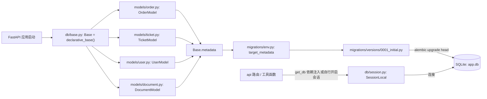
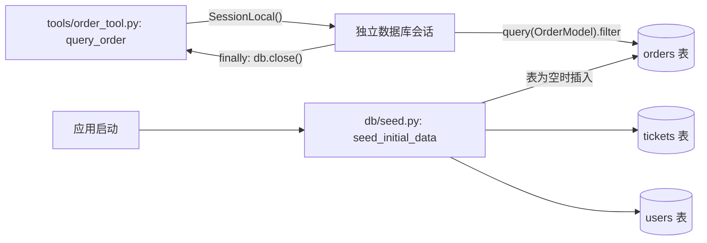
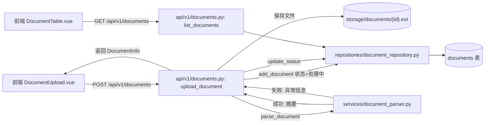
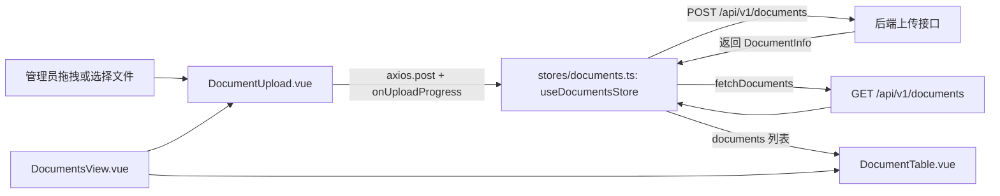

## Day 6：业务方上传了一堆文档，系统要能管理

第一周结束时，Agent 已经能聊天、能给结构化回答、还能协同查订单、工单、用户三套业务系统，但客服团队试用了几天后，业务方提出了一个新方向，光靠 AI 的通用知识和这几个业务系统的实时数据还不够，很多客服日常要回答的问题其实都写在公司自己的资料里，比如售后政策规定退款期限是几天、产品说明书里某个功能怎么用、常见问题文档里已经有的标准答案，这些内容 AI 目前完全不知道。业务方计划把售后政策、产品说明、接口文档、常见问题、运维手册、历史工单这些格式各异的资料都丢给系统，让 AI 以后回答问题时能查这些资料再作答。这是第二周要解决的核心问题，但在真正让 AI 检索资料之前，系统得先有地方装下这些文件，得知道每份文件解析成什么样、现在处于什么状态，这就是今天要做的事情，一个能接住各种格式文档、追踪处理状态的管理页面。

动手之前还有一件事情不能再拖，从 Day 2 到 Day 5，订单、工单、用户这几类业务数据全部是写在模块级字典里的内存 mock，服务一重启这些数据就没了，这在验证工具调用链路的阶段是合理的简化，但从今天开始，文档是系统自己产生并且必须长期保留的数据，不能允许一次重启就把管理员刚上传的资料全部清空，这是第一次出现"不引入数据库就没法继续往下走"的场景。与其今天先给文档单独搭一套内存存储、过几天再回头把订单工单用户也迁移一遍，不如借着这次机会把数据库地基一次性打好，顺带把之前几天悬空的 mock 数据也接进来，这样后面几周不管是会话历史、审批记录还是评估结果，都有一个现成的持久化层可以直接用。今天的内容因此拆成四块，先搭好 SQLAlchemy 和 SQLite 这套持久化地基，再把已有的订单、工单、用户工具从内存字典改造成数据库查询，然后才是本篇真正的主线，文档上传、解析、状态管理，最后是前端的知识库文档列表页面。真正的检索和向量化不在今天的范围内，那是 Day 7 要做的事，今天只需要让文档"进得来、存得住、看得见处理结果"。

### 一、后端：引入 SQLAlchemy、SQLite 和 Alembic

在动手写文档相关的代码之前，先把数据库这一层地基铺好。这一节要做三件事，一是搭建 SQLAlchemy 的引擎和会话管理，二是把订单、工单、用户、文档四张表的 ORM 模型定义出来，三是用 Alembic 管理这些表结构的变更，让"新增一张表"这件事从今天开始就是一个可追踪、可回滚的迁移动作，而不是手改一下代码就完事。

#### 1.1 设计阶段

数据库连接和会话的管理逻辑放进新增的 `backend/app/db/session.py`，这里面只做一件事，创建一个 SQLAlchemy 的 `engine`，再用它构造一个 `SessionLocal` 会话工厂，另外提供一个 `get_db` 生成器函数，配合 FastAPI 的依赖注入在每个请求里拿到一个会话、用完自动关闭。今天先用 SQLite 存放数据库文件，好处是不需要额外安装数据库服务，开发机上直接就能跑起来，缺点也很明显，SQLite 不适合真正的高并发生产环境，这一点在 Day 20 部署的时候会换成 PostgreSQL，今天的选择只是为了今天能跑起来，不代表这是最终形态。

紧挨着 `session.py` 的是 `backend/app/db/base.py`，里面只放一行 `Base = declarative_base()`，所有 ORM 模型都要继承这个 `Base`，Alembic 之后也是靠读取 `Base.metadata` 来知道现在一共有哪些表。这个文件之所以要单独拆出来而不是直接写进 `session.py`，是为了避免循环导入，模型文件需要导入 `Base`，`session.py` 又不需要知道任何具体的模型长什么样，两者拆开之后各自的依赖方向很清晰。

接下来是新增的 `backend/app/models` 目录，这是今天第一次出现的新目录，需要交代一下它和已有的 `schemas` 目录是什么关系。`schemas` 目录里的 Pydantic 模型描述的是接口层面的数据契约，是前后端之间约定好的 JSON 结构，`models` 目录里的 SQLAlchemy 模型描述的是数据库表结构，两者关注的问题完全不同，一个负责校验和序列化，一个负责持久化和查询，即使字段刚好长得差不多，也不应该合并成一套类，不然任何一边的改动都会不小心牵连另一边。今天要在 `models` 目录下新增四个文件，`order.py` 里的 `OrderModel`、`ticket.py` 里的 `TicketModel`、`user.py` 里的 `UserModel`，字段分别对应 Day 4 的 `OrderInfo`、Day 5 的 `TicketInfo` 和 `UserInfo`，再加上今天新增的 `document.py` 里的 `DocumentModel`，用来存文档的文件名、类型、状态、解析出的摘要和原始文件的磁盘路径。

表结构定义好之后，用 Alembic 来管理迁移。今天的初始化工作包括生成 `alembic.ini` 配置文件、改造 `migrations/env.py` 让它认识 `Base.metadata`，再生成第一个迁移脚本，把四张表的建表语句记录下来。往后每次给某张表加字段，都通过 `alembic revision --autogenerate` 生成新的迁移文件，而不是直接修改数据库文件，这样表结构的每一次变化都有据可查，回滚也有路径可退。



#### 1.2 实现阶段

先创建 `Base`，这是所有 ORM 模型的公共基类。

```python
# backend/app/db/base.py
from sqlalchemy.orm import declarative_base

Base = declarative_base()
```

接着是引擎和会话工厂，写在 `backend/app/db/session.py` 里。

```python
# backend/app/db/session.py
import os

from sqlalchemy import create_engine
from sqlalchemy.orm import sessionmaker

# 数据库文件路径通过环境变量配置，默认落在项目根目录下的app.db，Day 20 部署时只需要把这个环境变量换成 PostgreSQL 的连接字符串，上层 SessionLocal 用法不用改
DATABASE_URL = os.getenv("DATABASE_URL", "sqlite:///./app.db")

# SQLite 默认要求同一个连接只能在创建它的线程里使用，但 FastAPI 处理请求时会用到线程池，
# check_same_thread=False 关掉这个限制，这是 SQLite 开发环境下的常规做法，
# 换成 PostgreSQL 之后这个参数就不需要了。
_connect_args = {"check_same_thread": False} if DATABASE_URL.startswith("sqlite") else {}

engine = create_engine(DATABASE_URL, connect_args=_connect_args)
SessionLocal = sessionmaker(autocommit=False, autoflush=False, bind=engine)


def get_db():
    """FastAPI 依赖注入用的会话生成器，请求处理完毕后无论成功还是抛异常都会关闭会话。"""
    db = SessionLocal()
    try:
        yield db
    finally:
        db.close()
```

有了 `Base` 和会话，接下来把四张表的模型定义出来，先是订单表，对照 Day 4 的 `OrderInfo` 字段。

```python
# backend/app/models/order.py
from sqlalchemy import Column, String

from app.db.base import Base


class OrderModel(Base):
    """订单表，字段和 schemas/order.py 里的 OrderInfo 一一对应，
    但这里是数据库表结构，不负责接口层的校验，取值范围的限制交给写入时的业务代码保证。"""

    __tablename__ = "orders"

    order_no = Column(String, primary_key=True)
    status = Column(String, nullable=False)
    pay_status = Column(String, nullable=False)
    logistics_status = Column(String, nullable=False)
```

工单表和用户表照着同样的结构写，字段分别对应 Day 5 的 `TicketInfo` 和 `UserInfo`。

```python
# backend/app/models/ticket.py
from sqlalchemy import Column, String

from app.db.base import Base


class TicketModel(Base):
    """工单表，字段对应 schemas/ticket.py 里的 TicketInfo。"""

    __tablename__ = "tickets"

    ticket_no = Column(String, primary_key=True)
    title = Column(String, nullable=False)
    status = Column(String, nullable=False)
    priority = Column(String, nullable=False)
    assignee = Column(String, nullable=False)
```

用户表紧接着写，字段对应 `UserInfo`，同样是把 Day 5 已经定好的接口字段照搬成表结构，没有额外引入新的设计决策。

```python
# backend/app/models/user.py
from sqlalchemy import Column, String

from app.db.base import Base


class UserModel(Base):
    """用户表，字段对应 schemas/user.py 里的 UserInfo。"""

    __tablename__ = "users"

    user_id = Column(String, primary_key=True)
    name = Column(String, nullable=False)
    level = Column(String, nullable=False)
    phone = Column(String, nullable=False)
```

最后是今天新增的文档表，比前三张表多几个字段，用来记录解析摘要和处理状态。

```python
# backend/app/models/document.py
from datetime import datetime, timezone

from sqlalchemy import Column, DateTime, Integer, String, Text

from app.db.base import Base


class DocumentModel(Base):
    """
    文档表，file_path 存的是原始文件在本地磁盘上的路径，summary 是解析出来的文本摘要，
    status 用普通字符串存储，取值范围（处理中、已完成、失败）由业务代码在写入时保证，
    数据库层面不做约束，这一点和 schemas/document.py 里用 Literal 收紧取值范围的做法分工不同。
    """
    __tablename__ = "documents"

    id = Column(String, primary_key=True)
    filename = Column(String, nullable=False)
    file_type = Column(String, nullable=False)
    file_path = Column(String, nullable=False)
    size = Column(Integer, nullable=False)
    status = Column(String, nullable=False, default="处理中")
    summary = Column(Text, nullable=True)
    error=Column(Text, nullable=True)
    uploaded_at = Column(DateTime, default=lambda: datetime.now(timezone.utc))
```

四张表定义好之后，用 Alembic 接管迁移。先执行 `alembic init migrations` 生成基础目录结构，再改动生成出来的 `migrations/env.py`，让它知道去哪里找元数据。

```python
# migrations/env.py（只列出需要改动的关键部分，其余由 alembic init 生成的模板保持不变）
from app.db.base import Base
from app.db.session import DATABASE_URL
from app.models import document, order, ticket, user  # noqa: F401  确保模型被注册到 Base.metadata
config.set_main_option("sqlalchemy.url", DATABASE_URL)

target_metadata = Base.metadata
```

这里特意 `import` 了四个模型文件但不直接使用，是因为 SQLAlchemy 的 `Base.metadata` 只有在对应的模型类被 Python 解释器加载过一次之后才会知道这张表的存在，如果 `env.py` 里不显式导入这几个模块，`alembic revision --autogenerate` 生成的迁移文件里就会漏掉这几张表，这是一个初次配置 Alembic 时很容易踩的坑。

配置好之后执行 `alembic revision --autogenerate -m "create initial tables"`，会生成一个类似下面这样的迁移文件。

```python
# migrations/versions/2cd97e05671f_create_initial_tables.py（节选核心逻辑，revision id 等样板代码从略）
def upgrade():
    op.create_table(
        "orders",
        sa.Column("order_no", sa.String(), primary_key=True),
        sa.Column("status", sa.String(), nullable=False),
        sa.Column("pay_status", sa.String(), nullable=False),
        sa.Column("logistics_status", sa.String(), nullable=False),
    )
    op.create_table(
        "tickets",
        sa.Column("ticket_no", sa.String(), primary_key=True),
        sa.Column("title", sa.String(), nullable=False),
        sa.Column("status", sa.String(), nullable=False),
        sa.Column("priority", sa.String(), nullable=False),
        sa.Column("assignee", sa.String(), nullable=False),
    )
    op.create_table(
        "users",
        sa.Column("user_id", sa.String(), primary_key=True),
        sa.Column("name", sa.String(), nullable=False),
        sa.Column("level", sa.String(), nullable=False),
        sa.Column("phone", sa.String(), nullable=False),
    )
    op.create_table(
        "documents",
        sa.Column("id", sa.String(), primary_key=True),
        sa.Column("filename", sa.String(), nullable=False),
        sa.Column("file_type", sa.String(), nullable=False),
        sa.Column("file_path", sa.String(), nullable=False),
        sa.Column("size", sa.Integer(), nullable=False),
        sa.Column("status", sa.String(), nullable=False, server_default="处理中"),
        sa.Column("summary", sa.Text(), nullable=True),
        sa.Column("error", sa.Text(), nullable=True),
        sa.Column("uploaded_at", sa.DateTime(), nullable=True),
    )


def downgrade():
    op.drop_table("documents")
    op.drop_table("users")
    op.drop_table("tickets")
    op.drop_table("orders")
```

跑一次 `alembic upgrade head`，四张表就会在 `app.db` 里真正建出来。这里要提醒一句，`autogenerate` 生成的迁移文件不是每次都完全准确，遇到字段类型变更、索引调整这类复杂改动时，最好手动检查一遍生成的脚本再执行，直接无脑跑自动生成的内容在简单的新建表场景下没问题，但不是任何时候都能这么省心。

### 二、后端：把订单、工单、用户工具改造成基于数据库查询

数据库地基有了，接下来要把 Day 4 和 Day 5 里那几个查内存字典的工具函数换成真正查数据库，同时补一个种子数据脚本，把原来写死在 `_MOCK_ORDERS`、`_MOCK_TICKETS`、`_MOCK_USERS` 里的示例数据换个方式，在应用启动时插入数据库，这样效果和之前完全一样，客服还是能查到 202606050001 这个订单，只是数据来源从内存字典变成了真实的数据库表。

#### 2.1 设计阶段

种子数据的逻辑放进新增的 `backend/app/db/seed.py`，提供一个 `seed_initial_data` 函数，接收一个数据库会话，判断订单表是否为空，为空的话就把 Day 4、Day 5 里那几条示例订单、工单、用户数据插进去，这个判断是必要的，不然每次应用重启都会重复插入导致主键冲突。这个函数会在 FastAPI 应用启动时被调用一次。

三个工具文件的改造思路是一致的，把原来的 `_MOCK_XXX.get(id)` 换成一次数据库查询，但这里有一个需要仔细考虑的地方，`get_db` 这个依赖注入函数是绑定在 FastAPI 请求生命周期上的，工具函数的执行时机是在 `stream_chat` 那个 `while` 循环内部，不在任何一个 HTTP 请求的依赖注入路径上，没办法直接复用 `get_db` 生成器，所以每个工具函数内部要自己开一个 `SessionLocal()`，查完之后在 `finally` 里关掉，不依赖外部传入的会话。这意味着一次工具调用对应一次独立的数据库会话，粒度比一个完整请求更细，但换来的好处是工具函数保持独立，不需要在 Agent 循环那一层专门为了传递数据库会话而改动函数签名。



#### 2.2 实现阶段

先写种子数据脚本。

```python
# backend/app/db/seed.py
from sqlalchemy.orm import Session

from app.models.order import OrderModel
from app.models.ticket import TicketModel
from app.models.user import UserModel


def seed_initial_data(db: Session) -> None:
    """把 Day 4、Day 5 里原本写死在内存字典里的示例数据插入数据库，只在表为空时执行，
    避免每次应用重启都重复插入导致主键冲突。"""
    if db.query(OrderModel).count() == 0:
        db.add_all(
            [
                OrderModel(order_no="202606050001", status="待发货", pay_status="已支付", logistics_status="未出库"),
                OrderModel(order_no="202606050002", status="已发货", pay_status="已支付", logistics_status="已出库"),
            ]
        )

    if db.query(TicketModel).count() == 0:
        db.add_all(
            [
                TicketModel(
                    ticket_no="T20260701001",
                    title="订单发货延迟投诉",
                    status="处理中",
                    priority="高",
                    assignee="王芳",
                ),
                TicketModel(
                    ticket_no="T20260702002",
                    title="账号无法登录",
                    status="待处理",
                    priority="紧急",
                    assignee="未分配",
                ),
            ]
        )

    if db.query(UserModel).count() == 0:
        db.add_all(
            [
                UserModel(user_id="U10001", name="张伟", level="VIP", phone="138****5566"),
                UserModel(user_id="U10002", name="李娜", level="普通", phone="139****2233"),
            ]
        )

    db.commit()
```

`seed_initial_data` 需要在应用启动时被调用一次，在 FastAPI 的入口文件里加上一段启动事件。

```python
# backend/app/main.py（节选，只展示和今天相关的部分）
from fastapi import FastAPI

from app.db.session import SessionLocal
from app.db.seed import seed_initial_data
from contextlib import asynccontextmanager

@asynccontextmanager
async def lifespan(app: FastAPI):
    db = SessionLocal()
    try:
        seed_initial_data(db)
    finally:
        db.close()
    yield


app = FastAPI(title="AI 只是工单助手", lifespan=lifespan)

```

接下来把 `order_tool.py` 从查内存字典改成查数据库。

```python
# backend/app/tools/order_tool.py
from langchain_core.tools import tool

from app.db.session import SessionLocal
from app.models.order import OrderModel


@tool
def query_order(order_no: str) -> dict:
    """根据订单号查询订单的发货状态、支付状态和物流状态，订单号是形如 202606050001 的字符串。"""
    # 工具调用发生在 Agent 循环内部，不在 FastAPI 的请求-响应依赖注入路径上，没法复用 get_db，所以这里自己开一个会话，用完在 finally 里关闭。
    db = SessionLocal()
    try:
        order = db.query(OrderModel).filter(OrderModel.order_no == order_no).first()
        if order is None:
            return {"error": f"未找到订单 {order_no}，请确认订单号是否正确。"}
        return {
            "order_no": order.order_no,
            "status": order.status,
            "pay_status": order.pay_status,
            "logistics_status": order.logistics_status,
        }
    finally:
        db.close()
```

`ticket_tool.py` 和 `user_tool.py` 照着同样的结构改，只是查询的表和返回字段不一样。

```python
# backend/app/tools/ticket_tool.py
from langchain_core.tools import tool

from app.db.session import SessionLocal
from app.models.ticket import TicketModel


@tool
def query_ticket(ticket_no: str) -> dict:
    """根据工单号查询工单的标题、处理状态、优先级和负责人，工单号是形如 T20260701001 的字符串，
    通常出现在用户之前提交工单时收到的回执里，不要和订单号或者用户 ID 混淆。"""
    db = SessionLocal()
    try:
        ticket = db.query(TicketModel).filter(TicketModel.ticket_no == ticket_no).first()
        if ticket is None:
            return {"error": f"未找到工单 {ticket_no}，请确认工单号是否正确。"}
        return {
            "ticket_no": ticket.ticket_no,
            "title": ticket.title,
            "status": ticket.status,
            "priority": ticket.priority,
            "assignee": ticket.assignee,
        }
    finally:
        db.close()
```

`user_tool.py` 的改法完全一样，只是换成查用户表、返回用户字段。

```python
# backend/app/tools/user_tool.py
from langchain_core.tools import tool

from app.db.session import SessionLocal
from app.models.user import UserModel


@tool
def query_user(user_id: str) -> dict:
    """根据用户 ID 查询用户的姓名、等级和手机号，用户 ID 是形如 U10001 的字符串，
    通常需要先从用户自述或者已经查到的订单、工单信息里获得，不要直接把订单号或者工单号当成用户 ID 传入。"""
    db = SessionLocal()
    try:
        user = db.query(UserModel).filter(UserModel.user_id == user_id).first()
        if user is None:
            return {"error": f"未找到用户 {user_id}，请确认用户 ID 是否正确。"}
        return {
            "user_id": user.user_id,
            "name": user.name,
            "level": user.level,
            "phone": user.phone,
        }
    finally:
        db.close()
```

三个工具函数改完之后，`agents/llm_client.py` 里 `_TOOLS` 列表和系统提示词都不需要跟着变，因为这几个工具对外的名字、参数和返回值形状完全没变，变的只是函数内部去哪里取数据，这也是当初把返回值统一成 `dict`、把 docstring 写清楚的好处，工具的实现可以自由替换，只要对外的契约保持不变，调用方完全无感知。

### 三、后端：文档上传、解析摘要与状态管理

数据库地基和已有工具的改造做完之后，回到今天的主线任务，让系统能接住业务方要上传的这批文档。这一节要实现三个子能力，一是接收上传的文件并保存到本地磁盘，二是按文件格式解析出一段可读的文本摘要，三是把整个过程的状态记录下来，方便管理员知道某份文档到底是解析成功了还是失败了。

#### 3.1 设计阶段

先看接口层的数据契约，写在新增的 `backend/app/schemas/document.py` 里，定义一个 `DocumentInfo`，包含文档 ID、文件名、文件类型、状态、大小、上传时间、解析摘要和错误信息几个字段，状态字段用 `Literal` 限定成"处理中""已完成""失败"三种取值，这是延续 Day 3 以来一直在用的做法，把非法状态挡在校验层。

真正的解析逻辑放进新增的 `backend/app/services/document_parser.py`，之所以新建一个 `services` 目录而不是塞进已有的 `tools` 目录，是因为 `tools` 目录里放的都是能被 Agent 调用的工具函数，有明确的 `@tool` 装饰器和面向模型的 docstring，而文档解析是一个纯粹的内部处理逻辑，不需要被模型调用，混在一起容易让 `tools` 目录的职责变得模糊，所以单独开一个 `services` 目录存放这类不直接暴露给 Agent 的业务逻辑。解析函数按文件扩展名分发到不同的处理函数，PDF 用 `pypdf` 读取每一页文本，Word 文档用 `python-docx` 读取每个段落，Excel 用 `openpyxl` 读取单元格内容，CSV 用标准库的 `csv` 模块逐行读取，Markdown 和纯文本直接读文件内容，几种格式最终都统一成一段文本，再截取前面一部分作为摘要存进数据库，真正的语义切片和向量化不在今天的范围内，那是 Day 7 要做的事。

数据持久化这一层放进新增的 `backend/app/repositories/document_repository.py`，提供 `add_document`、`get_document`、`list_documents`、`update_status` 几个函数，这几个函数名字和职责其实和最初设想的内存版本一模一样，区别只在于内部实现从操作一个 Python 列表变成了操作数据库会话，这也是把数据访问单独封装成一层的好处，上层调用代码完全不用关心底层存储是内存还是数据库。

路由层放进新增的 `backend/app/api/v1/documents.py`，提供 `POST /api/v1/documents` 接收 multipart 上传的文件，先把文件保存到本地磁盘目录 `backend/storage/documents/` 下，用文档 ID 而不是原始文件名来命名磁盘上的文件，这是为了避免用户上传的文件名里带有路径穿越字符（比如 `../../etc/passwd` 这种精心构造的文件名）而导致文件被写到预期之外的位置，这是一个真实存在的安全风险点，不是过度设计。保存完文件之后立刻在数据库里插入一条状态为"处理中"的记录，紧接着同步调用解析函数，解析成功就把状态更新为"已完成"并写入摘要，解析抛出异常就把状态更新为"失败"并记录错误信息，整个过程不会让一次解析失败变成一个 500 错误返回给前端，而是让前端能看到"这份文档处理失败了，原因是什么"。另外提供一个 `GET /api/v1/documents` 返回文档列表供前端渲染。



#### 3.2 实现阶段

先定义接口层的数据结构。

```python
# backend/app/schemas/document.py
from datetime import datetime
from typing import Literal, Optional

from pydantic import BaseModel, Field


class DocumentInfo(BaseModel):
    """文档信息，status 用 Literal 限定取值范围，避免非法状态流到前端。"""

    id: str = Field(description="文档 ID")
    filename: str = Field(description="原始文件名")
    file_type: str = Field(description="文件扩展名，如 pdf、docx、xlsx、csv、md")
    status: Literal["处理中", "已完成", "失败"] = Field(description="文档处理状态")
    size: int = Field(description="文件大小，单位字节")
    uploaded_at: datetime = Field(description="上传时间")
    summary: Optional[str] = Field(default=None, description="解析出的文本摘要")
    error: Optional[str] = Field(default=None, description="解析失败时的错误信息")
```

接着是解析逻辑，按扩展名分发到不同的处理函数，统一产出一段文本摘要。

```python
# backend/app/services/document_parser.py
import csv
import io

import openpyxl
from docx import Document as DocxDocument
from pypdf import PdfReader

# 摘要只截取前面这么多字符，今天的目标是让管理员一眼看出文档大致内容和解析是否正常，
# 真正供检索使用的完整切片留给 Day 7 处理。
_SUMMARY_MAX_LENGTH = 500


def _parse_pdf(file_path: str) -> str:
    reader = PdfReader(file_path)
    return "\n".join(page.extract_text() or "" for page in reader.pages)


def _parse_docx(file_path: str) -> str:
    doc = DocxDocument(file_path)
    return "\n".join(paragraph.text for paragraph in doc.paragraphs)


def _parse_xlsx(file_path: str) -> str:
    workbook = openpyxl.load_workbook(file_path, read_only=True, data_only=True)
    lines: list[str] = []
    for sheet in workbook.worksheets:
        for row in sheet.iter_rows(values_only=True):
            lines.append(",".join(str(cell) for cell in row if cell is not None))
    return "\n".join(lines)


def _parse_csv(file_path: str) -> str:
    with open(file_path, "r", encoding="utf-8", errors="ignore") as f:
        reader = csv.reader(f)
        return "\n".join(",".join(row) for row in reader)


def _parse_text(file_path: str) -> str:
    with open(file_path, "r", encoding="utf-8", errors="ignore") as f:
        return f.read()


# 按扩展名分发到对应的解析函数，新增一种格式只需要往这个字典里加一行，
# 不用改调用方的代码，这个设计思路和 Day 5 里 _TOOLS_BY_NAME 是一致的。
_PARSERS = {
    "pdf": _parse_pdf,
    "docx": _parse_docx,
    "xlsx": _parse_xlsx,
    "csv": _parse_csv,
    "md": _parse_text,
    "txt": _parse_text,
}


def parse_document(file_path: str, file_type: str) -> str:
    """解析文档并返回一段文本摘要，不支持的格式或者解析过程中出现异常都会抛出异常，由调用方决定如何把这个异常转换成文档的失败状态。"""
    parser = _PARSERS.get(file_type.lower())
    if parser is None:
        raise ValueError(f"不支持的文件格式：{file_type}")
    full_text = parser(file_path)
    return full_text[:_SUMMARY_MAX_LENGTH]
```

`parse_document` 遇到不支持的格式或者解析失败都是直接抛异常，不在这一层做任何吞掉异常、返回空字符串之类的兜底处理，这是有意的设计，异常应该被完整地传递到调用方，由调用方决定把它转换成文档的"失败"状态并记录具体的错误信息，如果在这一层就把异常吞掉，调用方就没法知道这份文档到底是解析出了空内容还是压根解析失败了。

接下来是数据访问层，函数内部实现是基于数据库会话的查询。

```python
# backend/app/repositories/document_repository.py
from datetime import datetime, timezone
from typing import Optional

from sqlalchemy.orm import Session

from app.models.document import DocumentModel


def add_document(db: Session, doc_id: str, filename: str, file_type: str, file_path: str, size: int) -> DocumentModel:
    """插入一条状态为处理中的文档记录，摘要和错误信息此时都还是空的。"""
    document = DocumentModel(
        id=doc_id,
        filename=filename,
        file_type=file_type,
        file_path=file_path,
        size=size,
        status="处理中",
        uploaded_at=datetime.now(timezone.utc),
    )
    db.add(document)
    db.commit()
    db.refresh(document)
    return document


def get_document(db: Session, doc_id: str) -> Optional[DocumentModel]:
    return db.query(DocumentModel).filter(DocumentModel.id == doc_id).first()


def list_documents(db: Session) -> list[DocumentModel]:
    return db.query(DocumentModel).order_by(DocumentModel.uploaded_at.desc()).all()


def update_status(
    db: Session, doc_id: str, status: str, summary: Optional[str] = None, error: Optional[str] = None
) -> None:
    """更新文档的处理状态，解析成功传 summary，解析失败传 error，两者不会同时出现。"""
    document = get_document(db, doc_id)
    if document is None:
        return
    document.status = status
    document.summary = summary
    document.error = error
    db.commit()
```

最后是路由层，把保存文件、落库、解析、更新状态这几步串起来。

```python
# backend/app/api/v1/documents.py
import os
import uuid

from fastapi import APIRouter, Depends, UploadFile
from sqlalchemy.orm import Session

from app.db.session import get_db
from app.repositories.document_repository import add_document, list_documents, update_status
from app.schemas.document import DocumentInfo
from app.services.document_parser import parse_document

router = APIRouter(prefix="/api/v1/documents", tags=["documents"])

_STORAGE_DIR = "backend/storage/documents"
os.makedirs(_STORAGE_DIR, exist_ok=True)


def _to_document_info(document) -> DocumentInfo:
    return DocumentInfo(
        id=document.id,
        filename=document.filename,
        file_type=document.file_type,
        status=document.status,
        size=document.size,
        uploaded_at=document.uploaded_at,
        summary=document.summary,
        error=document.error,
    )


@router.post("", response_model=DocumentInfo)
async def upload_document(file: UploadFile, db: Session = Depends(get_db)) -> DocumentInfo:
    doc_id = str(uuid.uuid4())
    file_type = (file.filename.rsplit(".", 1)[-1] if "." in file.filename else "").lower()

    # 用文档 ID 而不是原始文件名拼接磁盘路径，避免用户上传的文件名里带路径穿越字符，
    # 导致文件被写到 storage 目录之外的位置。
    file_path = os.path.join(_STORAGE_DIR, f"{doc_id}.{file_type}")
    content = await file.read()
    with open(file_path, "wb") as f:
        f.write(content)

    document = add_document(
        db, doc_id=doc_id, filename=file.filename, file_type=file_type, file_path=file_path, size=len(content)
    )

    try:
        summary = parse_document(file_path, file_type)
        update_status(db, doc_id, status="已完成", summary=summary)
        document.status = "已完成"
        document.summary = summary
    except Exception as exc:
        # 解析失败不让这次请求以 500 收场，而是把文档状态标记为失败，管理员在列表页就能直接看到失败原因，不需要去翻后端日志。
        update_status(db, doc_id, status="失败", error=str(exc))
        document.status = "失败"
        document.error = str(exc)

    return _to_document_info(document)


@router.get("", response_model=list[DocumentInfo])
def list_documents_endpoint(db: Session = Depends(get_db)) -> list[DocumentInfo]:
    return [_to_document_info(doc) for doc in list_documents(db)]
```

这里有两个细节值得展开说一下。第一个是路由函数里 `add_document` 和 `update_status` 用的是同一个由 `get_db` 注入的会话，两次数据库写入发生在同一个请求、同一个会话的生命周期内，不会出现文档记录插入成功但状态更新用了另一个连接、导致数据不一致的情况。第二个是今天的解析是同步执行的，请求会一直等到文件解析完才返回，对于体积不大的文档这个耗时可以接受，但如果上传的是几十兆的 PDF，解析可能要跑上几秒甚至更久，这段时间里这个 HTTP 请求会一直挂起，这正是 Day 7 要解决的问题，把解析动作改成异步任务、请求本身立刻返回"已接收，处理中"，客户端再通过状态接口去轮询进度，今天先把同步版本的链路跑通，理解了处理成功和失败两条路径分别要做什么之后，改成异步只是把这段逻辑挪到后台任务里执行，不需要重新设计。

### 四、前端：知识库文档列表与拖拽上传

后端接口都准备好之后，前端要做一个 `/documents` 页面，管理员在这里能看到已上传文档的列表和处理状态，也能通过点击或者拖拽的方式上传新文档。

#### 4.1 设计阶段

页面容器是新增的 `frontend/src/views/DocumentsView.vue`，组合 `DocumentUpload.vue` 和 `DocumentTable.vue` 两个组件，前者负责上传交互，后者负责展示列表。这两个组件都需要读写同一份文档列表数据，上传成功之后列表要能刷新，这份跨组件共享的状态放进新增的 `frontend/src/stores/documents.ts`，用 Pinia 定义一个 `useDocumentsStore`，这里选 Pinia 而不是像 Day 5 的任务上下文面板那样用一个模块级的 `reactive` 对象，是因为文档列表不是挂在某一个页面生命周期上的临时状态，管理员上传完文档后可能会跳转到别的页面再回来，这份数据也可能被后面几天要做的文档处理详情页或者检索调试页面复用，跨页面共享、生命周期比单个页面更长这两个特征，正好是项目里已经用 Pinia 管理会话和用户信息的场景，所以这里延续这套约定而不是图省事临时起一个 `reactive` 对象。

`DocumentUpload.vue` 要同时支持点击选择文件和拖拽上传两种方式，拖拽上传需要处理浏览器原生的 `dragover`、`dragleave`、`drop` 几个事件，并且在 `dragover` 时调用 `preventDefault`，因为浏览器默认行为是打开被拖拽的文件而不是把它交给页面处理，不调用 `preventDefault` 拖拽上传根本不会触发。文件选中之后调用 store 里的上传方法，通过 `axios` 的 `onUploadProgress` 回调更新每个文件各自的上传进度百分比，上传完成后调用 store 的刷新方法重新拉取列表。

`DocumentTable.vue` 负责把列表渲染成表格，每一行展示文件名、类型、大小、上传时间和状态标签，状态标签根据"处理中""已完成""失败"三种取值分别用不同的颜色区分，这一点和 Day 4 里 `OrderInfoCard.vue` 用颜色区分订单状态是同样的做法。

还有一件事不能漏掉，`/documents` 是这个项目里第一次在 `/chat` 之外新增一个用户真正需要访问的页面，光把组件写出来、在 `router/index.ts` 里注册路由还不够，界面上目前没有任何入口能点过去，管理员只能手动改地址栏，这在真实场景里等于这个页面没做完。今天要顺带把 Day 1 规划过的路由表补上 `/documents` 这一条，再加一个最简单的顶部导航栏，让 `/chat` 和 `/documents` 之间能够互相跳转。



#### 4.2 实现阶段

先定义 Pinia store。

```typescript
// frontend/src/stores/documents.ts
import { defineStore } from 'pinia'
import axios from 'axios'

export interface DocumentInfo {
  id: string
  filename: string
  file_type: string
  status: '处理中' | '已完成' | '失败'
  size: number
  uploaded_at: string
  summary: string | null
  error: string | null
}

export const useDocumentsStore = defineStore('documents', {
  state: () => ({
    documents: [] as DocumentInfo[],
    loading: false,
  }),
  actions: {
    async fetchDocuments() {
      this.loading = true
      try {
        const { data } = await axios.get<DocumentInfo[]>('/api/v1/documents')
        this.documents = data
      } finally {
        this.loading = false
      }
    },
    async uploadDocument(file: File, onProgress: (percent: number) => void) {
      const formData = new FormData()
      formData.append('file', file)
      const { data } = await axios.post<DocumentInfo>('/api/v1/documents', formData, {
        onUploadProgress: (event) => {
          if (event.total) {
            onProgress(Math.round((event.loaded / event.total) * 100))
          }
        },
      })
      // 上传接口本身已经返回了这份文档的最终状态，直接刷新一次列表，保证和后端解析完成后的数据保持一致，不需要自己拼接返回值插入本地数组。
      await this.fetchDocuments()
      return data
    },
  },
})
```

接着是上传组件，处理拖拽和点击两种触发方式，并展示每个文件的上传进度。

```vue
<!-- frontend/src/components/documents/DocumentUpload.vue -->
<script setup lang="ts">
import { reactive, ref } from 'vue'
import { useDocumentsStore } from '../../stores/documents'

const store = useDocumentsStore()
const fileInput = ref<HTMLInputElement>()
const isDragOver = ref(false)
// 用文件名做 key 记录每个文件各自的上传进度，支持同时拖拽多个文件上传。
const uploadProgress = reactive<Record<string, number>>({})

async function uploadFiles(files: FileList | File[]) {
  for (const file of Array.from(files)) {
    uploadProgress[file.name] = 0
    try {
      await store.uploadDocument(file, (percent) => {
        uploadProgress[file.name] = percent
      })
    } finally {
      delete uploadProgress[file.name]
    }
  }
}

function onFileSelected(event: Event) {
  const input = event.target as HTMLInputElement
  if (input.files?.length) {
    uploadFiles(input.files)
    input.value = ''
  }
}

function onDrop(event: DragEvent) {
  event.preventDefault()
  isDragOver.value = false
  if (event.dataTransfer?.files.length) {
    uploadFiles(event.dataTransfer.files)
  }
}

function onDragOver(event: DragEvent) {
  // 浏览器默认行为是直接打开被拖拽的文件，不调用 preventDefault 拖拽上传不会触发 drop 事件。
  event.preventDefault()
  isDragOver.value = true
}
</script>

<template>
  <div
    class="upload-zone"
    :class="{ 'upload-zone-active': isDragOver }"
    @dragover="onDragOver"
    @dragleave="isDragOver = false"
    @drop="onDrop"
  >
    <p>将文件拖拽到此处，或者</p>
    <button type="button" @click="fileInput?.click()">点击选择文件</button>
    <input ref="fileInput" type="file" multiple hidden @change="onFileSelected" />

    <div v-for="(percent, name) in uploadProgress" :key="name" class="progress-row">
      <span class="progress-name">{{ name }}</span>
      <div class="progress-bar">
        <div class="progress-bar-inner" :style="{ width: percent + '%' }"></div>
      </div>
    </div>
  </div>
</template>

<style scoped>
.upload-zone {
  border: 2px dashed #d1d5db;
  border-radius: 8px;
  padding: 24px;
  text-align: center;
  transition: border-color 0.2s;
}

.upload-zone-active {
  border-color: #2563eb;
  background-color: #eff6ff;
}

.progress-row {
  display: flex;
  align-items: center;
  gap: 8px;
  margin-top: 8px;
  font-size: 13px;
}

.progress-name {
  flex-shrink: 0;
  width: 120px;
  overflow: hidden;
  text-overflow: ellipsis;
  white-space: nowrap;
}

.progress-bar {
  flex: 1;
  height: 6px;
  background-color: #e5e7eb;
  border-radius: 3px;
  overflow: hidden;
}

.progress-bar-inner {
  height: 100%;
  background-color: #2563eb;
  transition: width 0.2s;
}
</style>
```

最后是文档列表表格，用状态标签直观展示每份文档的处理结果。

```vue
<!-- frontend/src/components/documents/DocumentTable.vue -->
<script setup lang="ts">
import { onMounted } from 'vue'
import { useDocumentsStore } from '../../stores/documents'

const store = useDocumentsStore()

const STATUS_COLOR: Record<string, string> = {
  处理中: '#f59e0b',
  已完成: '#059669',
  失败: '#dc2626',
}

function formatSize(bytes: number): string {
  return bytes < 1024 * 1024 ? `${(bytes / 1024).toFixed(1)} KB` : `${(bytes / 1024 / 1024).toFixed(1)} MB`
}

onMounted(() => {
  store.fetchDocuments()
})
</script>

<template>
  <table class="doc-table">
    <thead>
      <tr>
        <th>文件名</th>
        <th>类型</th>
        <th>大小</th>
        <th>状态</th>
        <th>上传时间</th>
      </tr>
    </thead>
    <tbody>
      <tr v-for="doc in store.documents" :key="doc.id">
        <td>{{ doc.filename }}</td>
        <td>{{ doc.file_type }}</td>
        <td>{{ formatSize(doc.size) }}</td>
        <td>
          <span class="status-tag" :style="{ color: STATUS_COLOR[doc.status] }">{{ doc.status }}</span>
          <span v-if="doc.error" class="error-tip">{{ doc.error }}</span>
        </td>
        <td>{{ new Date(doc.uploaded_at).toLocaleString() }}</td>
      </tr>
    </tbody>
  </table>
</template>

<style scoped>
.doc-table {
  width: 100%;
  border-collapse: collapse;
  font-size: 14px;
}

.doc-table th,
.doc-table td {
  padding: 8px 12px;
  text-align: left;
  border-bottom: 1px solid #e5e7eb;
}

.status-tag {
  font-weight: 600;
}

.error-tip {
  display: block;
  color: #dc2626;
  font-size: 12px;
  margin-top: 2px;
}
</style>
```

`DocumentsView.vue` 把两个组件组合到一起，上传成功之后 `DocumentTable.vue` 能看到最新数据，是因为两者共用同一个 Pinia store，`DocumentUpload.vue` 上传完调用了 `fetchDocuments`，store 里的 `documents` 数组一变，所有引用它的组件都会自动重新渲染，不需要手动写事件通知父组件再让父组件传给另一个子组件。

```vue
<!-- frontend/src/views/DocumentsView.vue -->
<script setup lang="ts">
import DocumentUpload from '../components/documents/DocumentUpload.vue'
import DocumentTable from '../components/documents/DocumentTable.vue'
</script>

<template>
  <div class="documents-view">
    <h2>知识库文档管理</h2>
    <DocumentUpload />
    <DocumentTable />
  </div>
</template>

<style scoped>
.documents-view {
  padding: 24px;
  display: flex;
  flex-direction: column;
  gap: 16px;
}
</style>
```

组件写好之后，把 `/documents` 接进路由，改动 Day 2 时只有 `/chat` 一条记录的 `frontend/src/router/index.ts`。

```typescript
// frontend/src/router/index.ts
import { createRouter, createWebHistory } from 'vue-router'

const router = createRouter({
  history: createWebHistory(),
  routes: [
    { path: '/', redirect: '/chat' },
    { path: '/chat', component: () => import('../views/ChatView.vue') },
    { path: '/documents', component: () => import('../views/DocumentsView.vue') },
  ],
})

export default router
```

光注册路由还不够，界面上得有一个能点的入口，不然还是只能靠手动改地址栏访问，今天新增一个最简单的顶部导航栏组件，写在 `frontend/src/components/layout/NavBar.vue`。

```vue
<!-- frontend/src/components/layout/NavBar.vue -->
<script setup lang="ts"></script>

<template>
  <nav class="nav-bar">
    <RouterLink to="/chat" class="nav-link">对话</RouterLink>
    <RouterLink to="/documents" class="nav-link">知识库文档</RouterLink>
  </nav>
</template>

<style scoped>
.nav-bar {
  display: flex;
  gap: 16px;
  padding: 12px 24px;
  border-bottom: 1px solid #e5e7eb;
}

.nav-link {
  color: #374151;
  text-decoration: none;
  font-size: 14px;
}

.nav-link.router-link-active {
  color: #2563eb;
  font-weight: 600;
}
</style>
```

最后把这个导航栏放进 `App.vue`，摆在 `<router-view />` 上方，两块页面才算真正连了起来。

```vue
<!-- frontend/src/App.vue -->
<script setup lang="ts">
import NavBar from '@/components/layout/NavBar.vue'
</script>

<template>
  <NavBar />
  <router-view />
</template>
```

到这里前端也补齐了，管理员现在可以从对话页面直接点导航栏跳到知识库文档页面，上传、查看列表这套流程不再需要手动敲地址栏才能摸到。

### 五、本篇产出清单

| 文件 | 说明 |
| --- | --- |
| `backend/app/db/base.py` | 新增，`Base` 声明式基类 |
| `backend/app/db/session.py` | 新增，`engine`、`SessionLocal`、`get_db` |
| `backend/app/models/order.py` | 新增，`OrderModel`，订单表结构 |
| `backend/app/models/ticket.py` | 新增，`TicketModel`，工单表结构 |
| `backend/app/models/user.py` | 新增，`UserModel`，用户表结构 |
| `backend/app/models/document.py` | 新增，`DocumentModel`，文档表结构 |
| `migrations/env.py`、`migrations/versions/0001_create_initial_tables.py` | 新增，Alembic 迁移配置和首个建表脚本 |
| `backend/app/db/seed.py` | 新增，`seed_initial_data`，把 Day 4/5 的示例数据插入数据库 |
| `backend/app/tools/order_tool.py` | 修改，`query_order` 从内存字典查询改为数据库查询 |
| `backend/app/tools/ticket_tool.py` | 修改，`query_ticket` 从内存字典查询改为数据库查询 |
| `backend/app/tools/user_tool.py` | 修改，`query_user` 从内存字典查询改为数据库查询 |
| `backend/app/schemas/document.py` | 新增，`DocumentInfo` |
| `backend/app/services/document_parser.py` | 新增，`parse_document`，按格式分发解析出文本摘要 |
| `backend/app/repositories/document_repository.py` | 新增，`add_document`、`get_document`、`list_documents`、`update_status` |
| `backend/app/api/v1/documents.py` | 新增，`upload_document`、`list_documents_endpoint` 路由 |
| `frontend/src/stores/documents.ts` | 新增，`useDocumentsStore`，管理文档列表和上传逻辑 |
| `frontend/src/components/documents/DocumentUpload.vue` | 新增，拖拽和点击上传，展示上传进度 |
| `frontend/src/components/documents/DocumentTable.vue` | 新增，文档列表和状态标签 |
| `frontend/src/views/DocumentsView.vue` | 新增，`/documents` 页面容器 |
| `frontend/src/router/index.ts` | 修改，新增 `/documents` 路由 |
| `frontend/src/components/layout/NavBar.vue` | 新增，`RouterLink` 组成的顶部导航栏 |
| `frontend/src/App.vue` | 修改，挂载 `NavBar`，让页面之间可以点击跳转 |

跟着写完这些文件之后，本地重启前后端服务，应该能在页面顶部看到一个可以在对话和知识库文档之间切换的导航栏，点进 `/documents` 能看到文档列表、支持拖拽上传，服务重启后订单、工单、用户和文档数据也都还在。

### 六、总结

今天做了两件事，一是把从 Day 2 就开始用内存字典模拟的订单、工单、用户数据，正式迁移到了 SQLAlchemy + SQLite + Alembic 这套真实的持久化方案上，四张表现在都能在服务重启之后依然保留数据，表结构的每一次变化也都通过 Alembic 的迁移脚本留下了记录，二是在这个地基之上完成了本篇真正的主线任务，让系统能接住业务方要上传的售后政策、产品说明、接口文档等各种格式的资料，解析出文本摘要，并且把整个处理过程的状态透明地展示在前端页面上，还顺带补上了导航栏让这个页面真正可以被点击到达，不再是一个只能靠手动改地址栏才能访问的孤立页面。这几件事合起来，让知识库从"资料散落在各个员工电脑里"变成了有一个集中的入口，管理员能看到每份文档现在是处理中、已完成还是失败。

不过今天的文档处理还停留在"能解析出一段摘要"这一步，距离真正能被 AI 检索还差得很远，摘要不是切片，也没有做向量化，索引也没有建立起来。这正是 Day 7 要接着做的事情，把今天同步执行的解析动作改造成异步任务，避免大文件解析时把 HTTP 请求挂起太久，同时引入真正的文本切片和向量索引，让文档从"存得住"进化到"可检索"，处理状态也要跟着从"处理中、已完成、失败"三种细化成"解析中、切片完成、向量化中、可检索"这样更贴近真实处理流程的多个阶段，下一篇会在今天搭好的 `DocumentModel` 和数据库地基上继续往前推进。

