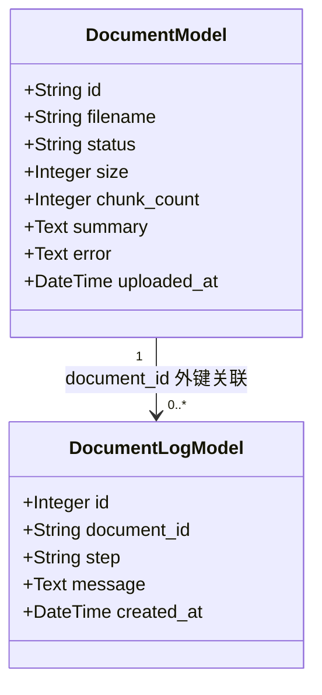
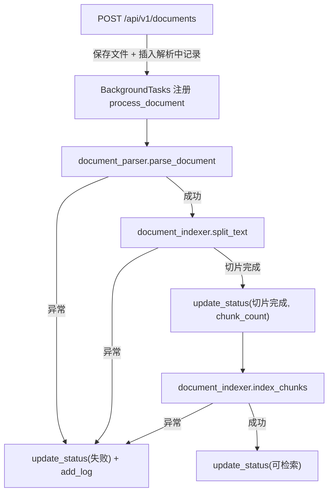
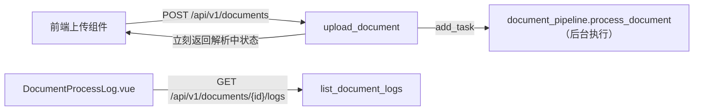
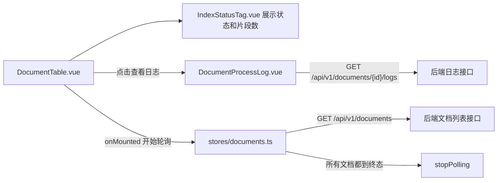

## Day 7：文档太长，需要切片和索引，前端要能看到处理状态

Day 6 把知识库文档管理这件事跑通了，管理员现在能上传售后政策、产品说明这些资料，系统会同步解析出一段文本摘要存进数据库，处理结果只有处理中、已完成、失败三种粗粒度状态。但这套流程离真正能用还差得远，摘要终究只是摘要，既不是切片，也没有向量化，AI 真正检索的时候靠的是一份份独立的文本片段和它们对应的向量，这两样东西今天之前都不存在。而且同步解析这件事本身也是个隐患，一份几十兆的 PDF 解析起来可能要跑上好几秒，这段时间对应的 HTTP 请求会一直挂着，前端上传按钮转半天圈，用户体验和系统健壮性都说不过去。

今天要把这几个问题一起解决掉。后端这边，文档上传之后不再原地等解析结果，而是把解析、切片、向量化这一整条流水线丢进后台任务执行，请求本身立刻返回。处理过程中的每一步都会更新文档状态、写一条日志，状态也从原来的三档细化成解析中、切片完成、向量化中、可检索、失败五档，贴近真实的处理阶段。前端这边要跟上后端的这些变化，状态标签要能展示这五种状态和对应的片段数量，还要提供一个入口能看到某份文档完整的处理日志，方便管理员在文档卡住或者失败时知道具体卡在哪一步。真正拿这些向量做检索问答是 Day 8 的事，今天的边界划在"文档已经建好索引、可以被检索"这一步为止，不涉及查询接口。

### 一、后端：给文档表和处理日志补齐字段

在动手写流水线之前，先把数据结构补齐。今天要给 `DocumentModel` 加一个字段用来记录切片数量，还要新增一张表专门存处理日志，因为一份文档在处理过程中会经历好几次状态推进，每一次推进对应的详细信息如果只靠 `error` 字段一个坑位去存，后面的记录会把前面的覆盖掉，管理员没法看到完整的处理轨迹，这是需要一张独立日志表的原因。

#### 1.1 设计阶段

`DocumentModel` 新增 `chunk_count` 字段，记录这份文档被切成了多少个片段，切片完成之前恒为 0。新增的 `DocumentLogModel` 写在 `backend/app/models/document_log.py` 里，包含自增主键 `id`、外键 `document_id` 指向 `documents.id`、处理阶段 `step`（取值如解析、切片、向量化）、详细说明 `message`，以及记录时间 `created_at`，这张表只做插入不做更新，每一次状态推进都追加一条新记录，不去重也不合并，方便前端把整个处理过程原样回放出来。



两张表定好之后，照 Day 6 的路子生成一个新的 Alembic 迁移，给 `documents` 加列、建 `document_logs` 表，`migrations/env.py` 里那行显式导入模型的语句也要跟着补上 `document_log`，不然 `autogenerate` 还是看不到这张新表。

#### 1.2 实现阶段

先改 `DocumentModel`，加上 `chunk_count`，顺带把默认状态从"处理中"改成今天新引入的"解析中"。

```python
# backend/app/models/document.py
from datetime import datetime, timezone

from sqlalchemy import Column, DateTime, Integer, String, Text

from app.db.base import Base


class DocumentModel(Base):
    """
    文档表，chunk_count 是今天新增的字段，记录这份文档被切成了多少个片段，
    status 现在会经历解析中、切片完成、向量化中、可检索、失败这几种取值，
    取值范围依然只由业务代码保证，数据库层面不做约束。
    """

    __tablename__ = "documents"

    id = Column(String, primary_key=True)
    filename = Column(String, nullable=False)
    file_type = Column(String, nullable=False)
    file_path = Column(String, nullable=False)
    size = Column(Integer, nullable=False)
    status = Column(String, nullable=False, default="解析中")
    summary = Column(Text, nullable=True)
    error = Column(Text, nullable=True)
    chunk_count = Column(Integer, nullable=False, default=0)
    uploaded_at = Column(DateTime, default=lambda: datetime.now(timezone.utc))
```

日志表是今天第一次出现的新模型，独立成一个文件。

```python
# backend/app/models/document_log.py
from datetime import datetime, timezone

from sqlalchemy import Column, DateTime, ForeignKey, Integer, String, Text

from app.db.base import Base


class DocumentLogModel(Base):
    """文档处理日志，每一次状态推进都追加一条记录，不做更新和去重，
    用来在前端完整回放某份文档从上传到可检索（或失败）经历的每一步。"""

    __tablename__ = "document_logs"

    id = Column(Integer, primary_key=True, autoincrement=True)
    document_id = Column(String, ForeignKey("documents.id"), nullable=False)
    step = Column(String, nullable=False)
    message = Column(Text, nullable=False)
    created_at = Column(DateTime, default=lambda: datetime.now(timezone.utc))
```

`migrations/env.py` 里显式导入模型的那一行要补上 `document_log`，否则 `Base.metadata` 不知道这张新表的存在。

```python
# migrations/env.py（只展示改动的这一行，其余沿用 Day 6）
from app.models import document, document_log, order, ticket, user  # noqa: F401  确保模型被注册到 Base.metadata
```

执行 `alembic revision --autogenerate -m "add document processing fields"` 会生成类似下面的迁移脚本。

```python
# migrations/versions/8f3a1c9d2b4e_add_document_processing_fields.py（节选核心逻辑，revision id 等样板代码从略）
def upgrade():
    op.add_column("documents", sa.Column("chunk_count", sa.Integer(), nullable=False, server_default="0"))
    op.create_table(
        "document_logs",
        sa.Column("id", sa.Integer(), primary_key=True, autoincrement=True),
        sa.Column("document_id", sa.String(), sa.ForeignKey("documents.id"), nullable=False),
        sa.Column("step", sa.String(), nullable=False),
        sa.Column("message", sa.Text(), nullable=False),
        sa.Column("created_at", sa.DateTime(), nullable=True),
    )


def downgrade():
    op.drop_table("document_logs")
    op.drop_column("documents", "chunk_count")
```

最后是接口层的数据契约，`backend/app/schemas/document.py` 在原有基础上加一个 `chunk_count` 字段，`status` 的取值范围也要跟着细化，另外新增一个 `DocumentLogEntry` 用来描述日志接口的返回结构。

```python
# backend/app/schemas/document.py
from datetime import datetime
from typing import Literal, Optional

from pydantic import BaseModel, Field


class DocumentInfo(BaseModel):
    """文档信息，status 用 Literal 限定取值范围，今天在 Day 6 的处理中、已完成、失败之上，
    拆成解析中、切片完成、向量化中、可检索、失败五个更贴近真实处理流程的阶段。"""

    id: str = Field(description="文档 ID")
    filename: str = Field(description="原始文件名")
    file_type: str = Field(description="文件扩展名，如 pdf、docx、xlsx、csv、md")
    status: Literal["解析中", "切片完成", "向量化中", "可检索", "失败"] = Field(description="文档处理状态")
    size: int = Field(description="文件大小，单位字节")
    chunk_count: int = Field(default=0, description="切片数量，切片完成之前恒为 0")
    uploaded_at: datetime = Field(description="上传时间")
    summary: Optional[str] = Field(default=None, description="解析出的文本摘要")
    error: Optional[str] = Field(default=None, description="解析或索引失败时的错误信息")


class DocumentLogEntry(BaseModel):
    """处理日志条目，对应 document_logs 表的一行，按时间正序返回给前端。"""

    id: int = Field(description="日志 ID")
    step: str = Field(description="处理阶段，如解析、切片、向量化")
    message: str = Field(description="这一步的详细说明")
    created_at: datetime = Field(description="记录时间")
```

数据结构这一层补齐之后，文档表和日志表都已经就位，接下来要做的是让处理流水线真正往这两张表里写数据。

### 二、后端：文本切片、向量化与后台处理流水线

这一节是今天的主线，要把 Day 6 里那个"保存文件、解析摘要"的同步流程，改造成"保存文件、丢进后台、逐步推进状态"的异步流水线，并且在流水线里真正加入切片和向量化两个环节。

#### 2.1 设计阶段

流水线要用到两个新依赖，`langchain-text-splitters` 提供切片器，`langchain-chroma`（连带 `chromadb`）提供一个不需要额外起服务进程、直接落在本地磁盘上的向量库，装好这两个包就能开始写代码。

文本提取这一层复用 Day 6 的 `backend/app/services/document_parser.py`，但要做一处改动，`parse_document` 原来返回的是截断到 500 字符的摘要，今天这段文本还要交给切片器处理，截断之后后面的内容全部丢失，所以要改成返回完整文本，摘要改由调用方自己截取前面一部分。

切片和向量化的逻辑放进新增的 `backend/app/services/document_indexer.py`，提供两个函数，`split_text` 用 `RecursiveCharacterTextSplitter` 把长文本切成多个片段，`index_chunks` 把切好的片段交给 Embedding 模型转成向量并写入 Chroma。这里选 Chroma 而不是自己维护一份向量数组，是因为它把向量的持久化、相似度检索这些细节都封装好了，Day 8 直接对着这份索引做查询就行，不需要今天重复造轮子。今天所有文档共用同一个 collection，靠写入时记录的 `document_id` 元数据区分来源，这样 Day 8 做全库检索时不需要挨个 collection 遍历。

流水线的编排逻辑放进新增的 `backend/app/services/document_pipeline.py`，提供一个 `process_document` 函数，依次调用解析、切片、向量化，每一步成功都更新一次文档状态、写一条日志，任意一步抛出异常都把状态标记为失败、记录具体的错误信息，然后提前结束，不会让后面的步骤继续跑在一个已经失败的文档上。这个函数会被注册成 FastAPI 的后台任务，执行时机在 HTTP 响应发出之后，不在请求的依赖注入生命周期里，跟 Day 6 里 `order_tool.py` 这些工具函数一个道理，不能通过 `Depends(get_db)` 拿会话，要自己开一个 `SessionLocal()`、用完自己关，这也是当初给 SQLite 连接加 `check_same_thread=False` 的原因之一，后台任务和请求处理一样都可能跑在线程池的不同线程里。



数据访问这一层也要跟着扩一下，`document_repository.py` 里的 `update_status` 今天要在一份文档的生命周期里被调用四五次，如果还像 Day 6 那样每次都无条件覆盖 `summary` 和 `error`，后面阶段的调用会把前面阶段已经写好的值冲掉，所以要改成只在调用方明确传入时才写入对应字段。日志的写入和查询放进新增的 `backend/app/repositories/document_log_repository.py`。

#### 2.2 实现阶段

先改 `document_parser.py`，去掉截断逻辑，返回完整文本。

```python
# backend/app/services/document_parser.py
import csv

import openpyxl
from docx import Document as DocxDocument
from pypdf import PdfReader


def _parse_pdf(file_path: str) -> str:
    reader = PdfReader(file_path)
    return "\n".join(page.extract_text() or "" for page in reader.pages)


def _parse_docx(file_path: str) -> str:
    doc = DocxDocument(file_path)
    return "\n".join(paragraph.text for paragraph in doc.paragraphs)


def _parse_xlsx(file_path: str) -> str:
    workbook = openpyxl.load_workbook(file_path, read_only=True, data_only=True)
    lines: list[str] = []
    for sheet in workbook.worksheets:
        for row in sheet.iter_rows(values_only=True):
            lines.append(",".join(str(cell) for cell in row if cell is not None))
    return "\n".join(lines)


def _parse_csv(file_path: str) -> str:
    with open(file_path, "r", encoding="utf-8", errors="ignore") as f:
        reader = csv.reader(f)
        return "\n".join(",".join(row) for row in reader)


def _parse_text(file_path: str) -> str:
    with open(file_path, "r", encoding="utf-8", errors="ignore") as f:
        return f.read()


_PARSERS = {
    "pdf": _parse_pdf,
    "docx": _parse_docx,
    "xlsx": _parse_xlsx,
    "csv": _parse_csv,
    "md": _parse_text,
    "txt": _parse_text,
}


def parse_document(file_path: str, file_type: str) -> str:
    """解析文档并返回完整文本，不支持的格式或者解析过程中出现异常都会抛出异常，由调用方决定如何处理。"""
    parser = _PARSERS.get(file_type.lower())
    if parser is None:
        raise ValueError(f"不支持的文件格式：{file_type}")
    return parser(file_path)
```

接下来是新增的切片和向量化逻辑。

```python
# backend/app/services/document_indexer.py
import os

from langchain_chroma import Chroma
from langchain_core.documents import Document
from langchain_openai import OpenAIEmbeddings
from langchain_text_splitters import RecursiveCharacterTextSplitter

_CHUNK_SIZE = 500
_CHUNK_OVERLAP = 50

_VECTOR_STORE_DIR = "backend/storage/vector_store"
os.makedirs(_VECTOR_STORE_DIR, exist_ok=True)

# 和 llm_client.py 里的 ChatOpenAI 一样走 OpenAI 协议兼容接口，复用同一套 API Key 和 base_url，换供应商时不需要单独维护一份 Embedding 凭证。
_embeddings = OpenAIEmbeddings(
    model=os.getenv("EMBEDDING_MODEL_NAME", "BAAI/bge-m3"),
    api_key=os.getenv("OPENAI_API_KEY"),
    base_url=os.getenv("OPENAI_BASE_URL") or None,
)

# 所有文档共用一个 collection，检索时靠 metadata 里的 document_id 区分来源，
# persist_directory 指定之后 Chroma 会在写入时自动落盘，不需要再手动调用 persist。
_vector_store = Chroma(
    collection_name="documents",
    embedding_function=_embeddings,
    persist_directory=_VECTOR_STORE_DIR,
)

_splitter = RecursiveCharacterTextSplitter(chunk_size=_CHUNK_SIZE, chunk_overlap=_CHUNK_OVERLAP)


def split_text(text: str) -> list[str]:
    """把一段长文本切成多个片段，chunk_overlap 保留一部分重叠内容，避免语义在切分边界被硬生生截断。
    今天的 chunk_size 按字符数计算，不是按 token 数，对中文资料够用，后续如果要精细控制模型的
    上下文占用，可以换成基于 tiktoken 编码器的切片方式。"""
    return _splitter.split_text(text)


def index_chunks(doc_id: str, filename: str, chunks: list[str]) -> None:
    """把切好的片段向量化并写入 Chroma，metadata 里记录 document_id 和片段序号，
    后面要重新索引或者删除这份文档的片段时，可以按 document_id 过滤定位。"""
    documents = [
        Document(page_content=chunk, metadata={"document_id": doc_id, "filename": filename, "chunk_index": i})
        for i, chunk in enumerate(chunks)
    ]
    ids = [f"{doc_id}-{i}" for i in range(len(chunks))]
    _vector_store.add_documents(documents, ids=ids)
```

`document_repository.py` 里的 `update_status` 要改成只在传入对应参数时才更新字段，避免中间某一步的调用把已经写好的摘要或者错误信息覆盖掉。

```python
# backend/app/repositories/document_repository.py
from datetime import datetime, timezone
from typing import Optional

from sqlalchemy.orm import Session

from app.models.document import DocumentModel


def add_document(db: Session, doc_id: str, filename: str, file_type: str, file_path: str, size: int) -> DocumentModel:
    """插入一条状态为解析中的文档记录，chunk_count 先记 0，摘要和错误信息此时都还是空的。"""
    document = DocumentModel(
        id=doc_id,
        filename=filename,
        file_type=file_type,
        file_path=file_path,
        size=size,
        status="解析中",
        chunk_count=0,
        uploaded_at=datetime.now(timezone.utc),
    )
    db.add(document)
    db.commit()
    db.refresh(document)
    return document


def get_document(db: Session, doc_id: str) -> Optional[DocumentModel]:
    return db.query(DocumentModel).filter(DocumentModel.id == doc_id).first()


def list_documents(db: Session) -> list[DocumentModel]:
    return db.query(DocumentModel).order_by(DocumentModel.uploaded_at.desc()).all()


def update_status(
    db: Session,
    doc_id: str,
    status: str,
    summary: Optional[str] = None,
    error: Optional[str] = None,
    chunk_count: Optional[int] = None,
) -> None:
    """更新文档的处理状态，summary、error、chunk_count 只在调用方明确传入时才写入，
    今天一份文档要经历四五次状态推进，不这么改的话后面的调用会把前面已经写好的值冲掉。"""
    document = get_document(db, doc_id)
    if document is None:
        return
    document.status = status
    if summary is not None:
        document.summary = summary
    if error is not None:
        document.error = error
    if chunk_count is not None:
        document.chunk_count = chunk_count
    db.commit()
```

日志的写入和查询是今天新增的能力，独立成一个文件。

```python
# backend/app/repositories/document_log_repository.py
from sqlalchemy.orm import Session

from app.models.document_log import DocumentLogModel


def add_log(db: Session, doc_id: str, step: str, message: str) -> None:
    """追加一条处理日志，不做去重和合并，每一步的详细记录都完整保留，方便排查文档卡在哪一步。"""
    db.add(DocumentLogModel(document_id=doc_id, step=step, message=message))
    db.commit()


def list_logs(db: Session, doc_id: str) -> list[DocumentLogModel]:
    return (
        db.query(DocumentLogModel)
        .filter(DocumentLogModel.document_id == doc_id)
        .order_by(DocumentLogModel.created_at.asc())
        .all()
    )
```

最后把解析、切片、向量化这几步串成完整的流水线。

```python
# backend/app/services/document_pipeline.py
from app.db.session import SessionLocal
from app.repositories.document_log_repository import add_log
from app.repositories.document_repository import update_status
from app.services.document_indexer import index_chunks, split_text
from app.services.document_parser import parse_document

_SUMMARY_MAX_LENGTH = 500


def process_document(doc_id: str, file_path: str, file_type: str, filename: str) -> None:
    """文档处理的完整流水线，解析、切片、向量化，每一步都更新状态并写一条日志。
    这个函数跑在 BackgroundTasks 里，执行时机在 HTTP 响应发出之后，不在请求的依赖注入生命周期内，
    不能像路由函数那样通过 Depends(get_db) 拿会话，要像 Day 6 的工具函数一样自己开、自己关会话。
    """
    db = SessionLocal()
    try:
        try:
            full_text = parse_document(file_path, file_type)
        except Exception as exc:
            update_status(db, doc_id, status="失败", error=str(exc))
            add_log(db, doc_id, step="解析", message=f"解析失败：{exc}")
            return

        summary = full_text[:_SUMMARY_MAX_LENGTH]
        add_log(db, doc_id, step="解析", message=f"解析完成，正文长度 {len(full_text)} 字符")

        try:
            chunks = split_text(full_text)
        except Exception as exc:
            update_status(db, doc_id, status="失败", error=str(exc), summary=summary)
            add_log(db, doc_id, step="切片", message=f"切片失败：{exc}")
            return

        update_status(db, doc_id, status="切片完成", summary=summary, chunk_count=len(chunks))
        add_log(db, doc_id, step="切片", message=f"切片完成，共 {len(chunks)} 个片段")

        update_status(db, doc_id, status="向量化中")
        add_log(db, doc_id, step="向量化", message="开始调用向量模型")

        try:
            index_chunks(doc_id, filename, chunks)
        except Exception as exc:
            update_status(db, doc_id, status="失败", error=str(exc))
            add_log(db, doc_id, step="向量化", message=f"向量化失败：{exc}")
            return

        update_status(db, doc_id, status="可检索")
        add_log(db, doc_id, step="向量化", message="向量化完成，已写入索引，可以被检索")
    finally:
        db.close()
```

`process_document` 里每一步都单独包了一层 `try/except`，是有意为之的，如果只在最外层包一个大 `try`，一旦切片失败，前面解析阶段产出的摘要就没机会写进数据库，管理员打开文档列表只能看到一个"失败"的标签和一句异常信息，却看不到这份文档其实已经解析出了多少内容。分阶段捕获异常之后，每一步失败都带着它之前已经拿到的成果一起落库，日志里也能看清楚具体是卡在解析、切片还是向量化这一步。

### 三、后端：上传接口改成异步返回，并提供日志查询

流水线写好之后，回到路由层，把原来同步调用 `parse_document` 的那部分逻辑，换成把 `process_document` 注册成后台任务，另外加一个查询某份文档处理日志的接口。

#### 3.1 设计阶段

`upload_document` 保存文件、插入一条状态为解析中的记录之后，不再同步等待解析结果，而是调用 `BackgroundTasks.add_task` 把 `process_document` 交给 FastAPI 在响应发出之后执行，路由函数本身立刻返回这份文档的初始状态。新增的 `GET /api/v1/documents/{doc_id}/logs` 直接读 `document_log_repository.list_logs`，按时间正序返回给前端。



#### 3.2 实现阶段

```python
# backend/app/api/v1/documents.py
import os
import uuid

from fastapi import APIRouter, BackgroundTasks, Depends, UploadFile
from sqlalchemy.orm import Session

from app.db.session import get_db
from app.repositories.document_log_repository import list_logs
from app.repositories.document_repository import add_document, list_documents
from app.schemas.document import DocumentInfo, DocumentLogEntry
from app.services.document_pipeline import process_document

router = APIRouter(prefix="/api/v1/documents", tags=["documents"])

_STORAGE_DIR = "backend/storage/documents"
os.makedirs(_STORAGE_DIR, exist_ok=True)


def _to_document_info(document:DocumentModel) -> DocumentInfo:
    return DocumentInfo(
        id=document.id,
        filename=document.filename,
        file_type=document.file_type,
        status=document.status,
        size=document.size,
        chunk_count=document.chunk_count,
        uploaded_at=document.uploaded_at,
        summary=document.summary,
        error=document.error,
    )


@router.post("", response_model=DocumentInfo)
async def upload_document(
    file: UploadFile, background_tasks: BackgroundTasks, db: Session = Depends(get_db)
) -> DocumentInfo:
    doc_id = str(uuid.uuid4())
    file_type = (file.filename.rsplit(".", 1)[-1] if "." in file.filename else "").lower()
    file_path = os.path.join(_STORAGE_DIR, f"{doc_id}.{file_type}")

    content = await file.read()
    with open(file_path, "wb") as f:
        f.write(content)

    document = add_document(
        db, doc_id=doc_id, filename=file.filename, file_type=file_type, file_path=file_path, size=len(content)
    )

    # 解析、切片、向量化挪到后台任务里执行，这里保存完文件、插完一条解析中的记录就立刻返回，
    # 不再等文档处理完，避免大文件解析时把这次 HTTP 请求挂起太久。
    background_tasks.add_task(process_document, doc_id, file_path, file_type, file.filename)

    return _to_document_info(document)


@router.get("", response_model=list[DocumentInfo])
def list_documents_endpoint(db: Session = Depends(get_db)) -> list[DocumentInfo]:
    return [_to_document_info(doc) for doc in list_documents(db)]


@router.get("/{doc_id}/logs", response_model=list[DocumentLogEntry])
def list_document_logs(doc_id: str, db: Session = Depends(get_db)) -> list[DocumentLogEntry]:
    return [
        DocumentLogEntry(id=log.id, step=log.step, message=log.message, created_at=log.created_at)
        for log in list_logs(db, doc_id)
    ]
```

这里有一点和 Day 6 明显不同，`upload_document` 返回的 `DocumentInfo` 现在只代表"刚刚接收"这个瞬间的状态，几乎总是解析中，前端不能再像 Day 6 那样指望这一次响应就带回最终的处理结果，得靠轮询或者别的机制去追后续的状态变化，这正是接下来前端要补上的部分。

### 四、前端：状态标签、片段数与处理日志展示

后端这边状态细化了、日志也有了，前端要跟上三件事，文档列表里的状态展示要能体现五种状态和片段数量，要有一个入口能看到某份文档完整的处理日志，还要让页面能自动感知状态变化，不用管理员手动刷新才能看到进度。

#### 4.1 设计阶段

状态标签独立成新增的 `frontend/src/components/documents/IndexStatusTag.vue`，接收 `status`、`chunkCount`、`error` 三个 prop，按状态显示不同颜色的文字，片段数量大于 0 时附带展示，失败时把错误信息也一起展示出来。处理日志独立成新增的 `frontend/src/components/documents/DocumentProcessLog.vue`，接收一个 `documentId`，挂载时调用日志接口，把返回的记录按时间顺序渲染成一个列表。

`DocumentTable.vue` 要做两处改动，一是把原来内联的状态展示代码换成 `IndexStatusTag`，二是给每一行加一个"查看日志"的入口，点击展开一行内嵌的 `DocumentProcessLog`。`stores/documents.ts` 也要跟着补上 `chunk_count` 字段、新增的 `fetchDocumentLogs` 方法，另外补一套简单的轮询机制，只要文档列表里还存在没有落到可检索或者失败这两种终态的记录，就每隔几秒重新拉一次列表，全部落定之后自动停止，这样管理员不需要手动刷新页面就能看到进度往前推进。



#### 4.2 实现阶段

先改 `stores/documents.ts`，补上新字段和轮询逻辑。

```typescript
// frontend/src/stores/documents.ts
import { defineStore } from 'pinia'
import axios from 'axios'

export interface DocumentInfo {
  id: string
  filename: string
  file_type: string
  status: '解析中' | '切片完成' | '向量化中' | '可检索' | '失败'
  size: number
  chunk_count: number
  uploaded_at: string
  summary: string | null
  error: string | null
}

export interface DocumentLogEntry {
  id: number
  step: string
  message: string
  created_at: string
}

// 只有落到这两种状态之一才算处理完毕，轮询要一直持续到列表里所有文档都落到终态。
const TERMINAL_STATUSES = ['可检索', '失败']

export const useDocumentsStore = defineStore('documents', {
  state: () => ({
    documents: [] as DocumentInfo[],
    loading: false,
    pollTimer: null as ReturnType<typeof setInterval> | null,
  }),
  actions: {
    async fetchDocuments() {
      this.loading = true
      try {
        const { data } = await axios.get<DocumentInfo[]>('/api/v1/documents')
        this.documents = data
      } finally {
        this.loading = false
      }
    },
    async fetchDocumentLogs(documentId: string) {
      const { data } = await axios.get<DocumentLogEntry[]>(`/api/v1/documents/${documentId}/logs`)
      return data
    },
    async uploadDocument(file: File, onProgress: (percent: number) => void) {
      const formData = new FormData()
      formData.append('file', file)
      const { data } = await axios.post<DocumentInfo>('/api/v1/documents', formData, {
        onUploadProgress: (event) => {
          if (event.total) {
            onProgress(Math.round((event.loaded / event.total) * 100))
          }
        },
      })
      // 上传接口现在只返回解析中这个初始状态，真正的处理进度要靠轮询去追，这里先刷新一次列表让新记录露出来，再开始轮询。
      await this.fetchDocuments()
      this.startPolling()
      return data
    },
    startPolling() {
      if (this.pollTimer) return
      this.pollTimer = setInterval(async () => {
        await this.fetchDocuments()
        const allDone = this.documents.every((doc) => TERMINAL_STATUSES.includes(doc.status))
        if (allDone) this.stopPolling()
      }, 2000)
    },
    stopPolling() {
      if (this.pollTimer) {
        clearInterval(this.pollTimer)
        this.pollTimer = null
      }
    },
  },
})
```

接下来是状态标签组件，把状态、片段数、错误信息放在一起展示。

```vue
<!-- frontend/src/components/documents/IndexStatusTag.vue -->
<script setup lang="ts">
defineProps<{
  status: string
  chunkCount: number
  error: string | null
}>()

const STATUS_COLOR: Record<string, string> = {
  解析中: '#f59e0b',
  切片完成: '#0891b2',
  向量化中: '#7c3aed',
  可检索: '#059669',
  失败: '#dc2626',
}
</script>

<template>
  <div class="status-cell">
    <span class="status-tag" :style="{ color: STATUS_COLOR[status] }">{{ status }}</span>
    <span v-if="chunkCount > 0" class="chunk-count">{{ chunkCount }} 个片段</span>
    <span v-if="error" class="error-tip">{{ error }}</span>
  </div>
</template>

<style scoped>
.status-cell {
  display: flex;
  flex-direction: column;
  gap: 2px;
}

.status-tag {
  font-weight: 600;
  font-size: 13px;
}

.chunk-count {
  font-size: 12px;
  color: #6b7280;
}

.error-tip {
  font-size: 12px;
  color: #dc2626;
}
</style>
```

处理日志组件负责拉取并展示某份文档的完整处理轨迹。

```vue
<!-- frontend/src/components/documents/DocumentProcessLog.vue -->
<script setup lang="ts">
import { onMounted, ref } from 'vue'
import { useDocumentsStore, type DocumentLogEntry } from '../../stores/documents'

const props = defineProps<{ documentId: string }>()
const store = useDocumentsStore()
const logs = ref<DocumentLogEntry[]>([])
const loading = ref(false)

onMounted(async () => {
  loading.value = true
  try {
    logs.value = await store.fetchDocumentLogs(props.documentId)
  } finally {
    loading.value = false
  }
})
</script>

<template>
  <div class="process-log">
    <p v-if="loading">日志加载中…</p>
    <ul v-else class="log-list">
      <li v-for="log in logs" :key="log.id">
        <span class="log-step">{{ log.step }}</span>
        <span class="log-message">{{ log.message }}</span>
        <span class="log-time">{{ new Date(log.created_at).toLocaleTimeString() }}</span>
      </li>
    </ul>
  </div>
</template>

<style scoped>
.process-log {
  padding: 8px 12px;
  background-color: #f9fafb;
  border-radius: 6px;
  font-size: 13px;
}

.log-list {
  list-style: none;
  margin: 0;
  padding: 0;
  display: flex;
  flex-direction: column;
  gap: 4px;
}

.log-step {
  font-weight: 600;
  margin-right: 8px;
}

.log-time {
  float: right;
  color: #9ca3af;
}
</style>
```

最后改 `DocumentTable.vue`，接入状态标签组件、加上展开日志的入口，并在组件挂载时启动轮询、卸载时停掉。

```vue
<!-- frontend/src/components/documents/DocumentTable.vue -->
<script setup lang="ts">
import { onMounted, onUnmounted, ref } from 'vue'
import { useDocumentsStore } from '../../stores/documents'
import IndexStatusTag from './IndexStatusTag.vue'
import DocumentProcessLog from './DocumentProcessLog.vue'

const store = useDocumentsStore()
const expandedId = ref<string | null>(null)

function formatSize(bytes: number): string {
  return bytes < 1024 * 1024 ? `${(bytes / 1024).toFixed(1)} KB` : `${(bytes / 1024 / 1024).toFixed(1)} MB`
}

function toggleLog(docId: string) {
  expandedId.value = expandedId.value === docId ? null : docId
}

onMounted(async () => {
  await store.fetchDocuments()
  store.startPolling()
})

onUnmounted(() => {
  store.stopPolling()
})
</script>

<template>
  <table class="doc-table">
    <thead>
      <tr>
        <th>文件名</th>
        <th>类型</th>
        <th>大小</th>
        <th>状态</th>
        <th>上传时间</th>
        <th></th>
      </tr>
    </thead>
    <tbody>
      <template v-for="doc in store.documents" :key="doc.id">
        <tr>
          <td>{{ doc.filename }}</td>
          <td>{{ doc.file_type }}</td>
          <td>{{ formatSize(doc.size) }}</td>
          <td>
            <IndexStatusTag :status="doc.status" :chunk-count="doc.chunk_count" :error="doc.error" />
          </td>
          <td>{{ new Date(doc.uploaded_at).toLocaleString() }}</td>
          <td><button type="button" @click="toggleLog(doc.id)">查看日志</button></td>
        </tr>
        <tr v-if="expandedId === doc.id">
          <td colspan="6">
            <DocumentProcessLog :document-id="doc.id" />
          </td>
        </tr>
      </template>
    </tbody>
  </table>
</template>

<style scoped>
.doc-table {
  width: 100%;
  border-collapse: collapse;
  font-size: 14px;
}

.doc-table th,
.doc-table td {
  padding: 8px 12px;
  text-align: left;
  border-bottom: 1px solid #e5e7eb;
}
</style>
```

轮询逻辑放在 `DocumentTable.vue` 的生命周期钩子里，而不是塞进 `DocumentsView.vue`，是因为这份状态和"文档列表要不要动态刷新"这件事本身就是表格组件的职责，`DocumentUpload.vue` 上传完之后也会调用一次 `startPolling`，两处调用不会冲突，`startPolling` 内部已经做了判断，已经在轮询就直接返回，不会开出第二个定时器。

### 五、本篇产出清单

| 文件 | 说明 |
| --- | --- |
| `backend/app/models/document.py` | 修改，新增 `chunk_count` 字段，`status` 默认值改为"解析中" |
| `backend/app/models/document_log.py` | 新增，`DocumentLogModel`，文档处理日志表结构 |
| `migrations/env.py` | 修改，导入语句补上 `document_log` |
| `migrations/versions/8f3a1c9d2b4e_add_document_processing_fields.py` | 新增，`documents` 表加列、创建 `document_logs` 表的迁移脚本 |
| `backend/app/schemas/document.py` | 修改，`DocumentInfo` 增加 `chunk_count`、细化 `status` 枚举，新增 `DocumentLogEntry` |
| `backend/app/services/document_parser.py` | 修改，`parse_document` 改为返回完整文本，不再截断 |
| `backend/app/services/document_indexer.py` | 新增，`split_text`、`index_chunks`，切片与向量化 |
| `backend/app/services/document_pipeline.py` | 新增，`process_document`，解析、切片、向量化的完整流水线 |
| `backend/app/repositories/document_repository.py` | 修改，`add_document` 初始状态改为"解析中"，`update_status` 支持按需增量更新和 `chunk_count` |
| `backend/app/repositories/document_log_repository.py` | 新增，`add_log`、`list_logs` |
| `backend/app/api/v1/documents.py` | 修改，`upload_document` 改为注册后台任务并立即返回，新增 `list_document_logs` 路由 |
| `frontend/src/stores/documents.ts` | 修改，`DocumentInfo` 增加字段，新增 `fetchDocumentLogs`、`startPolling`、`stopPolling` |
| `frontend/src/components/documents/IndexStatusTag.vue` | 新增，展示处理状态、片段数量和错误信息 |
| `frontend/src/components/documents/DocumentProcessLog.vue` | 新增，展示某份文档的完整处理日志 |
| `frontend/src/components/documents/DocumentTable.vue` | 修改，接入 `IndexStatusTag`，新增查看日志的展开行和轮询逻辑 |

跟着写完这些文件之后，本地重启前后端服务，上传一份文档应该能立刻看到接口返回"解析中"，几秒钟内状态标签会依次跳到切片完成、向量化中，最终停在可检索并显示出片段数量，点击查看日志能看到每一步的详细记录，`backend/storage/vector_store` 目录下也能看到 Chroma 落盘的数据文件。

### 六、总结

今天把 Day 6 遗留的两个问题一起解决了，一是文档处理不再是一次性同步跑完、卡住请求的黑盒操作，而是拆成解析、切片、向量化三个阶段的后台流水线，每一步都会更新状态、写一条可追溯的日志，二是文档终于真正具备了被检索的基础，切好的片段经过 Embedding 转成向量、写进本地的 Chroma 索引，不再只是一段用来展示的摘要文字。前端也跟着补上了细粒度的状态标签、片段数量展示和处理日志入口，还加了一套简单的轮询，管理员不用守着页面手动刷新就能看到进度往前推进。

不过今天搭好的 Chroma 索引目前还是个只进不出的仓库，写进去的向量没有任何查询接口去用它，AI 回答问题时也还完全不知道这份索引的存在。这正是 Day 8 要接着做的事，在今天建好的向量库上实现真正的检索能力，让用户问出类似"7 天无理由退款政策是什么"这样的问题时，AI 能先从这份索引里找到相关片段，再基于检索到的内容组织答案，聊天页面也要跟着展示"正在检索知识库"这个过程和命中的原文片段。
